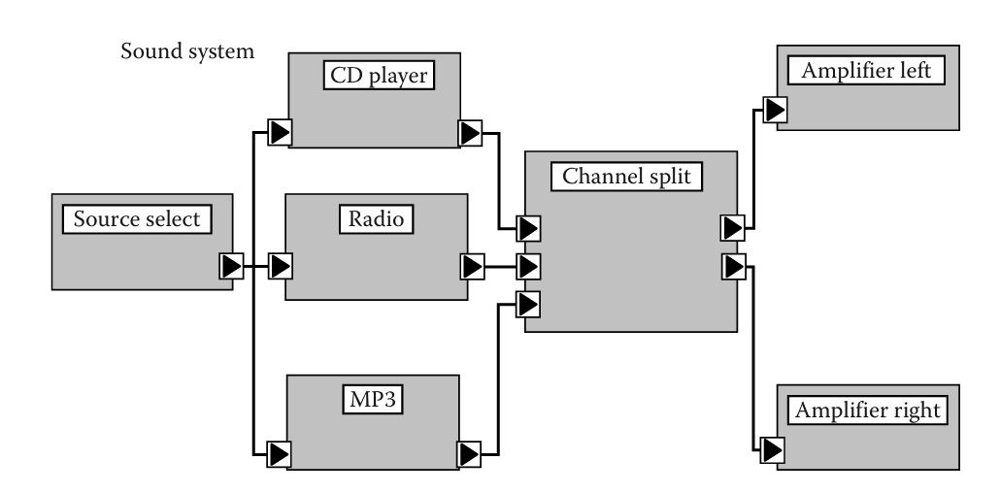
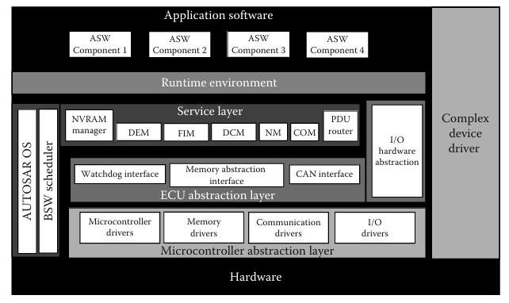
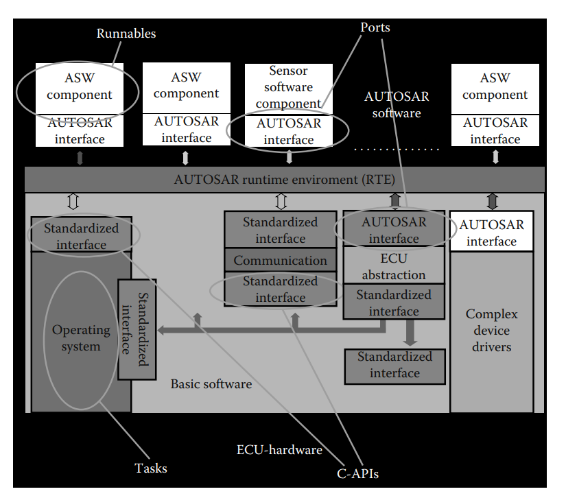
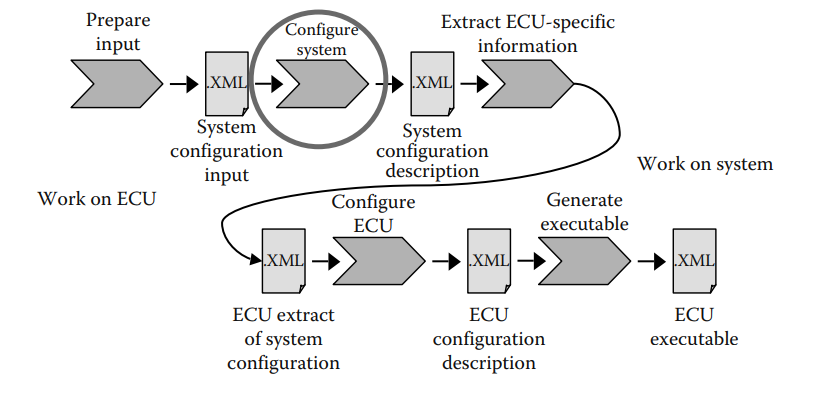
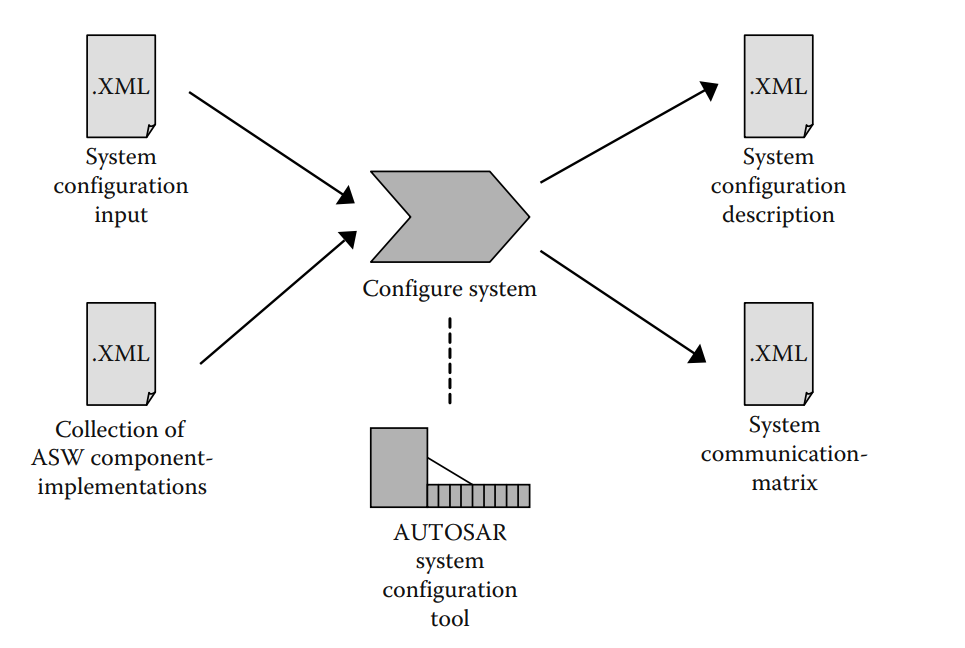
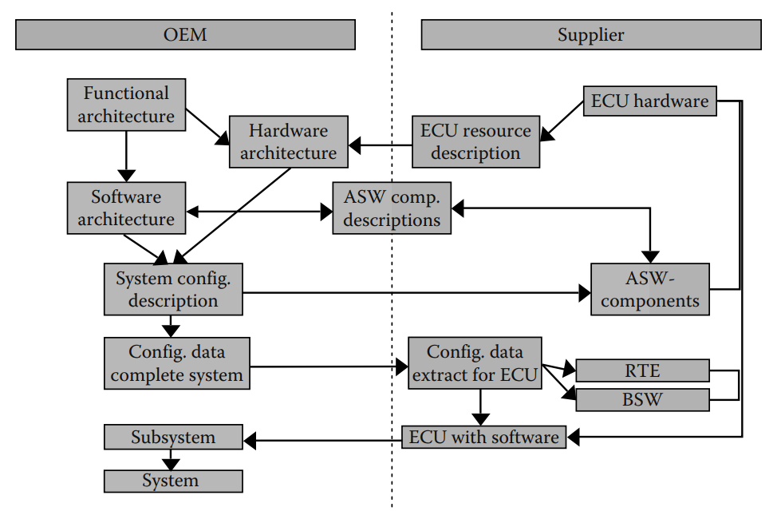
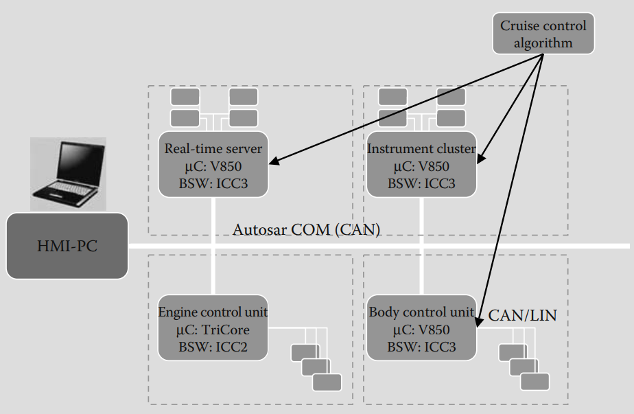

# Áp dụng tiêu chuẩn AUTOSAR

## 2.1 Motivation

Sự phát triển của các ECU được đặc trưng bởi một số yếu tố thúc đẩy:

- Nhu cầu về nhiều service, an toàn, chi phí và sự tiện lợi
- Sự phức tạp ngày càng tăng do nhiều ECU hơn và sự phát triển trong chia sẻ phần mềm và chức năng
- Đa dạng hơn của ECU phần cứng và mạng

Mạng lưới ECU ngày càng đa dạng nhưng vẫn chưa được tiêu chuẩn hóa để tận dụng công nghệ mới.

### 2.1.1 Shortcomings in Former Software Structures

Kiến trúc phần mềm trước đây thiếu mức độ trừu tượng phù hợp và chưa có phương pháp tích hợp hiệu quả. Điều này dẫn đến việc các yêu cầu chất lượng không được xác định rõ ràng.

Nhiều chức năng trong ô tô được phân tán qua nhiều ECU. Đặc biệt, các công nghệ tương lai như drive-by-wire đòi hỏi sự phối hợp chặt chẽ và an toàn giữa ECU của nhiều hệ thống. Do đó, sự kết nối và tích hợp giữa các ECU ngày càng trở nên quan trọng.

### 2.1.2 Setting up AUTOSAR

AUTOSAR là một tiêu chuẩn cho ngành ô tô điện tử được dẫn đầu bởi 10 đối tác cốt lõi: BMW Group, Bosch, Continental, DaimlerChrysler, Ford Motor Company, General Motors, PSA Peugeot Citroën, Siemens VDO, Toyota Motor Corporation, and Volkswagen. 

### 2.1.3 Main Objectives of AUTOSAR

Nguyên tắc chính của AUTOSAR là “cooperate on standards, compete on implementation.” Do đó các mục tiêu chính được đưa ra:

1. Xem xét tính khả dụng và các yêu cầu an toàn
2. Kích hoạt dự phòng
3. Khả năng mở rộng cho các biến thể xe và nền tảng khác nhau
4. Triển khai và tiêu chuẩn hóa các chức năng cơ bản như một giải pháp "tiêu chuẩn" trên toàn ngành
5. Khả năng chuyển các chức năng từ ECU này sang ECU khác trong mạng lưới ECU
6. Tích hợp các mô-đun chức năng từ nhiều nhà cung cấp
7. Khả năng bảo trì trong toàn bộ vòng đời sản phẩm
8. Tăng cường sử dụng phần cứng thương mại có sẵn (COTS)
9. Cập nhật và nâng cấp phần mềm trong suốt thời gian sử dụng xe

Mô hình AUTOSAR sử dụng XML theo UML 2.0 để mô tả hệ thống. Ba trụ cột chính của AUTOSAR là BSW (Basic Software), RTE (Runtime Environment), và Application Interfaces. Một hệ thống quan trọng trong AUTOSAR là Virtual Functional Bus (VFB), giúp ứng dụng giao tiếp mà không cần biết chi tiết về phần cứng bên dưới, đơn giản hóa quá trình phát triển phần mềm.

### 2.1.4 Working Methods in AUTOSAR

Để có thể thiết lập một tiêu chuẩn, cần có sự ổn định tối thiểu và sự hiểu biết chung về vấn đề đang được giải quyết. Do đó, AUTOSAR không được bắt đầu một cách vội vàng mà đã có sự chuẩn bị từ trước. Cụ thể, đã có nhiều dự án nghiên cứu được thực hiện trước đó, đáng kể là các dự án ITEA-EAST/EEA và AEE.

## 2.2 Mainstay of AUTOSAR: AUTOSAR Architecture

### 2.2.1 AUTOSAR Concept

AUTOSAR đã xác định một phương pháp phát triển mới cho kiến trúc và phần mềm ô tô. AUTOSAR áp dụng phương pháp phát triển dựa trên mô hình (model-driven development) trong đó kiến trúc phần mềm, phần cứng ECU, và cấu trúc mạng đều được mô hình hóa theo một metamodel thống nhất (theo chuẩn của OMG MetaObject Facility).

Kiến trúc phần mềm bao gồm các thành phần phần mềm (software components) có các cổng giao tiếp (ports) gồm:
- Required port (tam giác hướng vào): nhận dữ liệu.
- Provided port (tam giác hướng ra): gửi dữ liệu.

Có hai loại giao diện là:
- Sender/Receiver interface: giao tiếp kiểu gửi/nhận dữ liệu theo tin nhắn.
- Client/Server interface: giao tiếp kiểu remote procedure call.

VFB (Virtual Functional Bus): là một lớp trung gian trừu tượng, giúp các thành phần phần mềm giao tiếp mà không cần biết cụ thể phần cứng (giống CORBA). Nhờ đó, việc giao tiếp giữa các component dù nằm trên cùng ECU hay khác ECU đều được xử lý thống nhất.

Kiến trúc phần cứng được mô hình hóa song song với định nghĩa của kiến trúc phần mềm. AUTOSAR cho phép mô hình hóa cấu trúc liên kết của mạng xe cũng như phần cứng của ECU

### 2.2.2 Layered Software Architecture

AUTOSAR định nghĩa kiến trúc phần mềm cho ECU theo kiểu phân lớp.

Lớp thấp nhất là **Microcontroller Abstraction Layer (MCAL)** chịu trách nhiệm trừu tượng hóa phần cứng. MCAL được xem như là device drivers bao gồm 4 nhóm: microcontroller drivers, memory drivers, communication driver (CAN, LIN, FlexRay), and I/O driver (PWM, ADC, DIO). Tầng trên MCAL là **ECU Abstraction Layer (ECU-AL)** cung cấp các dịch vụ bổ sung của device driver. Tầng trên nữa là **Service Layer (SL)** cung cấp dịch vụ như quản lý bộ nhớ NVRAM, quản lý lỗi chẩn đoán DEM v.v. AUTOSAR OS cũng nằm trong lớp này và được phép truy cập vào phần cứng. **Complex Device Driver (CDD)** được phép truy cập trực tiếp phần cứng để mở rộng kiến trúc với các driver mới chưa được tiêu chuẩn hóa. Lớp **Runtime Environment (RTE)** hỗ trợ tách biệt giữa **Basic Software (BSW)** và **Application Software (ASW)** giúp AWS không cần quan tâm đến chi tiết phần cứng và truy cập dịch vụ của BSW dễ dàng. Ngoài ra thì RTE cũng đóng vai trò là middleware hiện thực hóa mô hình Virtual Functional Bus (VFB) ở local.

## 2.3 Main Areas of AUTOSAR Standardization: BSW and RTE

### 2.3.1 BSW

Tập hợp các BSW module sẽ bao gồm device drivers, communnication và I/O driver. Tổng cộng, AUTOSAR quy định một tập hợp cố định gồm 63 BSW module.

Mỗi mô-đun BSW đều có giao diện rõ ràng, gồm các hàm API, kiểu dữ liệu và mã lỗi. Tuy nhiên, các phần mềm ở tầng trên (phía trên RTE) không thể truy cập trực tiếp các giao diện này mà phải thông qua RTE (Runtime Environment). Ngoài giao diện, mỗi mô-đun còn đi kèm bộ tham số cấu hình, được chia theo thời điểm cấu hình là: precompile (trước biên dịch), link time (khi liên kết) và postbuild (sau biên dịch), nhằm xác định chính xác thời gian áp dụng cấu hình.

### 2.3.2 BSW Conformance Classes

Việc chuyển đổi toàn bộ hệ thống hiện tại sang AUTOSAR trong một bước thì rất phức tạp vì cần phải cài đặt 63 module BSW và điều chỉnh lại các giao diện phần mềm. Trong giai đoạn chuyển đổi, sẽ có sự pha trộn giữa phần mềm và ECU theo và không theo AUTOSAR.

Để hỗ trợ quá trình này, AUTOSAR đưa ra khái niệm Implementation Conformance Classes (ICCs) chia các module BSW thành cụm, chỉ yêu cầu các giao diện giữa các cụm phải tuân theo chuẩn AUTOSAR. ICCs chỉ ảnh hưởng đến tầng BSW và RTE, nên phần mềm ứng dụng (ASW) phía trên vẫn có thể sử dụng lại mà không cần thay đổi.

#### 2.3.2.1 ICC1

ICC1 là cấp độ tương thích thấp nhất trong ba cấp độ triển khai ICC của AUTOSAR. 

Trong ICC1:
- RTE và toàn bộ BSW được gộp chung thành một cụm (cluster).
- Chỉ giao diện giữa RTE–ASW và RTE–bus cần tuân theo chuẩn AUTOSAR.
- Giao diện giữa RTE và BSW không cần chuẩn hóa, do đó RTE là độc quyền (proprietary).

Tuy nhiên, ICC1 vẫn phải đảm bảo đầy đủ chức năng và hành vi theo AUTOSAR như lên lịch thực thi các runnable entities của ASW, giao tiếp giữa các thành phần ASW, cung cấp các dịch vụ như NVRAM Manager hay Diagnostic Event Manager (DEM), dù không cần tách thành các module riêng biệt như trong chuẩn. 

ICC1 thường được xem là bước đầu tiên trong quá trình chuyển đổi từ hệ thống độc quyền sang hệ thống theo chuẩn AUTOSAR.

#### 2.3.2.2 ICC2

ICC2 là cấp độ triển khai trung gian trong ba cấp độ ICC của AUTOSAR.

Trong ICC2:
- Các mô-đun BSW liên quan logic được gom thành nhiều cụm (clusters) riêng biệt.
- RTE là một cụm riêng biệt.
- Tất cả các giao diện giữa các cụm, giữa RTE và ASW, và giữa hệ thống với bus đều phải tuân thủ chuẩn AUTOSAR.
- Cho phép tích hợp các cụm BSW từ nhiều nhà cung cấp khác nhau.

#### 2.3.2.3 ICC3

ICC3 là cấp độ tương thích cao nhất với chuẩn AUTOSAR.

Trong ICC3:
- Tất cả các module BSW được triển khai đầy đủ theo đúng chuẩn AUTOSAR, bao gồm cả các giao diện tương ứng.
- Không có sự gom nhóm (clustering) các module, mỗi module tồn tại riêng lẻ như được định nghĩa trong AUTOSAR.

Đây là mức độ triển khai đầy đủ nhất, đảm bảo tương thích tối đa và khả năng thay thế, tái sử dụng, tích hợp với các thành phần AUTOSAR từ bất kỳ nhà cung cấp nào.

### 2.3.3 RTE

#### 2.3.3.1 Features of RTE

Về cơ bản có hai phần riêng biệt trong kiến trúc AUTOSAR, phần trên RTE là các ASW và phân dưới RTE là BSW.

Đối với phần bên dưới, các module BSW có thể gọi các hàm API của nhau hoặc sử dụng trực tiếp các dịch vụ như OS. Ngược lại, các thành phầ ASW chỉ giao tiếp với nhau qua các port và không dược truy cập trực tiếp vào BSW.

Mỗi thành phần ASW hoạt động qua qua runnable entities. Đây là các đơn vị thực thi có thể được RTE kích hoạt dựa trên các event như có dữ liệu mới, bộ định thời timeout, hoặc khi có response từ server.

RTE "gắn kết" ASW và BSW lại với nhau nhưng nó không đơn thuần là một lớp trừu tượng bởi trong AUTOSAR, ASW không thể sử dụng trực tiếp các khái niệm như tác vụ OS hay thông điệp CAN như trong hệ thống truyền thống. Do đó, việc chuyển đổi từ ứng dụng không-AUTOSAR sang AUTOSAR đòi hỏi thay đổi toàn bộ hành vi nội tại để tuân theo mô hình AUTOSAR.

RTE thực hiện hai nhiệm vụ chính:
- Truyền thông: cung cấp API để gửi/nhận dữ liệu hoặc thực hiện gọi từ xa (client/server).
- Kích hoạt runnable entities: ánh xạ các runnable thành các tác vụ OS và kích hoạt chúng tương ứng, hoặc gọi trực tiếp như một hàm.

#### 2.3.3.2 Generation of RTE

RTE được tạo ra để đảm bảo sự phù hợp với các cấu hình cụ thể của mỗi ECU. RTE sẽ chỉ chứa những chức năng cần thiết, không dư thừa, nhằm đảm bảo tối ưu hóa cho từng hệ thống. Quá trình tạo RTE gồm hai giai đoạn:

1. Contract phase:
- Giai đoạn này không phụ thuộc vào ECU.
- Mục tiêu là tạo “hợp đồng” giữa thành phần ASW và RTE, tức là bộ API mà ASW có thể sử dụng khi lập trình.
- Đầu vào gồm mô tả thành phần ASW với các port và runnable entity.
- Kết quả là tạo file header riêng cho ASW, trong đó khai báo tất cả các hàm API RTE mà thành phần ASW được phép sử dụng, cùng với các kiểu dữ liệu cần thiết.

2. Generation phase
- Giai đoạn này phụ thuộc vào cấu hình ECU cụ thể.
- Đầu vào là mô tả cấu hình ECU (bao gồm ánh xạ runnable entity vào task OS, ma trận truyền thông, v.v.).
- Kết hợp với các file header từ giai đoạn contract và mã nguồn BSW cần thiết.
- Kết quả là mã nguồn hoàn chỉnh có thể biên dịch thành file thực thi cho ECU tương ứng.

## 2.4 Main Areas of AUTOSAR Standardization: Methodology và Templates

### 2.4.1 Generation of RTE

AUTOSAR hướng đến các mục tiêu kỹ thuật rõ ràng nhằm quản lý các kiến trúc phần mềm trong tương lai. Các mục tiêu chính bao gồm:
- Khả năng chuyển giao chức năng từ một ECU này sang một ECU khác trong cùng mạng hệ thống.
- Tích hợp các module chức năng đến từ nhiều nhà cung cấp khác nhau.
- Tái sử dụng các giải pháp đã được kiểm chứng, cả về phần cứng lẫn phần mềm

### 2.4.2 Description of the Methodology

AUTOSAR methodology dùng SPEM (Software Process Engineering Metamodel – Siêu mô hình kỹ thuật quy trình phần mềm) để mô tả sự phụ thuộc giữa các hoạt động và sản phẩm công việc trong quá trình phát triển phần mềm.

Phương pháp này tập trung vào luồng công việc (workflow) chứ không nhằm mục tiêu xây dựng một quy trình hoàn chỉnh hay mô tả các tương tác kinh doanh phức tạp.

Vì thế nó đảm bảo tính nhất quán và khả năng tích hợp hoàn toàn với metamodel của AUTOSAR.

- AUTOSAR metamodel: định nghĩa cách mô tả các yếu tố.
- AUTOSAR methodology: định nghĩa khi nào và ở đâu những mô tả đó được sử dụng trong các hoạt động cụ thể

### 2.4.3 AUTOSAR Models, Templates, and Exchange Formats

AUTOSAR dựa trên mô hình, mọi thành phần trong hệ thống AUTOSAR đều phải được mô tả bằng các phần tử mô hình chuẩn hóa.

Các mô hình AUTOSAR được tuần tự hóa (serialize) sang định dạng XML chuẩn, nhằm phục vụ cho trao đổi dữ liệu và lưu trữ lâu dài.

Từ mô hình này, mã nguồn được tạo ra trực tiếp, bao gồm:
- API cho thành phần phần mềm ứng dụng (ASW),
- Middleware RTE (Run-Time Environment),
- Cấu hình BSW (Basic Software).

### 2.4.4 System Configuration

Đầu vào của cấu hình hệ thống cần được xác định gồm các thành phần phần mềm ứng dụng (ASW) và phần cứng (Hardware).

Tiếp theo là cấu hình hệ thống. Mục tiêu chính là gán các ASW component vào các ECU, dựa trên tài nguyên sẵn có và yêu cầu thời gian thực (timing).

Kết quả đầu ra của hoạt động cấu hình hệ thống:
- Mô tả cấu hình hệ thống đầy đủ (bao gồm ánh xạ thành phần, cấu trúc liên kết hệ thống, v.v.).
- Phân bổ mỗi ASW component vào ECU cụ thể.
- Ma trận truyền thông hệ thống (system communication matrix), mô tả chi tiết các đặc điểm của mạng/truyền thông giữa các ECU.

### 2.4.5 ECU Configuration

Bước đầu tiên ta cần phải trích xuất thông tin riêng cho ECU, nói đơn giản hơn đó chính là lấy thông tin từ System Configuration Description cho một ECU cụ thể để tạo ra một tệp cấu hình riêng cho ECU từ hệ thống chung.

Tiếp theo là bổ sung các thông tin cần thiết để triển khai bao gồm task, scheduling, danh sách các module BSW chính, gán các runnable entities vào task cụ thể, cấu hình các module BSW dựa trên thông tin từ nhà cung cấp (vendor) và thông số chuẩn. Đây là bước thiết kế phức tạp và quan trọng, yêu cầu:
- Cấu hình phải phù hợp giữa tham số chung và tham số nhà cung cấp.
- Phải sử dụng các công cụ phần mềm (editors/tools) để hỗ trợ người thiết kế.
- Trình tạo mã tự động (generators) cần được dùng để sinh code cho RTE, OS, COM.

Cuối cùng là giai đoạn biên dịch và liên kết (compile & link) mã nguồn để tạo ra tập tin thực thi. Đây là quá trình lặp lại vì trong vòng đời dự án có thể thêm ASW components mới vào ECU hoặc xuất hiện các ràng buộc mạng mới (network constraints).

### 2.4.6 Implementation to Existing Development Processes and Tooling

AUTOSAR định nghĩa tập hợp các kiểu dữ liệu chuẩn, interface, component và các tham số cấu hình BSW dưới dạng mô hình. Các mô hình này sẽ được trao đổi và tái sử dụng giữa nhà cung cấp và khách hàng trong suốt vòng đời phát triển phần mềm.

Để tận dụng lợi ích của AUTOSAR, phương pháp này cần được áp dụng vào mô hình phát triển. Kiến trúc phần mềm cần được ánh xạ tới AUTOSAR metamodle. Các thông số cấu hình sẽ được biểu diễn dưới dạng model để trực tiếp thúc đẩy sự phát triển phần mềm thông qua việc tạo mã. Để hoạt động ổn định dựa trên mô hình cần phải có các tool chuyên dụng cho AUTOSAR.

## 2.5 AUTOSAR in Practice: Conformance Testing

Khi một OEM mua phần mềm AUTOSAR từ nhà cung cấp, họ phải đảm bảo rằng phần mêm đó phải tuân thủ đúng đặc tả của AUTOSAR. Chỉ khi đó, các thành phần phần mềm từ các nhà cung cấp khác nhau với có thể hoạt động cùng nhau trên hệ thống ECU của xe.

Để kích hoạt phần mềm, AUTOSAR đã đưa ra Conformance Test. Conformance Test là quá trình kiểm thử xem một phần mềm có tuân thủ theo yêu cầu của đặc tả hay không. Đây là điều kiện tiên quyết để đạt được tính tương thích (interoperability) giữa các module phần mềm đến từ nhiều nhà cung cấp. 

Trong Conformance Test, người test hệ thống của system under sest (SUT) không phải là người triển khai. Kết quả thử nghiệm được kiếm tra bởi conformance test agency (CTA)

Ở giai đoạn đầu tiên, AUTOSAR tập trung vào việc Conformance Test cho BSW ở nhiều mức ICC khác nhau. Sau đó các nguyên tắc sẽ được mở rộng sang ASW. Mục đích của việc test đó là kiểm tra khả năng kết nối các module và cụm module về các chức năng cơ bản.

Để đạt được các mục tiêu này, tiêu chuẩn AUTOSAR cần cung cấp một bộ đặc tả nhất quán cho các module BSW có liên quan đến SUT. Điều này bao gồm tài liệu yêu cầu module BSW, đặc tả phần mềm module BSW và đặc tả kiểm thử tính phù hợp (conformance test).

## 2.6 AUTOSAR in Practice: Migration to AUTOSAR ECU

Hầu hết ECU tuân thủ AUTOSAR không được phát triển từ đầu. Các hệ thống hiện tại được sửa đổi để đạt được hệ thống phù hợp với tiêu chuẩn AUTOSAR. Có thể có một số hệ thống tổng hợp:
- Một số BSW module được thay thế bởi AUTOSAR BSW module. Ưu thế của việc này là toàn bộ các stack của BSW được tiêu chuẩn hóa, các module và sự tương tác của các module được xác định.
- Các cụm BSW module được thay thế bởi các cụm AUTOSAR BSW module. Version này cũng có lợi thế của nó trong việc bán các cụm của bussiness.
- Một bản triển khai RTE có thể được bổ sung phía trên lớp BSW gốc không tuân thủ AUTOSAR và được sử dụng cho một số ứng dụng, nhưng không phải tất cả. Phiên bản này được sử dụng trong các hệ thống thử nghiệm. Đây là bước đầu tiên hướng tới việc đạt đến cấp độ ICC1. Tuy nhiên, nó không được khuyến nghị cho sản xuất hàng loạt vì yêu cầu thêm bộ nhớ và không mang lại lợi ích chức năng nào.
- Một system methodology có thể được sử dụng để đặc tả hệ thống, nhưng không được sử dụng để thiết kế kiến trúc và triển khai AUTOSAR.

Các bước cần thiết trong quá trình chuyển từ ECU sang AUTOSAR ECU:
1. Quyết định chọn kiến trúc ECU kiểu ICC1, ICC2, hay ICC3. Cần phải phân tích kiến trúc phần mềm hiện tại và quy trình xây dựng đã có. Xem xét BSW hiện tại có thể tương tác với tầng RTE. Hãy quyết định hướng đi phù hợp. Liệu phần mềm cơ sở hiện tại có thể đáp ứng kiến trúc ICC3 chỉ với một vài thay đổi nhỏ không? Hay tốt hơn là nên phát triển một hệ thống ICC1? Một nhà cung cấp không thể tự mình đưa ra quyết định này cho sản phẩm của mình. Nếu nhà sản xuất OEM có ý định chạy các thành phần ASW từ các nhà cung cấp khác trên ECU này, thì các yêu cầu đến từ những thành phần ASW bổ sung đó cũng cần phải được xem xét.
2. Mô tả loại ECU, khả năng kết nối và các tài nguyên bằng cách sử dụng mẫu tài nguyên ECU. Bước này có thể được thực hiện trực tiếp bởi nhà cung cấp bán dẫn.
3. Phát triển kiến trúc cho tầng ứng dụng. Phân tích các ứng dụng phần mềm hiện đang chạy trên ECU. Chia nhỏ các ứng dụng này thành các component một cách logic. Tách các thành phần này thành hai nhóm là phần phụ thuộc phần cứng và phần không phụ thuộc phần cứng. Nhóm đầu tiên sẽ chạy như các ASW trên tầng RTE với BSW bên dưới. Nhóm thứ hai có thể được triển khai như một complex device driver.
Chuyển các thành phần không phụ thuộc phần cứng thành các thành phần ASW. Việc trích xuất một thành phần đơn lẻ từ legacy application đồng nghĩa với việc phải phân tích toàn bộ các giao tiếp nội bộ và bên ngoài của nó. Thành phần thực tế có thể là atomic-component, sensor-component, actor-component sẽ được mô hình hóa bằng cách sử dụng các giao diện đó.
Ngoài phần giao tiếp, hành vi nội tại của thành phần cũng cần được phân tích. Các hàm hoạt động theo chu kỳ (cyclically based) và theo sự kiện (event-based) trong mã nguồn kế thừa sẽ được mô hình hóa dưới dạng các thực thể có thể chạy (runnable entities).
4. Tiến hành bước cấu hình hệ thống. Tích hợp thiết kế các ràng buộc ánh xạ bằng cách sử dụng phần ràng buộc hệ thống trong mẫu hệ thống (system template). Tất cả các thành phần được lên kế hoạch chạy trên cùng một ECU sẽ được ánh xạ tới phần cứng của nó trong bước tạo hệ thống (system-generation).
Kết quả của bước tạo hệ thống được trích xuất với sự hỗ trợ của công cụ trích xuất ECU (ECU extractor). Thông tin cần thiết để triển khai, cấu hình và kiểm thử ECU riêng lẻ sẽ được tách ra. Lúc này, ta có thể thực hiện giai đoạn hợp đồng (contract phase) của trình tạo RTE AUTOSAR. Giai đoạn này sẽ tạo ra bộ tệp header cần thiết để lập trình viên ứng dụng triển khai các thành phần. Các thành phần này được liên kết với nhau thông qua các port và connectors.
5. Tích hợp ECU. Cấu hình BSW, như cách sử dụng luồng (thread), mức ưu tiên của các luồng, các tham số giao tiếp của hệ thống bus (ví dụ: mức ưu tiên của khung CAN), v.v. Thực hiện giai đoạn tạo RTE bằng trình tạo RTE. Nếu tất cả phần mềm cần thiết cho ECU đã được thu thập, bao gồm mã BSW, mã RTE và mã các thành phần ASW, thì có thể tiến hành build ECU software image. Sau đó, image này vào thiết bị đích và tiến hành kiểm thử.

## 2.7 AUTOSAR in Practice: Application of OEM–Supplier Collaboration

Trong phần này sẽ là ví dụ về làm thế nào mà OEM và nhà cung cấp có thể cộng tác trong quá trình phát triển mạng lưới ECU. Giả sử rằng một số nhà cung cấp phát triển một số ECU chạy trên mạng lưới ECU của xe. OEM là nhà tích hợp cho toàn bộ hệ thống. Các bước sẽ được miêu tả dưới đây.

Một hệ thống con, bao gồm một số ECU (phần mềm và phần cứng được tích hợp) được một nhà cung cấp bán cho OEM. OEM tích hợp hệ thống con này vào mạng lưới ECU trên xe mình. Số ECU còn lại có thể đến từ các nhà cung cấp khác.

Điều kiện tiên quyết:
Một hệ thống con, bao gồm một số ECU được trang bị phần mềm AUTOSAR, được phát triển bởi nhà cung cấp.

Hậu điều kiện:
Một hệ thống ECU được điều chỉnh theo mong muốn cụ thể của khách hàng và được bán cho khách hàng.

Các bước thực hiện:
1. Nhà cung cấp cung cấp thông tin đầu vào cho bước cấu hình hệ thống. Nhà cung cấp cung cấp mô tả tài nguyên ECU cho phần cứng được sử dụng trong hệ thống con cho OEM. OEM sẽ thêm mô tả này vào các mô tả đã có cho toàn bộ xe, để có được một tập hợp đầy đủ các mô tả tài nguyên ECU cho tất cả phần cứng được sử dụng trong chiếc xe cụ thể đó.
Nhà cung cấp cũng cung cấp mô tả các thành phần ASW của hệ thống con cho OEM. OEM sẽ thêm các mô tả này vào kiến trúc phần mềm của toàn bộ xe.
Nhà cung cấp cung cấp các ràng buộc hệ thống (system constraints) cho các thành phần ASW được sử dụng trong hệ thống con cho OEM. OEM sẽ tích hợp các ràng buộc này vào kiến trúc hệ thống tổng thể.
2. OEM thực hiện bước cấu hình hệ thống. OEM tích hợp cả ba template là ECU resource description, system template và ASW component template. Lúc này, OEM tiến hành bước cấu hình hệ thống, đây là một quá trình lặp đi lặp lại. Việc ánh xạ ban đầu các thành phần ASW vào phần cứng ECU có thể dẫn đến nhu cầu điều chỉnh kiến trúc hệ thống cũng như kiến trúc phần mềm. Điều này kéo theo các thay đổi từ phía OEM cũng như từ phía nhà cung cấp. Do đó, cần có mối quan hệ hợp tác chặt chẽ giữa OEM và các nhà cung cấp liên quan. OEM sau đó trích xuất các mô tả cấu hình cho hệ thống con ECU cụ thể sẽ do nhà cung cấp đó triển khai. OEM chuyển dữ liệu cấu hình này cho nhà cung cấp.
3. Nhà cung cấp triển khai hệ thống con. Nhà cung cấp điều chỉnh hệ thống con của mình, tạo RTE và cấu hình BSW cho từng ECU. Sau khi tích hợp và kiểm thử trên từng ECU cũng như ở cấp độ hệ thống con, nhà cung cấp sẽ bàn giao hệ thống con đã tích hợp cho OEM.
4. OEM tích hợp hệ thống. OEM tích hợp hệ thống con vào toàn bộ hệ thống điện - điện tử của xe, bao gồm các bước tích hợp và kiểm thử.

## 2.8 AUTOSAR in Practice: Demonstration of AUTOSAR-Compliant ECUs

### 2.8.1 Description of the Demonstrator

Chức năng chính được đưa ra trong Demonstrator là hệ thống điều khiển hành trình (cruise control). Đây là một chức năng cần dữ liệu từ nhiều cảm biến thuộc các miền khác nhau, có một bộ xử lý trung tâm (không phụ thuộc miền) để xử lý dữ liệu, và sử dụng nhiều thiết bị đầu ra. Để thể hiện sự tương tác với các chức năng khác, một số ứng dụng bổ sung cũng được hiện thực hóa, bao gồm điều hòa không khí, hệ thống rửa kính gạt mưa, và khóa cửa trung tâm. Tuy nhiên, trong phần này, chúng ta sẽ tập trung vào chức năng điều khiển hành trình.

Người lái có thể kích hoạt chức năng điều khiển hành trình bằng cách nhấn một nút để thiết lập tốc độ. Hệ thống điều khiển hành trình sẽ bắt đầu duy trì tốc độ dựa trên tốc độ thực tế của xe. Để thông báo cho người lái về trạng thái hiện tại, một biểu tượng đèn báo điều khiển hành trình sẽ được kích hoạt trong cụm đồng hồ hiển thị. Người lái có thể chuyển lại chế độ điều khiển thủ công bằng cách nhấn nút hủy (cancel) hoặc đạp phanh. Khi chức năng điều khiển hành trình đã được kích hoạt, tốc độ được ghi nhớ. Giá trị tốc độ cuối cùng có thể được khôi phục bằng cách nhấn nút resume. Bất cứ lúc nào, người lái cũng có thể ghi đè tốc độ đã thiết lập bằng cách đạp chân ga. Khi người lái nhả chân ga, tốc độ đã thiết lập trước đó sẽ được khôi phục và duy trì trở lại.

Để trình bày các khái niệm liên miền (cross-domain) của AUTOSAR, chức năng này đặc biệt phù hợp vì có:
- Nhiều cảm biến: bàn đạp ga, phanh, các nút bấm
- Một thuật toán xử lý dữ liệu không phụ thuộc vào miền cụ thể
- Nhiều cơ cấu chấp hành: điều khiển động cơ, cụm đồng hồ hiển thị

Demonstrator bao gồm một bộ bốn ECU với chức năng được rút gọn và một máy tính PC bổ sung. Các thiết bị này được kết nối với nhau thông qua một mạng CAN tốc độ cao. Ba trong số các ECU sử dụng phần cứng NEC V850 và một ECU sử dụng vi điều khiển TriCore (μC). Máy tính PC được sử dụng để điều khiển trung tâm cho toàn bộ chức năng, mô phỏng lưu lượng dữ liệu trên bus, và phục vụ cho giao diện người–máy (HMI). Trên các ECU V850, một ngăn xếp phần mềm cơ sở AUTOSAR ICC3 được triển khai. Trên vi điều khiển TriCore, một triển khai ICC2 của ngăn xếp BSW AUTOSAR được hiện thực. Mỗi ECU đảm nhận một vai trò cụ thể trong mạng. Một ECU đảm nhận vai trò máy chủ thời gian thực (real-time server), một là bộ điều khiển động cơ, một là bộ điều khiển thân xe, và một là bộ điều khiển cụm đồng hồ hiển thị. Các cảm biến và cơ cấu chấp hành được kết nối thông qua mạng CAN tới một trong các ECU.

### 2.8.2 Concepts Shown by the Demonstrator

Kết quả cho thấy việc áp dụng thực tế chu trình phát triển AUTOSAR và khả năng tích hợp chức năng hệ thống liên miền (cross-domain). Kinh nghiệm trong phát triển AUTOSAR được tích lũy thông qua việc thực hiện đầy đủ các bước của phương pháp AUTOSAR, bắt đầu từ việc sử dụng các mẫu khác nhau và cấu hình hệ thống. Các thành phần ASW được mô tả thông qua ASW component template. Qua đó, tính khả dụng của mẫu ASW được thể hiện và các thành phần ASW không phụ thuộc vào phần cứng cụ thể.

Ở đây, khái niệm "tính khả dụng" cần được hiểu không chỉ đơn thuần là việc có thể mô tả một thành phần ASW bằng mẫu này. Nó còn thể hiện rằng một thuật toán điều khiển hiện có và điều khiển cơ cấu chấp hành có thể được áp dụng vào khái niệm AUTOSAR để mô tả một hệ thống. Kết quả của bước này là các mô tả thành phần ASW tuân thủ AUTOSAR và mô tả ràng buộc (constraint) cho thuật toán điều khiển hành trình, phần mềm điều khiển động cơ và các thành phần ASW còn lại.

Hệ thống được đặc tả và mô phỏng trên mức VFB (Virtual Functional Bus). Một trong những mục tiêu của AUTOSAR là cho phép mô phỏng hành vi của các thành phần ASW trên mức độ không phụ thuộc phần cứng cụ thể. Điều này được thực hiện thông qua một công cụ mô phỏng nguyên mẫu. Mô phỏng như vậy cho phép thực hiện tích hợp và xác nhận sớm ở mức mô hình. Ví dụ như toàn bộ cảm biến và I/O cơ cấu chấp hành của động cơ và xe cần thiết để vận hành ECU được mô phỏng. Các thành phần này được mô phỏng cả trong môi trường HIL (hardware-in-the-loop) lẫn mô phỏng VFB, nơi các thành phần ASW và RTE được mô phỏng. Điều này cho phép so sánh trực tiếp giữa hai kỹ thuật mô phỏng.

Sau khi tích hợp ảo, các thành phần ASW được ánh xạ sang phần cứng thực tế và được tích hợp cùng với AUTOSAR BSW và các trình điều khiển thiết bị phức tạp bổ sung. Để thể hiện sự độc lập trong cài đặt thành phần ASW điều khiển hành trình, thành phần này có thể được ánh xạ lên cả ba ECU mà hệ thống BSW ICC3 đang chạy.

Việc triển khai BSW dựa trên phiên bản R2.0 của AUTOSAR. Tuy nhiên, phần mềm chạy trên ECU điều khiển động cơ có các yêu cầu đặc thù, không được bao gồm trong R2.0, do đó BSW trên ECU này bao gồm cả các module AUTOSAR và không phải AUTOSAR. Điều này cho thấy khả năng áp dụng các khái niệm AUTOSAR trong miền hệ thống truyền lực (powertrain).

Việc tích hợp bao gồm cấu hình BSW và các thành phần ASW, cũng như tạo ra RTE cho phần cứng mục tiêu cụ thể bằng công cụ tạo RTE.

Tóm lại, các khái niệm bổ sung được thể hiện qua quá trình triển khai bao gồm:
- Việc sử dụng các triển khai BSW và RTE trên các nền tảng phần cứng khác nhau
- Quản lý chế độ hoạt động, đặc biệt là chế độ tiết kiệm năng lượng (low power mode)
- Kết hợp giữa AUTOSAR BSW với các trình điều khiển thiết bị phức tạp

Việc triển khai này cũng cho phép chuyển đổi kết nối cảm biến và cơ cấu chấp hành giữa các ECU. Điều này có thể được hiện thực như một kịch bản cắm vào (pluggable) hoặc phân bố lại (deployment scenario), Ví dụ: chuyển đổi giữa kết nối LIN và kết nối trực tiếp.

## 2.9 Business Aspects

Từ góc độ kinh doanh, AUTOSAR thay đổi toàn bộ thị trường với các ECU và phần mềm. Tuy nhiên, AUTOSAR không là nguyên nhân chính gây ra sự thay đổi, nó chỉ áp dụng và thúc đẩy các xu hướng trong phát triển phần mềm hiện đại. Mà nguyên nhân chính là việc tách biệt ASW khỏi phần cứng bằng kiến trúc phân lớp.