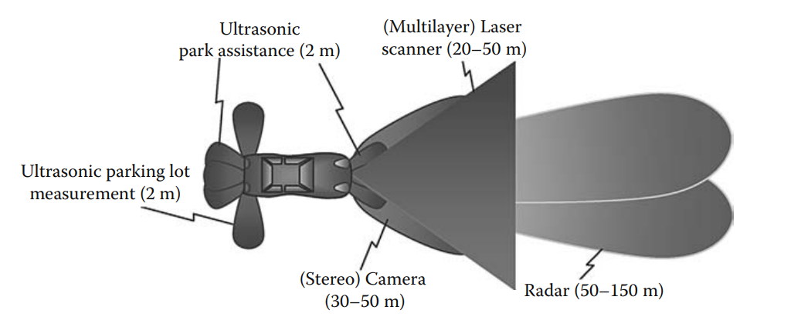
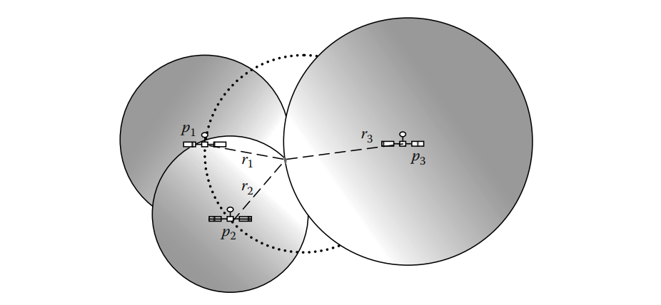

# Intelligent Vehicle Technologies

## 3.1 Introduction: Road Transport and Its Evolution

### 3.1.1 Such a Wonderful Product

Chúng ta có thể nói rằng ô tô có lẽ là sản phẩm thành công và có ảnh hưởng nhất của thế kỷ 20. Nó đã tạo ra một ngành công nghiệp khổng lồ trên toàn cầu; làm thay đổi cuộc sống của hàng triệu người và cũng thay đổi cách tổ chức các thành phố.

Tuy nhiên, sự tăng trưởng mạnh mẽ này cũng mang đến nhiều vấn đề mà ngày nay chúng ta phải đối mặt. Những vấn đề này chủ yếu liên quan đến an toàn, sự tắc nghẽn cơ sở hạ tầng và nhu cầu năng lượng cho toàn bộ số phương tiện đó. Trong chương này, các công nghệ điện tử mới hiện đang mang lại một số giải pháp cho các vấn đề đó.

### 3.1.2 Safety Problems

Số người tử vong do tai nạn giao thông đã đạt đến mức đáng kinh ngạc. Đây là một thách thức lớn ảnh hưởng đến ngành công nghiệp trên thế giới. Các phương tiện và cơ sở hạ tầng đã được cải thiện rất nhiều, tuy nhiên hiện nay tỷ lệ tai nạn do lỗi của người lái lại gia tăng. Do đó, các kỹ thuật điều khiển mới đang được phát triển nhằm giảm thiểu lỗi của người điều khiển bằng cách từng bước loại bỏ sự can thiệp trực tiếp của họ vào việc điều khiển phương tiện.

### 3.1.3 Congestion Problem

Tình trạng tắc nghẽn cơ sở hạ tầng là một vấn đề nghiêm trọng ở hầu hết các đô thị lớn và trên các tuyến giao thông chính. Nó gây thiệt hại tương đương với vài phần trăm tổng sản phẩm quốc nội (GNP) ở nhiều quốc gia do thời gian và năng lượng bị lãng phí. Hơn nữa, tắc nghẽn còn làm gia tăng ô nhiễm và khí thải gây hiệu ứng nhà kính (GHGs).

Việc cải thiện chất lượng phương tiện đã góp phần tăng khả năng vận chuyển. Để đáp ứng nhu cầu vận chuyển ngày càng tăng, các giải pháp dành cho các quốc gia công nghiệp hiện nay tập trung vào việc quản lý hiệu quả hơn cơ sở hạ tầng và phương tiện, sử dụng hiệu quả tính liên kết giữa các phương tiện vận tải. đồng thời áp dụng các công nghệ điều khiển phương tiện mới.

Các kỹ thuật điều khiển mới như điều khiển hành trình thích ứng (adaptive cruise control - ACC), nếu được thiết kế tốt, có thể cải thiện đáng kể lưu lượng hạ tầng bằng cách giảm khoảng cách thời gian giữa các xe và tạo ra dòng chảy giao thông mượt mà hơn, hạn chế tình trạng kẹt xe.

Một loại điều khiển khác cần được triển khai là kiểm soát nhu cầu lưu thông để tránh tắc nghẽn. Xu hướng là áp dụng một hình thức thu phí đường bộ nhằm giảm lưu lượng giao thông tại các khu vực khi mức độ phương tiện bắt đầu tiến gần đến ngưỡng gây tắc nghẽn.

### 3.1.4 Energy and Emissions

Vấn đề chính của phương tiện cá nhân là loại nhiên liệu mà chúng sử dụng. Phần lớn là sử dụng nhiên liệu hóa thạch, dẫn đến nhiều loại khí thải khác nhau. Mặc dù các nhà sản xuất ô tô đã đạt được nhiều tiến bộ trong việc giảm các chất ô nhiễm tại chỗ, nhưng vẫn còn một số vấn đề liên quan đến NOx và bụi mịn. Tuy nhiên, vấn đề lớn nhất là lượng khí CO₂ phát thải gây ra hiệu ứng nhà kính, trở thành một vấn đề lớn trên toàn cầu.

Các giải pháp trong trung hạn dường như nằm ở hướng tương tự như việc sử dụng cơ sở hạ tầng – bao gồm phân bổ phương thức vận tải hợp lý hơn giữa vận tải công cộng và phương tiện cá nhân, cũng như kiểm soát việc sử dụng phương tiện hiệu quả hơn thông qua các chính sách thu phí đường bộ. Về lâu dài, các loại nhiên liệu mới như biogas hoặc hydro (được sản xuất theo các quy trình trung hòa carbon) có thể mang lại giải pháp toàn diện cho vấn đề phát thải khí nhà kính.

## 3.2 New Technologies

### 3.2.1 Sensor Technologies

Cảm biến là yếu tố thiết yếu trong bất kỳ hệ thống điều khiển nào, và điều này đặc biệt đúng đối với các phương tiện giao thông đường bộ khi chúng ta muốn bổ sung một số tính năng hỗ trợ cho người lái. Ví dụ như cảm biến siêu âm hỗ trợ các thao tác ở tốc độ thấp như đỗ xe, trong khi camera và cảm biến laser cung cấp phạm vi đủ để hỗ trợ khi lái xe trong thành phố. Radar thường được sử dụng để phát hiện phương tiện phía trước khi di chuyển ở tốc độ cao.

#### 3.2.1.1 Ultrasound Sensors

Đây là những cảm biến chủ động đơn giản và chi phí thấp, phát ra sóng siêu âm hình nón thông qua sự kích hoạt điện của một bộ chuyển đổi tĩnh điện hoặc áp điện và nhận lại sóng phản hồi thông qua quá trình chuyển đổi đối xứng. Việc đo thời gian giữa lúc phát và nhận sóng cho phép ước lượng khoảng cách đến vật cản gần nhất, với phạm vi phát hiện tối đa chỉ vài mét. 

Cảm biến siêu âm được sử dụng rộng rãi trong ngành công nghiệp ô tô cho một số ứng dụng, phổ biến nhất là hỗ trợ lùi xe và hệ thống hỗ trợ đỗ xe, cũng như hệ thống phát hiện xâm nhập.

#### 3.2.1.2 Inertial Sensors-Accelerometer-Gyrometers

Một đơn vị đo quán tính đầy đủ (IMU - inertial measurement unit) bao gồm sáu cảm biến cho phép đo lường theo sáu bậc tự do (DoF - degrees of freedom) của một phương tiện, cụ thể là ba góc quay (nghiêng dọc – roll, nghiêng ngang – pitch, và xoay quanh trục đứng – yaw) và ba gia tốc tuyến tính.

Tuy nhiên, vì phương tiện di chuyển trên mặt đường nên chỉ cần đo góc quay quanh trục thẳng đứng (yaw) và gia tốc theo phương dọc. Hai yếu tố này đủ để tái tạo xấp xỉ quỹ đạo chuyển động của phương tiện.

#### 3.2.1.3 Light Detection and Ranging or Laser Detection and Ranging

LIDAR (Light Detection and Ranging) hoặc LADAR (Laser Detection and Ranging) là các cảm biến chủ động bao gồm một nguồn sáng, hệ thống phát hiện photon, mạch đo thời gian, và hệ thống quang học cho cả nguồn phát và bộ thu.

LIDAR phát ra một tín hiệu liên tục được điều chế biên độ và xác định độ lệch pha của tín hiệu phản xạ. Với tần số hình sin cố định **𝑓**, nếu có một vật thể ở khoảng cách **𝑑**, sẽ có độ lệch pha **Δ𝜑 = 2𝜋𝑓(2𝑑/𝑐)** giữa tín hiệu phát và tín hiệu thu, với **𝑐** là vận tốc ánh sáng. Khoảng cách ước lượng đến vật thể được tính bằng **𝑑 = Δ𝜑𝑐/4𝜋𝑓**.

Khoảng cách tối đa có thể đo bằng phương pháp lệch pha là **𝑑𝑚𝑎𝑥 = 𝑐/2𝑓 = 𝜆/2** với 𝜆 là bước sóng của tín hiệu. Vượt quá khoảng cách này sẽ khiến số vòng pha trở nên không xác định.

Do tín hiệu hồng ngoại có bước sóng cỡ micromet, kỹ thuật điều chế biên độ được sử dụng để vượt qua giới hạn của đo lệch pha.

Một kỹ thuật LADAR khác là phát các xung, thu sóng phản xạ, và đo thời gian truyền đi - quay về. Các xung này được điều chế biên độ bằng mã giả ngẫu nhiên để dễ dàng ghép nối tín hiệu phát và thu.

Bằng cách sử dụng đầu quay hoặc gương, thiết bị sẽ quét nhiều hướng để xác định khoảng cách đến vật cản ở nhiều phương khác nhau. Một sự đánh đổi giữa độ phân giải, góc quét và tốc độ quét được lựa chọn nhằm đạt hiệu suất phù hợp cho từng ứng dụng. Trong điều kiện thời tiết tốt, các nguồn laser cho phép có thể phát hiện vật cản ở khoảng cách lên đến 200 mét với độ chính xác vài cm.

Vấn đề chính của các thiết bị quét này nằm ở chi phí và độ tin cậy của các thành phần cơ khí trong suốt vòng đời của phương tiện. Công nghệ vi cơ điện (MEMS) có thể là hướng phát triển mới. Với kích thước nhỏ hơn sẽ giảm quán tính, từ đó tăng hiệu suất. Các ma trận gương siêu nhỏ (micromirror arrays) có thể là công nghệ hữu ích để điều khiển độ phân giải của cảm biến LIDAR. Các gương vi mô này còn có thể hoạt động như bộ quét phân tán, tạo ra nhiều tia laser nhỏ quét vùng làm việc từ các góc và vị trí khác nhau.

#### 3.2.1.4 Radio Detection and Ranging

Công nghệ RADAR (Radio Detection and Ranging) là loại cảm biến chủ động phát sóng điện từ tần số cao và ngay lập tức thu lại tín hiệu phản xạ, sau đó xử lý để xác định khoảng cách, phương vị và vận tốc của vật thể

Ở chế độ phát xung, vận tốc tương đối **𝑉𝑟** của mục tiêu được đo thông qua hiệu ứng Doppler, với độ lệch tần số **Δ𝑓 = 2𝑉𝑟𝑓/𝑐**. Khoảng cách được xác định thông qua ước lượng cường độ tín hiệu phản xạ, với hệ số tỷ lệ là **1/𝑑^4**.

Tương tự như LIDAR, RADAR dạng sóng liên tục cũng được sử dụng, nhưng được điều chế tần số (FMCW – Frequency Modulated Continuous Wave), giúp loại bỏ sự mơ hồ do hiệu ứng Doppler thông qua xử lý miền tần số phù hợp. Ở tần số cao (khoảng 77 GHz), công nghệ FMCW kinh tế hơn do không cần các thành phần đắt tiền như trong phát xung. Ngoài ra, FMCW cho phép đo khoảng cách ngắn hiệu quả vì tín hiệu phản xạ được thu liên tục, trong khi RADAR dạng xung cần thời gian hồi phục sau mỗi xung phát.

Trong ngành công nghiệp ô tô, RADAR có thể phát hiện vật thể ở khoảng cách lên đến 150 mét trong phạm vi quét 120 độ. Nó có khả năng đo vận tốc tương đối lên đến 60 m/s (tương đương 215 km/h) với độ chính xác cao.

#### 3.2.1.5 Vision Sensor

Cảm biến hình ảnh (vision sensors) cung cấp một mảng 2D gồm tới hàng triệu điểm ảnh với góc nhìn rộng, phụ thuộc vào hệ thống quang học. Bộ cảm biến CMOS (Complementary Metal–Oxide Semiconductor) ngày càng phổ biến hơn CCD (Charge-Coupled Device) nhờ có dải sáng rộng hơn (phi tuyến), tiêu thụ điện năng và chi phí thấp hơn, đồng thời hỗ trợ xử lý độc lập từng điểm ảnh. Công nghệ SoC (System on chip) cho phép thiết kế các thiết bị tích hợp có khả năng xuất dữ liệu tiền xử lý một cách nhanh chóng để các higher level application xử lý tiếp.

Hệ thống stereo-vision sử dụng hai hình ảnh chụp từ hai vị trí hơi lệch nhau. Thuật toán đối sánh điểm ảnh giữa hai ảnh sẽ tạo ra "disparity map", phản ánh mức độ lệch ngang giữa hai ảnh nếu hai camera được lắp song song. Khi camera được hiệu chuẩn chính xác, ta có thể tái tạo sự phân bố không gian của vật thể dựa vào disparity map.

Khoảng cách giữa tâm quang học của hai camera gọi là baseline quyết định khả năng ước lượng khoảng cách. Camera đặt gần nhau cho độ chính xác cao ở cự ly gần nhưng tầm xa thấp, còn camera đặt xa nhau giúp mở rộng tầm xa nhưng độ chính xác ở gần sẽ giảm.

#### 3.2.1.6 Global Navigation Satellite System

Hệ thống định vị toàn cầu (GPS - Global Positioning System) là một hệ thống cung cấp thông tin về thời gian, vị trí và vận tốc tại bất kỳ địa điểm nào trên hành tinh. Một chòm sao gồm 24 vệ tinh được phân bố đều ở độ cao 20.200 km, theo các quỹ đạo tròn có chu kỳ 12 giờ, nghiêng 55 độ so với mặt phẳng xích đạo, nhằm cung cấp độ phủ sóng toàn cầu với chi phí hợp lý. Các vệ tinh sử dụng đồng hồ nguyên tử để giữ thời gian nhất quán. Chúng có khả năng phát hai sóng mang vi ba, với các tần số lần lượt là 1227,60 MHz và 1575,42 MHz.

Nguyên lý cơ bản của hệ thống định vị vệ tinh toàn cầu (GNSS - Global Navigation Satellite System) là tam giác hóa. Nếu bộ thu có thể ước lượng được khoảng cách giữa nó và một số vệ tinh có vị trí đã biết, thì nó phải nằm ở đâu đó bên trong thể tích được xác định bởi giao điểm của các mặt cầu, mỗi mặt cầu có tâm là một vệ tinh và bán kính bằng khoảng cách đã ước lượng. Khoảng cách này được tính toán thông qua việc ước lượng thời gian truyền sóng giữa vệ tinh phát và bộ thu. Thông điệp phát đi chứa một dấu thời gian, được so sánh với thời gian thu nhận tuyệt đối, với điều kiện bộ thu được đồng bộ với chòm vệ tinh. Việc định thời này phải cực kỳ chính xác, vì ở tốc độ ánh sáng, sai số 1 micro giây sẽ dẫn đến sai lệch vị trí 300 m.

Vị trí của bộ thu GPS được tính bằng cách sử dụng thông tin của các vị trí p₁, p₂, p₃ được truyền bởi các vệ tinh, và các khoảng cách giả định r₁, r₂, r₃, thu được từ thời gian truyền sóng. Bộ thu được định vị tại giao điểm của các mặt cầu, có tâm lần lượt là p₁, p₂ và p₃, với các bán kính lần lượt là r₁, r₂ và r₃.

Để xác định chính xác vị trí tâm của các mặt cầu, các vệ tinh truyền đi quỹ đạo thực tế của chúng để sai lệch so với quỹ đạo danh định không bị truyền vào phép tính vị trí của bộ thu. Hơn nữa, để ước lượng chính xác bán kính của các mặt cầu, đồng hồ của bộ thu và vệ tinh phải được đồng bộ thông qua các thuật toán phân tán phức tạp nhằm giảm sai lệch đồng hồ của bộ thu.

Các trạm gốc địa phương có thể cung cấp thêm thông tin để hiệu chỉnh sai số bằng các yếu tố điều chỉnh tinh vi khác nhau, chẳng hạn như hiện tượng khúc xạ ở tầng điện ly (cao từ 50–500 km), làm biến dạng nhẹ đường đi của ánh sáng và gây ra sự sai lệch giữa quãng đường thực sự của sóng điện từ và đường thẳng lý tưởng. Các hiệu chỉnh tầng điện ly này phải được truyền liên tục, vì hình học của bài toán luôn thay đổi dù chậm. Các hệ thống định vị GPS nhận được hiệu chỉnh như vậy từ trạm được gọi là GPS vi sai (DGPS - Differential GPS).

Một nguồn sai số phổ biến khác là sự che khuất và phản xạ của sóng điện từ, khi tia trực tiếp bị cản bởi một vật cản trong khi tia phản xạ vẫn đến được bộ thu; khi đó, chiều dài của đường đi gián tiếp sẽ được dùng trong phép tính, có thể gây ra bước nhảy trong ước lượng vị trí. Bộ lọc thông thấp thường được sử dụng để giảm thiểu bất kỳ sự thay đổi đột ngột nào trong ước lượng vị trí.

Các cảm biến GNSS trong ô tô thông thường cung cấp độ chính xác định vị khoảng 10 m. Khi sử dụng hiệu chỉnh cục bộ truyền đến bộ thu (DGPS), có thể dễ dàng đạt độ chính xác 1 m, trong khi các bộ thu cao cấp như GPS định vị động học thời gian thực (RTK - Real-time Kinematic) có thể cung cấp ước lượng vị trí chính xác đến từng centimet.

### 3.2.2 Sensor Fusion

#### 3.2.2.1 Introduction

Sensor fusion là quá trình sử dụng nhiều cảm biến để cung cấp một ước lượng về trạng thái của phương tiện và môi trường xung quanh nó. Khó khăn chính trong việc hợp nhất dữ liệu là việc tổng hợp dữ liệu thường có các mốc thời gian không đồng bộ, và các dữ liệu cảm biến thì chỉ phản ánh một phần và có nhiều nhiễu. Nếu thuật toán hợp nhất dữ liệu phải đồng bộ toàn bộ dữ liệu trước khi thực hiện một chu kỳ xử lý, điều đó có thể gây ra độ trễ cao, làm ảnh hưởng đến khả năng điều khiển hệ thống hoặc gây chậm trễ trong phản ứng.

#### 3.2.2.2 Sensor Fusion for Improved Localization

Bài toán định vị là một ví dụ điển hình về việc hợp nhất dữ liệu cảm biến không đồng nhất. Các cảm biến được sử dụng để định vị vị trí của hệ thống có thể là cảm biến tuyệt đối hoặc cảm biến tương đối. Các cảm biến vị trí tuyệt đối như GNSS thường có độ chính xác hoặc tần suất làm mới chưa đủ cho các ứng dụng điều khiển ô tô. Các cảm biến vị trí tương đối như radar, LIDAR, camera, bộ đếm xung và bộ thu phát siêu âm thường có độ chính xác cao.

Tuy nhiên, việc chỉ sử dụng cảm biến tương đối, ngay cả khi vị trí ban đầu được biết chính xác, luôn dẫn đến sai số tăng không giới hạn. Hiện tượng này được gọi là vấn đề trôi sai số trong phương pháp tự tính (dead-reckoning drifting problem).

Việc hợp nhất cảm biến tuyệt đối và cảm biến tương đối là một phương pháp để đạt được vị trí vừa tuyệt đối vừa chính xác. Lý thuyết bộ lọc Kalman (KF - Kalman filter) cho kết quả rất tốt, vì đây là một bộ ước lượng tối ưu. Ở mỗi bước, một dự đoán sơ bộ về phân bố vị trí của vật thể di động được gọi là hàm niềm tin (belief function) sẽ được tính toán từ các phép đo và niềm tin trước đó, cùng với lệnh điều khiển bộ chấp hành và các mô hình nội tại của hệ thống (mô hình hệ thống và mô hình cảm biến). Khi một tập dữ liệu cảm biến mới được thu thập, dự đoán đó sẽ được hiệu chỉnh thành một hàm niềm tin hậu nghiệm để sử dụng cho chu kỳ kế tiếp. Điều này lý giải tại sao bộ lọc Kalman thường được phân loại là bộ lọc ước lượng trạng thái kiểu dự đoán–hiệu chỉnh (predictor–corrector).

Trong các ứng dụng định vị hiện đại phổ biến, khi GPS có độ chính xác 10 mét được hợp nhất với đo quán tính odometry, chúng có thể cung cấp ước lượng với độ chính xác xấp xỉ 1 mét, phù hợp cho các hệ thống điều hướng tư vấn. Việc sử dụng cảm biến đắt tiền hoặc các dịch vụ hiệu chỉnh (đòi hỏi một hình thức truyền thông nào đó) có thể nâng độ chính xác lên tới 10 cm, từ đó phù hợp cho các hệ thống điều khiển phương tiện.

### 3.2.3 Wireless Network Technologies

Các công nghệ truyền thông không dây được ứng dụng vào lĩnh vực ô tô đã mở ra những ứng dụng mới như điều hướng (navigation), quản lý đội xe (fleet management), hệ thống thanh toán ( billing facilities), và an toàn giao thông đường bộ (road security). Tất cả các ứng dụng hiện đang có mặt trên thị trường đều dựa vào việc trao đổi dữ liệu giữa phương tiện và cơ sở hạ tầng (V2I – vehicle-to-infrastructure) thông qua các mạng riêng hoặc giao thức riêng. Các tiêu chuẩn cho giao tiếp giữa các phương tiện với nhau (V2V – vehicle-to-vehicle) hiện đang được nghiên cứu.

Vì số lượng phương tiện là hàng triệu và có tuổi thọ trung bình lên tới 10 năm hoặc hơn, cùng với việc công nghệ luôn thay đổi liên tục, nên hệ thống truyền thông và các giao thức liên quan phải đáp ứng các yêu cầu nghiêm ngặt về độ tin cậy, khả năng mở rộng và tính linh hoạt. Do đó, việc tuân thủ mô hình kết nối hệ thống mở 7 lớp (OSI) sẽ là vấn đề quan trọng để đảm bảo khả năng tương thích giữa các công nghệ truyền thông V2V trong tương lai.

Giao thức định tuyến IPv6 có thể đóng vai trò quan trọng, vì giao thức này hỗ trợ cả các mạng không dây như Wifi (IEEE 802.11), Wimax (IEEE 802.16) và các mạng di động (GSM, GPRS, UMTS), đồng thời đơn giản hóa việc định tuyến dữ liệu qua các nút không đồng nhất, giảm bớt độ trễ và tài nguyên xử lý, vì IPv6 không phụ thuộc vào lớp vật lý. Nó cũng hỗ trợ các giao thức định tuyến tương thích với mạng di động, như trong các nghiên cứu của Lực lượng Công tác Kỹ thuật Internet về Tính Di động Mạng (IETF NEMO -  International Engineering Task Force for Network Mobility), và tương thích với mạng ad-hoc, như các nghiên cứu của IETF MANET (IETF Mobile Ad-hoc Networking).

### 3.2.4 Intelligent Control Applications

Các cơ cấu chấp hành truyền thống thực hiện lệnh của người lái theo cách trực tiếp, trong khi các ECU có thể nâng cao hiệu suất vượt xa khả năng con người. Băng thông thao tác của con người, mà trong đó 10 Hz được xem là giới hạn trên, dễ dàng bị vượt qua bởi các thiết bị điện cơ. Ví dụ tiếp theo sẽ cho thấy cách mà “điều khiển thông minh” có thể nâng cao đáng kể hiệu suất của hệ thống phanh.

#### 3.2.4.1 Antilock Braking System

Hệ thống chống bó cứng phanh (ABS) cho các ứng dụng ô tô được giới thiệu bởi Teldix vào những năm 1960, trước khi Bosch mua lại bằng sáng chế và cải tiến nó qua nhiều thế hệ ABS liên tiếp. Hệ thống này có thể kích hoạt và nhả từng phanh lên đến 50 lần mỗi giây nên mỗi lốp xe đạt được lực ma sát dọc tối ưu và lực ma sát ngang đủ tốt, nhờ đó khoảng cách phanh được giảm thiểu trong khi khả năng điều khiển xe vẫn ở mức chấp nhận được.

Các thuật toán điều khiển ABS đảm bảo rằng điểm vận hành luôn duy trì trong khoảng giữa hai biên A và B được hiển thị trong hình. Khi phanh được tác động, động học của xe và định luật ma sát nhanh chóng làm trượt điểm vận hành từ điểm O đến điểm S, dẫn đến hệ số lực phanh cuối cùng là 50% và tỷ lệ trượt là 100% (bánh bị khóa). Nếu phanh được nhả ra, sự trượt sẽ dần trở về 0. Nếu tốc độ hoàn tác tác động đủ nhanh, lực phanh có thể được duy trì ở mức cao.

#### 3.2.4.2 Electronic Stability Program

Chương trình ổn định điện tử (ESP) là một phần mở rộng của hệ thống ABS đưa việc kiểm soát lực quay quanh trục dọc (yaw) đến mức tối ưu, bằng cách thiết lập mối liên hệ giữa góc lái, tốc độ từng bánh xe và công suất động cơ nhằm tối ưu hóa việc kiểm soát quỹ đạo khi vào cua, tránh hiện tượng understeering (xe bị đẩy thẳng ra ngoài cua) và oversteering (đuôi xe quăng ngược lại) thông qua việc điều chỉnh chính xác tốc độ quay của từng bánh xe.

#### 3.2.4.3 X-by-Wire Technologies

Công nghệ X-by-wire là một thuật ngữ tổng quát chỉ những kiến trúc điện tử loại bỏ các cơ cấu truyền động cơ khí và thủy lực cùng các thành phần trung gian, thay vào đó là các thành phần điện tử và điện, được liên kết với nhau chỉ bằng dây dẫn, dùng để truyền thông tin và năng lượng.

Công nghệ X-by-wire tối ưu hóa các ứng dụng điều khiển và thậm chí nâng cao hiệu suất xe, do nó áp dụng điều khiển cơ cấu chấp hành hoàn toàn bằng điện tử, dù có thể đánh đổi về độ tin cậy. Các vấn đề về độ tin cậy được giải quyết thông qua việc sử dụng hệ thống linh kiện kép một cách hệ thống

Các nguyên mẫu SPARC X-by-wire, được phát triển trong dự án SPARC, đã mở rộng và tích hợp các chức năng ABS và ESP truyền thống trong một bộ điều khiển tổng thể cho xe, có nhiệm vụ phối hợp giữa các cơ cấu phanh và lái nhằm nâng cao khả năng điều khiển hệ thống.

### 3.2.5 Latest Driving Assistance

Hệ thống hỗ trợ đầu tiên xuất hiện trên ô tô là hệ thống chống bó cứng phanh (ABS). Gần đây, nhiều hệ thống mới đã xuất hiện, tập trung vào việc điều khiển tốc độ và vô-lăng trong các tình huống khác nhau.

Một trong những chức năng đầu tiên là hệ thống kiểm soát hành trình thích ứng (ACC - Adaptive Cruise Control), là bản nâng cấp của hệ thống kiểm soát hành trình truyền thống (Cruise Control), vốn duy trì tốc độ xe ở một giá trị đặt trước. ACC cũng cố gắng duy trì tốc độ đặt, nhưng nếu có xe chậm hơn ở cùng làn đường, hệ thống sẽ điều chỉnh tốc độ dựa trên khoảng cách tới xe đó. Nhờ cảm biến đo khoảng cách và tốc độ tương đối (LIDAR hoặc RADAR), bộ điều khiển điều chỉnh tốc độ xe thông qua việc kiểm soát động cơ hoặc phanh.

Những hệ thống đầu tiên xuất hiện trên thị trường Nhật Bản vào cuối những năm 1990 hoạt động kém trong điều kiện thời tiết xấu (do sử dụng LIDAR), khiến cảm biến không nhận diện được xe phía trước. Những hệ thống mới hơn, dựa trên radar và có khả năng xử lý thông tin quay vòng hoặc thị giác để nhận biết bán kính cua đường, hoạt động hiệu quả hơn rất nhiều. Một chức năng hiện đại hơn sử dụng công nghệ tương tự là phát hiện vật cản nâng cao và dự đoán va chạm, nhờ kết hợp thông tin từ radar và camera stereo.

Hiện nay, các chức năng mới tập trung vào hướng dẫn xe theo chiều ngang, với các cơ cấu chấp hành lái điện và bộ điều khiển điện tử. Một trong những ứng dụng đầu tiên trên thị trường là hệ thống giữ làn đường (lane-keeping), nơi thông tin vị trí xe trong làn được thu nhận thông qua xử lý ảnh. Từ đó, lỗi sai lệch được tính toán và mô-men xoắn được áp dụng lên trục lái để đưa xe trở về giữa làn đường. Hiện tại, hệ thống chỉ hỗ trợ tài xế, người vẫn chịu trách nhiệm lái.

Sử dụng cùng các cơ cấu lái điện và cảm biến hình ảnh có khả năng tái tạo không gian 3D xung quanh xe, một ứng dụng ấn tượng hơn hiện đang được tích hợp vào những chiếc xe tiên tiến nhất hỗ trợ đỗ xe (parking assistance). Dựa vào thông tin 3D từ một hoặc nhiều camera gắn trên xe, kết hợp với cảm biến siêu âm, máy tính sẽ tạo ra quỹ đạo tối ưu để thực hiện đỗ xe song song, điều khiển vô-lăng tự động. 

## 3.3 Dependability Issues

### 3.3.1 Introduction

Tính tin cậy (Dependability) là một thuật ngữ tổng quát dùng để chỉ các thuộc tính hoạt động tốt và không tốt của một hệ thống hoặc phân hệ. Các thuộc tính của tính tin cậy thường được gọi bằng từ viết tắt RAMS:
- Reliability (độ tin cậy): Chỉ sự liên tục trong cung cấp dịch vụ của hệ thống, thường được đo bằng thời gian trung bình giữa các lần hỏng (MTBF).
- Availability (tính sẵn sàng): Chỉ mức độ mà hệ thống sẵn sàng hoạt động khi được yêu cầu.
- Maintainability (khả năng bảo trì): Chỉ khả năng khôi phục hệ thống sau khi xảy ra sự cố, thường được đo bằng thời gian trung bình để sửa chữa (MTTR).
- Safety (tính an toàn): Chỉ nguy cơ xảy ra sự cố nghiêm trọng (thậm chí gây chết người), được đánh giá dựa trên xác suất xảy ra và mức độ nghiêm trọng của hậu quả.
- Ngoài ra, còn có thể đề cập đến Security (bảo mật), là khả năng của hệ thống trong việc chỉ cho phép người dùng được xác thực vận hành, và khả năng chống lại các cuộc tấn công có chủ đích.

Các quy trình chứng nhận và kiểm định (certification and homologation) đảm bảo rằng các phương tiện thông minh vận hành trên đường công cộng đều có các thuộc tính nằm trong giới hạn cho phép. Các tiêu chuẩn này không ngừng được cập nhật, bổ sung thêm nhiều yêu cầu bắt buộc như: dây đai an toàn (1979), thiết bị chống trộm điện tử (1995), và ABS (2003) theo tiêu chuẩn châu Âu.

Các nhà sản xuất và nhà cung cấp đã tiến hành các nghiên cứu chuyên sâu về kiến trúc phần cứng và phần mềm, được thể hiện qua sự ra đời của các tiêu chuẩn như MISRA, AUTOSAR và X-by-wire nhằm xây dựng các hướng dẫn thiết kế hệ thống an toàn chất lượng cao. Đối với công nghệ drive-by-wire, các hướng dẫn này có thể trở thành tiêu chuẩn chứng nhận mới, khi có đủ bằng chứng về tính an toàn mà không cần đến các yếu tố bảo vệ cơ học truyền thống.

Vấn đề trách nhiệm pháp lý đặt ra mối nguy tiềm ẩn giữa nhà sản xuất, nhà cung cấp và người dùng. Trách nhiệm thường thuộc về người lái, trừ khi có lỗi chức năng nghiêm trọng trong hệ thống được chứng minh. Thiết bị ghi dữ liệu (data loggers) là một giải pháp hữu hiệu để giải quyết các tranh chấp về trách nhiệm pháp lý và đã được áp dụng kể từ khi hệ thống túi khí (airbag) được giới thiệu.

### 3.3.2 Fail-Safe Automotive Transportation Systems

Nguyên nhân gốc rễ của một tai nạn có thể đến từ yếu tố bên ngoài hoặc nội tại của hệ thống giao thông và người sử dụng. Mức độ an toàn tổng thể đạt được thông qua các phân tích giảm thiểu rủi ro được thực hiện ở các cấp độ khác nhau nhằm ngăn chặn các sự kiện thảm họa xảy ra:
- Cải thiện độ tin cậy nội tại của hệ thống (tăng cường độ bền cho phần cứng và phần mềm)
- Loại trừ các mối đe dọa tiềm tàng từ cơ sở hạ tầng vận hành của hệ thống
- Xác định các quy trình vận hành phù hợp để ngăn chặn việc người dùng sử dụng sai hệ thống

Trong số các cấp độ này, các ứng dụng trong ngành ô tô thường có ít giải pháp hơn so với các hệ thống giao thông đường sắt hoặc hàng không, vì:
- Các hạn chế về chi phí và không gian cản trở việc sử dụng các kỹ thuật dư thừa (redundancy)
- Cơ sở hạ tầng đường bộ hoàn toàn mở
- Phần lớn tài xế không phải là người điều khiển chuyên nghiệp

Một hệ thống giao thông được gọi là “an toàn khi xảy ra lỗi” (fail-safe) khi việc xảy ra lỗi dẫn đến một trạng thái an toàn, trong đó chỉ cho phép hoạt động giao thông có giới hạn.

Trong trường hợp hệ thống giao thông đường sắt, trạng thái an toàn đạt được bằng cách dừng tàu. Thiết kế tổng thể của hệ thống ngăn không cho các tàu khác đi vào khối (block) vùng lớn hơn khoảng cách dừng tối đa phía sau phương tiện đã dừng.

Trong trường hợp giao thông hàng không, các lỗi được xử lý thông qua các biện pháp dư thừa. Mọi thành phần quan trọng đều được lắp ba hoặc bốn lần, và thành phần bị lỗi sẽ được loại khỏi chu trình điều khiển thông qua cơ chế bỏ phiếu (voting mechanism).

Trong trường hợp hệ thống giao thông ô tô, việc gặp trục trặc phức tạp hơn. Tuy nhiên, từ góc nhìn của các phương tiện khác, một chiếc xe bị hỏng hoặc dừng lại là một vật cản. Nói cách khác, xử lý lỗi ở cấp độ phương tiện không phải lúc nào cũng đủ để loại trừ vấn đề, và vấn đề này có thể ảnh hưởng tới toàn đội xe.

Hiện nay, một số hệ thống hỗ trợ người lái tiên tiến (ADAS) đang được nghiên cứu và đưa ra thị trường nhằm phát hiện vật cản và hỗ trợ các thao tác tránh va chạm trong trường hợp có xe bị hỏng nằm trên đường.

Khi, bất chấp các cảnh báo, phương tiện đi vào trạng thái va chạm không thể tránh khỏi (ICS – inevitable collision state), và trước khi va chạm xảy ra, các hành động phù hợp có thể giúp giảm thiểu thiệt hại, trước khi các biện pháp an toàn thụ động được kích hoạt.

Phát hiện va chạm không thể tránh khỏi, phanh tự động, căng dây an toàn, kích hoạt túi khí sớm là một số thách thức mà các ứng dụng xe thông minh ngày nay phải đối mặt.

Xe có thể đi vào ICS do một vật cản “di chuyển” vào vùng nguy hiểm của xe, ví dụ như cây đổ trên đường hoặc xe khác di chuyển hỗn loạn. Một phương tiện cũng có thể đi vào ICS vì khả năng cảm nhận không gian, thời gian không đầy đủ, có thể do lỗi cảm biến hoặc do vật cản bị khuất phía sau khúc cua.

Công nghệ giao tiếp giữa phương tiện với phương tiện (V2V) và giữa phương tiện với hạ tầng (V2I) mang đến các ứng dụng mới, giúp nâng cao an toàn và đưa ra giải pháp ngăn phương tiện khác đi vào trạng thái ICS:
1. Một chiếc xe dừng có thể phát sóng cảnh báo – “roadcast” đến tất cả các phương tiện trong phạm vi
2. Thông tin về tai nạn có thể được tải lên các hệ thống giám sát giao thông trung tâm phù hợp, và sau đó được tải về cho các phương tiện đang đi vào khu vực đó
3. Mở rộng ra, nếu băng thông đủ lớn, mọi phương tiện nên phát sóng hành trình của mình để tạo nên một hệ thống nhận thức môi trường dư thừa

Các ứng dụng này có tiềm năng mạnh mẽ trong việc cải thiện an toàn vì chúng hoạt động trước khi ICS xảy ra và giải quyết nguyên nhân gốc rễ thay vì cố gắng giảm thiểu hậu quả, với phạm vi “cảm nhận” vượt xa tầm của các cảm biến tự nhiên hoặc công nghệ. Theo nghĩa đó, các công nghệ truyền thông đang mở ra những hướng đi mới trong các vấn đề an toàn ô tô.

Hơn nữa, chúng cung cấp một cách tiếp cận toàn diện. Hệ thống giao thông ô tô an toàn khi lỗi xảy ra hiện đang được thiết kế để mở rộng lên quy mô toàn đội xe.

Mức độ an toàn tổng thể của hệ thống sẽ phụ thuộc vào:
- Công nghệ cảm biến,
- Độ tin cậy của bộ điều khiển và cơ cấu chấp hành
- Hiệu quả truyền thông tin trong toàn đội xe

### 3.3.3 Intelligent Autodiagnostic

Khả năng phát hiện lỗi là yếu tố thiết yếu để đảm bảo sự sống còn của hệ thống giao thông và người sử dụng. Ứng dụng truyền thống đầu tiên của phát hiện lỗi là cài đặt các cảm biến thích hợp để giám sát các tham số vật lý phản ánh tổng thể tình trạng của hệ thống và các hệ thống con. Các cảm biến đo áp suất lốp hoặc nhiệt độ động cơ là những ví dụ tiêu biểu cho các ứng dụng giám sát và chẩn đoán đơn giản.

Các ứng dụng phát hiện và chẩn đoán lỗi thông thường thường dựa trên tình huống cụ thể: các quy tắc đơn giản được thiết kế để xác định liệu một lỗi có xảy ra hay không, sử dụng các ngưỡng, vùng hai chiều (2D domains), v.v. Khi một lỗi được phát hiện, lỗi đó sẽ được ghi lại trong ECU, và tùy theo mức độ nghiêm trọng, cảnh báo có thể được hiển thị ngay lập tức cho người lái xe.

Trước sự gia tăng của các hệ thống ô tô với vai trò chủ yếu thuộc về phần mềm, người ta cũng cần phát hiện các lỗi thực thi do các yếu tố bên ngoài gây ra (chẳng hạn như thời tiết, nhiễu điện từ, hoặc đứt dây dẫn). Để đảm bảo rằng các lệnh từ ECU được gửi đi chính xác, người ta có thể đưa vào các biện pháp dư thừa, có thể là dư thừa về thông tin hoặc phần cứng, nhằm phát hiện sự không nhất quán và kích hoạt các hành vi dự phòng phù hợp. Tuy nhiên, trong đa số các ứng dụng ô tô, các ràng buộc về chi phí, không gian, và thời gian đưa sản phẩm ra thị trường khiến cho việc dư thừa hoàn toàn ECU trở nên không khả thi. Do đó, dư thừa thường được thực hiện trong một ECU duy nhất.

Khi xét đến dữ liệu đầu vào, ECU tiếp nhận có thể kiểm tra tính nhất quán của các tín hiệu dư thừa, và kích hoạt các quy trình phù hợp khi phát hiện sai lệch. Khi xét đến dữ liệu đầu ra, cơ chế phản hồi sẽ được chuyển hướng trở lại đầu vào của vi xử lý. Sự không nhất quán giữa tín hiệu đầu ra được yêu cầu và tín hiệu đầu ra đo được có nghĩa là hoặc đầu ra có lỗi, hoặc vòng phản hồi bị hỏng.

Các ứng dụng chẩn đoán phức tạp hơn cũng đang được thử nghiệm thực tế, chẳng hạn như phát hiện đứt gãy cơ học, trong đó sử dụng kỹ thuật nhận dạng để ước lượng và giám sát các tham số không thể đo trực tiếp như hệ số giảm chấn và độ cứng của hệ thống treo, nhằm phát hiện các hỏng hóc cơ học sắp xảy ra bằng thuật toán phát hiện lỗi dựa trên mô hình.

Một số nghiên cứu được thực hiện trong lĩnh vực chẩn đoán mạng dây, như trong dự án Smart Embedded Electronic Diagnosis System (SEEDS), nơi các chip phản xạ nhúng được sử dụng để giám sát tình trạng của bộ dây dẫn nhúng. Bộ dây này có thể dài đến 4 km dây, và là nguồn lỗi lớn trong hệ thống.

Vì các chức năng nhúng thường được phân tán qua nhiều ECU, nên đôi khi rất khó xác định ECU nào gây ra lỗi chức năng. Mặt khác, một ECU thường tham gia vào nhiều chức năng, do đó một ECU bị lỗi có thể dẫn đến nhiều lỗi chức năng cùng lúc. Việc đưa vào mối tương quan giữa các lỗi khác nhau có thể là một phương pháp hiệu quả để nâng cao khả năng chẩn đoán, chuyển từ góc nhìn cục bộ sang góc nhìn hệ thống; các kỹ thuật logic mờ (fuzzy logic) và mạng nơ-ron nhân tạo có thể hỗ trợ phát triển các chẩn đoán ở cấp hệ thống như vậy.
