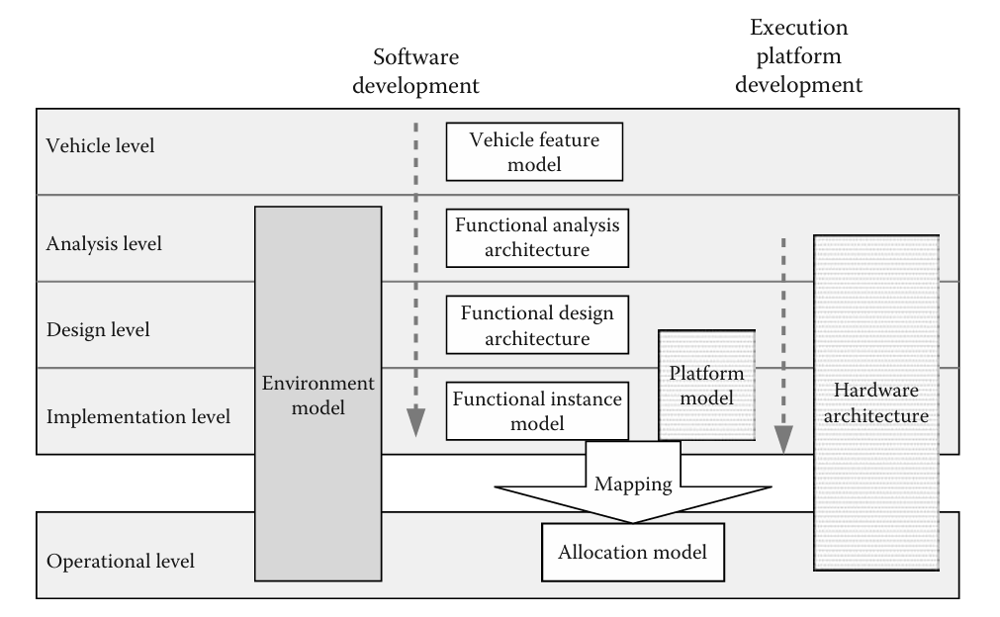

# Các miền chức năng của xe và yêu cầu của chúng

## 1.1 Bối cảnh chung

Ngành công nghiệp ô tô hiện nay đóng vai trò quan trọng vào doanh thu trên thế giới. Vì thế lĩnh vực Embedded Electronics và Embedded Software đã trở nên rất nóng trong mảng nghiên cứu về xe hơi. Những xu hướng chung này đã dẫn đến việc hiện nay có thể nhúng tới nhiều MB dữ liệu trên hơn nhiều vi xử lý được kết nối trong các mạng truyền thông.

Công nghệ điện tử đã tạo ra những bước tiến lớn về chất lượng của các linh kiện điện tử như hiệu suất, độ bền và độ tin cậy. Hơn nữa, một số automotive-embedded network được phát triển như LIN, CAN, TTP/C, FlexRay, MOST, and IDB-1394.

Một lý do công nghệ khác cho sự gia tăng của các hệ thống nhúng ô tô là thực tế các công nghệ phần cứng và phần mềm mới tạo sự phát triển cho các chức năng của xe mà ít tốn kém hơn hoặc không khả thi nếu chỉ sử dụng công nghệ cơ khí. Do đó, chúng đáp ứng các yêu cầu của người dùng cuối về độ an toàn, sự tiện lợi và chi phí. Ví dụ như động cơ điện tử, phanh ABS, ESP, v.v.

Nói tóm lại, nhờ những công nghệ này, khách hàng có thể mua một chiếc xe an toàn, hiệu quả và được cá nhân hóa, trong khi các nhà sản xuất ô tô có thể nắm vững sự khác biệt giữa các biến thể sản phẩm và đổi mới.

Các ứng dụng đa phương tiện và viễn thông trên ô tô đang tăng nhanh do nhu cầu của người tiêu dùng. Ví dụ như các thiết bị giải trí, thiết bị âm thanh / radio, hệ thống định vị. Tóm lại các hệ thống điện tử tiến bộ vô hạn, áp lực lớn nhất của thiết bị điện tử là chi phí.

Cuộc cách mạng điện tử liên tục phát triển mang lại hai tín hiệu tích cực chính. Đầu tiên là dành cho người dùng, những người yêu cầu tăng hiệu suất, sự tiện lợi, hiệu quả trong việc di chuyển, an toàn và ít tốn chi phí nhiên liệu. Tín hiệu tích cực thứ hai là đối với sự phát triển, nghiên cứu công nghệ dựa trên phần mềm của các các nhà sản xuất ô tô và nhà cung cấp.

Tuy nhiên có một thách thức đó chính là sự cố hỏng hóc trong các hệ thống điện tử. Do đó, việc phát triển và sản xuất chúng cần dựa trên một phương pháp phù hợp, bao gồm mô hình hóa, đánh giá và xác nhận tiên nghiệm và thử nghiệm.

Các hệ thống nhúng trong xe thường được phân loại theo các miền tương ứng với các chức năng, ràng buộc và mô hình khác nhau.

## 1.2 Miền chức năng

Các nhà sản xuất ô tô phân biệt một số miền cho các thiết bị điện tử nhúng trong ô tô, mặc dù đôi khi một miền chỉ là một chức năng. Theo bảng thuật ngữ của dự án ITEA EAST-EEA, một miền được định nghĩa là "một phạm vi kiến thức, ảnh hưởng và hoạt động trong đó một hoặc nhiều hệ thống sẽ được xử lý. Thuật ngữ miền có thể được sử dụng như một phương tiện để nhóm các hệ thống cơ khí và điện tử.

Trong lịch sử, 5 miền được xác định là: hệ thống truyền lực, khung gầm, thân xe, HMI và viễn thông. Hệ thống truyền lực có liên quan đến hệ thống tham gia vào động cơ đẩy dọc của xe bao gồm động cơ, hộp số và các thành phần phụ khác. Miền khung gầm bao gồm 4 bánh xe và vị trí chuyển động tương đối của chúng. Theo định nghĩa của EAST-EEA, miền thân xe bao gồm các thực thể không thuộc động lực học của xe chẳng hạn như túi khí, cần gạt nước, đèn chiếu sáng, bộ nâng cửa sổ, điều hòa không khí, thiết bị ghế, v.v. Miền HMI bao gồm thiết bị cho phép trao đổi thông tin giữa các hệ thống điện tử và trình điều khiển (màn hình và công tắc). Cuối cùng, miền viễn thông có liên quan đến các thành phần cho phép trao đổi thông tin giữa xe và thế giới bên ngoài như radio, hệ thống định vị, truy cập Internet, v.v.

### 1.2.1 Miền hệ thống truyền động

Miền này đại diện cho hệ thống điều khiển động cơ từ người lái xe và các yêu cầu từ các bộ phận khác của hệ thống nhúng như climate control, ESP, v.v.

Miền này được thiết kế để tối ưu hóa các thông số nhất định "certain parameters" như mức tiêu thụ nhiên liệu, sự tiện lợi khi lái xe, v.v. Một parameter có thể được kiểm soát bởi một hệ thống như là lượng nhiên liệu phải được phun vào mỗi xi lanh ở mỗi chu kỳ động cơ theo số vòng quay mỗi phút (RPM) của động cơ và vị trí của bàn đạp ga.

Các đặc điểm chính của các hệ thống nhúng của miền hệ thống truyền lực là:
- Từ quan điểm chức năng: Điều khiển hệ thống truyền lực có tính đến các chế độ làm việc khác nhau của động cơ.
- Từ quan điểm phần cứng: Miền này yêu cầu các cảm biến có thông số kỹ thuật phải xem xét việc giảm thiểu các tiêu chí chi phí.
- Từ quan điểm thực hiện: Các chức năng được chỉ định được thực hiện dưới dạng một số nhiệm vụ với các quy tắc kích hoạt khác nhau theo quy tắc lấy mẫu, với các hạn chế nghiêm ngặt về thời gian được áp dụng đối với việc lập lịch tác vụ, làm chủ giao tiếp an toàn với các hệ thống khác và với các cảm biến hoặc bộ truyền động cục bộ.

### 1.2.2 Miền khung gầm

Miền khung gầm bao gồm các hệ thống có mục đích kiểm soát sự tương tác của xe với đường (bánh xe, v.v.). Các bộ điều khiển tính đến các yêu cầu do người lái đưa ra nhằm đảm bảo sự thoải mái của người lái và hành khách. Miền này bao gồm các hệ thống như ABS, ESP, kiểm soát ổn định tự động (ASC) và dẫn động bốn bánh (4WD). Miền khung gầm có tầm quan trọng hàng đầu đối với sự an toàn của hành khách và của chính chiếc xe.

Các đặc điểm của miền khung gầm tương tự như các đặc điểm được trình bày cho miền hệ thống truyền lực: các định luật điều khiển đa biến, thời gian lấy mẫu khác nhau, và các ràng buộc về thời gian nghiêm ngặt khoảng 10ms.

Đối với miền hệ thống truyền lực, các hệ thống điều khiển các thành phần khung gầm được phân phối hoàn toàn trên một bộ vi điều khiển được nối mạng và chúng giao tiếp với các hệ thống khác. Ví dụ hệ thống ESP điều chỉnh quỹ đạo của xe bằng cách điều khiển hệ thống phanh. Vai trò của nó là tự động điều chỉnh quỹ đạo của xe ngay khi có tình trạng thiếu lái hoặc quá lái. Để làm được điều này, nó phải so sánh yêu cầu lái của người lái xe với phản ứng của xe. Điều này được thực hiện thông qua một số cảm biến được phân phối trong xe sau mỗi chu kỳ lấy mẫu. Ngay sau khi cần áp dụng hiệu chỉnh, nó sẽ phanh các bánh trước hoặc bánh sau riêng lẻ hoặc ra lệnh giảm công suất động cơ cho hệ thống hệ thống truyền động. Hệ thống này hợp tác trực tuyến với nhiều hệ thống khác như ABS, điều khiển giảm chấn điện tử (EDC) v.v., để đảm bảo an toàn cho xe.

### 1.2.3 Miền thân xe

Miền thân xe chứa các chức năng được nhúng trong một chiếc xe không liên quan đến việc kiểm soát động lực học của nó. Ngày nay, cần gạt nước, đèn, cửa ra vào, cửa sổ, ghế ngồi và gương được điều khiển ngày càng nhiều bởi các hệ thống phần mềm. Các chức năng của miền thân thường liên quan đến nhiều giao tiếp với nhau và do đó có một kiến trúc phân tán phức tạp.

Trong lĩnh vực này xuất hiện khái niệm về hệ thống con hoặc cụm con dựa trên các mạng cấp cảm biến-thiết bị truyền động chi phí thấp, ví dụ, LIN, kết nối các mô-đun được xây dựng như các hệ thống cơ điện tử tích hợp. Mặt khác, miền cơ thể cũng chứa một hệ thống con trung tâm, được gọi là điện tử cơ thể trung tâm, có chức năng chính là đảm bảo truyền tin nhắn giữa các hệ thống hoặc miền khác nhau.

### 1.2.4 Đa phương tiện, Viễn thông và HMI

Viễn thông trong phương tiện bao gồm các hệ thống hỗ trợ trao đổi thông tin giữa các phương tiện hoặc giữa phương tiện và cơ sở hạ tầng đường bộ. Chúng đã được sử dụng để thu phí đường và trong tương lai sẽ tối ưu hóa giao thông, báo hiệu va chạm, cung cấp chẩn đoán từ xa, cũng như hỗ trợ điều hướng, giải trí, duyệt web, và liên lạc.

Hệ thống HMI (Human-Machine Interface) giúp người lái và hành khách tương tác với xe, bao gồm hiển thị thông tin về trạng thái phương tiện (tốc độ, mức dầu, cửa, đèn, v.v.), tình trạng thiết bị đa phương tiện và tiếp nhận lệnh điều khiển. Nhưng có một vấn đề của HMI là đảm bảo chất lượng, hiệu suất, sự thoải mái và quan trọng nhất là an toàn, tránh làm người lái mất tập trung.

Giao tiếp giữa xe và môi trường (V2V, V2I) sẽ ngày càng quan trọng, mang lại nhiều dịch vụ có giá trị cao. Công nghệ tương lai sẽ bao gồm nhận diện giọng nói, công tắc điều khiển theo tầm nhìn, bàn phím ảo và các hệ thống giám sát phương tiện để giảm tải công việc cho người lái.

### 1.2.5 Active/Passive Safety

Nói về sự an toàn, nhu cầu của khách hàng về sự an toàn khi lái xe ngày càng tăng vì thế thách thức ở đây trong ngành công nghiệp automotive đó là làm thế nào để thiết kế các hệ thống nhúng mà nó đạt được độ an toàn nhất và ít tốn chi phí nhất. 

Trong automotive thì sự an toàn của hệ thống nhúng nhắm vào hai mục tiêu: "active safety" và "passive safety", cảnh báo trước khi va chạm và sau đó hành động sau khi va chạm. Dây an toàn và túi khí là ví dụ về hệ thống giúp giảm ảnh hưởng của tai nạn, và do đó chúng góp phần vào passive safety. Túi khí được điều khiển bằng một thuật toán phức tạp trên một ECU và xử lý thông tin từ các hệ thống khác. Nó được cảnh báo bởi các tín hiệu đến từ các cảm biến khác nhau như cảm biến tốc độ xe, thuật toán này điều chỉnh thời điểm phù hợp để triển khai túi khí. Thiết bị đã hoạt động với một giây kể từ thời điểm va chạm được phát hiện bởi cảm biến để kích hoạt túi khí.

### 1.2.6 Chẩn đoán

Hệ thống điện tử trên ô tô ngày càng phức tạp, với nhiều vi điều khiển tương tác chặt chẽ, làm cho chẩn đoán lỗi trở thành một chức năng quan trọng trong suốt vòng đời xe. Hệ thống chẩn đoán tích hợp (OBD - Onboard Diagnostics) giúp thu thập thông tin và hỗ trợ kiểm tra tình trạng xe, có lợi cho cả chủ xe lẫn kỹ thuật viên sửa chữa.

Ban đầu, OBD chỉ đơn giản bật đèn cảnh báo khi có lỗi, nhưng các hệ thống hiện đại sử dụng giao tiếp tiêu chuẩn hóa để mã hóa và báo cáo lỗi thông qua mã lỗi chẩn đoán (DTC). Mục tiêu chính của tiêu chuẩn hóa này là kiểm soát khí thải trong suốt vòng đời xe.

## 1.3 Các thành phần, mô hình và quy trình được tiêu chuẩn hóa

Thiết kế hệ thống nhúng trên xe dựa trên quy trình phát triển hợp tác, đòi hỏi đảm bảo khả năng tương thích giữa các thành phần do nhiều đối tác phát triển và tăng tính linh hoạt bằng cách dễ dàng chuyển đổi giữa các nền tảng. Vì thế nên việc tiêu chuẩn hóa dịch vụ giúp chia sẻ tài nguyên phần cứng giữa các tiến trình ứng dụng, đặc biệt là trong mạng, giao thức và hệ điều hành.

### 1.3.1 Các giao thức mạng trong xe

Năm 1993, Ủy ban Tiêu chuẩn Truyền thông Dữ liệu và Mạng Xe của SAE đã phân loại ba loại giao thức truyền thông dựa trên tốc độ mạng và chức năng: Class A, Class B và Class C.

- Class A có tốc độ dưới 10 kbps, dành cho mạng cảm biến và cơ cấu chấp hành, với các giao thức tiêu biểu như LIN bus và TTP/A bus.
- Class B hỗ trợ tốc độ trung bình (10–500 kbps), phù hợp cho các hệ thống điện tử thân xe và truyền thông nội bộ, với CAN-B là giao thức phổ biến.
- Class C dành cho các hệ thống an toàn quan trọng trong truyền động và khung gầm, với tốc độ dưới 1 Mbps. Các giao thức như CAN-C (high-speed CAN), TTP/C và FlexRay thuộc nhóm này, yêu cầu độ tin cậy cao và khả năng chịu lỗi tốt.

Các mạng Class C sẽ ngày càng quan trọng trong các ứng dụng X-by-wire, như điều khiển lái và phanh bằng điện tử.

### 1.3.2 Hệ điều hành

OSEK/VDK là hệ điều hành đa nhiệm trở thành tiêu chuẩn trong ngành công nghiệp ô tô Châu Âu. Tiêu chuẩn này được chia thành bốn phần:

- **OSEK/VDX OS**: Định nghĩa về nhân hệ điều hành.
- **OSEK/VDX COM**: Xử lý giao tiếp giữa các tác vụ, cả bên trong và bên ngoài ECU.
- **OSEK/VDX NM**: Quản lý mạng truyền thông giữa các ECU.
- **OSEK/VDX OIL**: Ngôn ngữ mô tả các thành phần của một ứng dụng.

OSEK/VDX OS cung cấp các dịch vụ quản lý đối tượng như:

- **Tasks**: Gồm Basic Tasks (không có điểm chặn) và Extended Tasks (có thể có điểm chặn).
- **Events & Alarms**: Cung cấp cơ chế đồng bộ hóa giữa các tác vụ.
- **Resources**: Quản lý truy cập tài nguyên dùng chung với giao thức Priority Ceiling Protocol (PCP) giúp tránh priority inversion và deadlock.

Hệ thống sử dụng Fixed Priority Scheduling (FP), có thể preemptive hoặc non-preemptive. OSEK/VDX có bốn conformance classes để phân loại mức độ hỗ trợ:

- **BCC1**: Giới hạn tài nguyên, tối ưu bộ nhớ và thuật toán.
- **BCC2**: Hỗ trợ nhiều task trên cùng một mức ưu tiên.
- **ECC1**: Hỗ trợ Extended Tasks nhưng chỉ một task trên mỗi mức ưu tiên.
- **ECC2**: Hỗ trợ đầy đủ tất cả dịch vụ.

OSEK/VDX OIL là một ngôn ngữ mô tả cấu hình ứng dụng cho một ECU (Electronic Control Unit). Ngôn ngữ này cho phép định nghĩa nhiều chế độ ứng dụng khác nhau, chẳng hạn như chế độ vận hành bình thường, chế độ chẩn đoán và chế độ tải xuống.

Để đảm bảo độ tin cậy và khả năng chịu lỗi cho các ứng dụng quan trọng, hệ thống sử dụng phương pháp time-triggered, trong đó OSEKtime cung cấp các dịch vụ như lập lịch tĩnh và time-triggered, xử lý ngắt, phân phối, đồng bộ hóa thời gian và đồng hồ, xử lý thông điệp nội bộ, và cơ chế phát hiện lỗi. OSEKtime tương thích với OSEK/VDX và được bổ sung bởi lớp FTCom để cung cấp dịch vụ truyền thông.

Rubus OS, một hệ điều hành dành riêng cho ngành công nghiệp ô tô, được phát triển bởi Arcticus Systems. Hệ điều hành này bao gồm ba phần:

- **Red Kernel**: Quản lý các tác vụ theo lịch trình time-triggered.
- **Blue Kernel**: Dành cho các tác vụ event-triggered.
- **Green Kernel**: Chịu trách nhiệm xử lý ngắt từ bên ngoài.

### 1.3.3 Middleware

Tính linh hoạt và khả năng chuyển giao của các thành phần ứng dụng trong hệ thống nhúng yêu cầu hai yếu tố chính:

1. Mô tả ngữ nghĩa của các tương tác: Các ứng dụng trên nền tảng phân tán được xây dựng dựa trên mô tả các thành phần, ngữ nghĩa của các loại tương tác giữa các thành phần này và cách chúng được kết hợp. Các tương tác này phải được chỉ định độc lập với việc phân bổ các thành phần vào ECU (Đơn vị điều khiển điện tử).

2. Thuộc tính về thời gian và độ tin cậy: Ở cấp độ ứng dụng, các thuộc tính yêu cầu, đặc biệt là về thời gian và độ tin cậy, phải được đảm bảo khi các thành phần được phân bổ lên nền tảng kỹ thuật, bao gồm hệ điều hành, các trình điều khiển giao tiếp và giao thức, cũng như các trình điều khiển I/O.

Các tính năng này thường được thực hiện thông qua việc chỉ định phần mềm trung gian (middleware). Đầu tiên, cấu trúc của phần mềm trung gian (tức là các thành phần phần mềm được phân bổ trên mỗi ECU và cách chúng tương tác) phải được xác định một cách chính thức. Thứ hai, các dịch vụ giao diện cho phép các thành phần ứng dụng sử dụng các dịch vụ của phần mềm trung gian một cách độc lập với việc phân bổ của chúng cũng phải được cung cấp.

### 1.3.4 Ngôn ngữ mô tả kiến trúc cho các ứng dụng ô tô

Việc chia sẻ ngôn ngữ mô hình hóa giữa các đối tác khác nhau tham gia thiết kế các hệ thống nhúng trên xe hỗ trợ quá trình phát triển hợp tác hiệu quả. Ngôn ngữ này cần cho phép mô tả hệ thống ở các bước khác nhau trong quá trình phát triển như xác định yêu cầu, mô tả chức năng, thiết kế, triển khai, tinh chỉnh, v.v. với việc xem xét các quan điểm khác nhau của các bên liên quan và đảm bảo tính nhất quán giữa các quan điểm này. Nó cũng phải phản ánh cấu trúc của các hệ thống nhúng như một kiến trúc của các thành phần (thành phần phần cứng, thành phần chức năng, thành phần phần mềm).

Khái niệm ngôn ngữ mô tả kiến trúc (Architecture Description Languages - ADLs), phát triển cho các ứng dụng phần mềm lớn, rất phù hợp với mục tiêu này. ADLs được sử dụng để mô tả cấu trúc của một hệ thống thông qua các thành phần được kết nối với nhau để tạo thành các cấu hình.

Những mô tả này không bao gồm chi tiết triển khai, với mục tiêu là làm chủ cấu trúc của các hệ thống phức tạp. Do đó, việc tổ hợp (associated to hierarchy) được sử dụng để chỉ định sự kết hợp của các yếu tố tạo thành cấu trúc cơ bản. Đối với các hệ thống quan trọng, như trong điện tử ô tô, một ADL phải hỗ trợ không chỉ mô tả các khía cạnh chức năng của hệ thống mà còn các khía cạnh phi chức năng (thuộc tính thời gian, độ tin cậy, an toàn), cũng như các công cụ biến đổi và xác minh giữa thiết kế và triển khai, đồng thời duy trì tính nhất quán giữa các mô hình khác nhau.

MetaH, một ADL được chỉ định bởi Honeywell Labs vào năm 1991, đã được chọn làm tiêu chuẩn cho ADL hàng không AADL dưới sự giám sát của SAE vào năm 2001. Đối với lĩnh vực ô tô, nhiều ngôn ngữ đã được đề xuất, ví dụ như EAST-ADL, được chỉ định trong dự án ITEA EAST-EEA của châu Âu và mở rộng trong dự án ATESST. Mục tiêu của EAST-ADL là hỗ trợ mô tả không mơ hồ các hệ thống điện tử nhúng trong xe tại mỗi cấp độ phát triển của chúng, thông qua năm cấp độ trừu tượng, chia thành bảy lớp (còn gọi là artifacts). Các lớp này chủ yếu liên quan đến việc phát triển phần mềm, trong khi các lớp khác liên kết với nền tảng thực thi (ECUs, mạng, hệ điều hành, trình điều khiển I/O, phần mềm trung gian, v.v.). Tất cả các lớp này đều liên kết chặt chẽ, cho phép theo dõi sự tương quan giữa các thực thể liên quan đến quá trình phát triển.

Ngoài việc phân tách cấu trúc, EAST-ADL cũng có khả năng mô hình hóa các mối quan tâm cắt ngang như yêu cầu, mô tả hành vi, và các hoạt động xác minh và kiểm tra. Ở cấp độ xe, mô hình tính năng xe mô tả các tính năng có thể nhìn thấy từ phía người sử dụng, chẳng hạn như hệ thống phanh chống bó cứng (ABS) hoặc cần gạt nước. Kiến trúc phân tích chức năng, ở cấp độ phân tích, là một artifact đại diện cho các chức năng thực hiện các tính năng, hành vi của chúng và sự hợp tác của chúng. Mô hình thiết kế chức năng ở cấp độ thiết kế mô tả sự phân rã hoặc tinh chỉnh các chức năng được mô tả ở cấp độ phân tích để đáp ứng các ràng buộc liên quan đến phân bổ, hiệu suất, tái sử dụng, mối quan tâm của nhà cung cấp, v.v.

Ở cấp độ triển khai, mô hình mẫu chức năng đóng vai trò chuẩn bị việc phân bổ các thành phần phần mềm và tín hiệu trao đổi cho các tác vụ và khung của hệ điều hành. Đây thực chất là một cấu trúc phần mềm phẳng, nơi các thực thể của mô hình thiết kế chức năng đã được khởi tạo. EAST-ADL cũng cung cấp cách mô tả nền tảng phần cứng và các dịch vụ có sẵn (hệ điều hành, giao thức, phần mềm trung gian), đồng thời hỗ trợ chỉ định cách mẫu chức năng được phân bổ vào nền tảng. Điều này được thực hiện thông qua ba artifact khác nhau, bao gồm kiến trúc phần cứng, mô hình nền tảng và mô hình phân bổ. Mô hình phân bổ được sử dụng ở cấp độ vận hành, mô tả các tác vụ được hệ điều hành và khung quản lý, mà các tác vụ này lại được giao thức quản lý. Tất cả các chi tiết triển khai đều được ghi lại ở cấp độ trừu tượng thấp nhất.

Ngôn ngữ EAST-ADL cung cấp tính nhất quán trong và giữa các artifact thuộc các cấp độ khác nhau từ quan điểm cú pháp và ngữ nghĩa, giúp mô hình dựa trên EAST-ADL trở thành một hỗ trợ mạnh mẽ và không mơ hồ không chỉ cho việc hiện thực hóa các thành phần phần mềm mà còn cho việc xây dựng các mô hình thích hợp cho xác nhận và kiểm tra tự động.