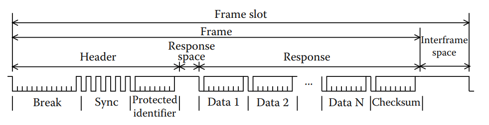

# A Review of Embedded Automotive Protocols

## 4.1 Automotive Communication Systems: Characteristics and Constraints

### 4.1.1 From Point-to-Point to Multiplexed Communications

Kể từ những năm 1970, các hệ thống điện tử dần dần thay thế các hệ thống thuần cơ học hoặc thủy lực. Hiệu suất và độ tin cậy ngày càng cao của các linh kiện phần cứng và công nghệ phần mềm đã cho phép triển khai các chức năng phức tạp. Một trong những mục tiêu chính của các hệ thống điện tử là hỗ trợ người lái kiểm soát phương tiện, thông qua các chức năng liên quan đến hệ thống lái, truyền lực hoặc phanh chẳng hạn như ABS, ESP, EPS, hệ thống treo chủ động v.v. Một lý do khác để sử dụng các hệ thống điện tử là để điều khiển các thiết bị trên thân xe, như đèn, gạt nước, cửa xe, cửa sổ, và gần đây là thiết bị giải trí và truyền thông.

Ban đầu trong điện tử ô tô, mỗi chức năng mới đều được triển khai như một ECU. Tuy nhiên có sự thay đổi vì cần phân tán chức năng qua nhiều ECU và trao đổi thông tin giữa các chức năng. Ví dụ, tốc độ xe được ước lượng bởi bộ điều khiển động cơ hoặc cảm biến bánh xe cần được biết để điều chỉnh lực lái, điều khiển hệ thống treo, hoặc đơn giản là chọn tốc độ gạt nước phù hợp.

Đầu những năm 1990, dữ liệu được truyền qua các liên kết Point-to-Point giữa các ECU. Tuy nhiên, điều này đòi hỏi số lượng kênh truyền thông tỉ lệ với n², trong đó n là số lượng ECU nghĩa là nếu mỗi nút được kết nối với tất cả các nút còn lại, số liên kết sẽ tăng theo bình phương của n, dẫn đến vấn đề về trọng lượng, chi phí, độ phức tạp và độ tin cậy do dây dẫn và đầu nối gây ra.

Vào giữa những năm 1980, Bosch đã phát triển mạng điều khiển CAN (Controller Area Network), lần đầu tiên được tích hợp vào các xe sản xuất của Mercedes vào đầu những năm 1990. Đây là mạng truyền thông được sử dụng phổ biến nhất trong các hệ thống ô tô hiện nay.

### 4.1.2 Car Domains and Their Evolution

Vì các chức năng tích hợp trong ô tô không có cùng yêu cầu về hiệu suất hoặc độ an toàn, nên hệ thống truyền thông được kỳ vọng phải đáp ứng các mức chất lượng dịch vụ (QoS) khác nhau (ví dụ: thời gian phản hồi, độ dao động thời gian – jitter, băng thông, các kênh truyền dẫn dự phòng để chịu lỗi truyền, hiệu quả của cơ chế phát hiện lỗi, v.v.). Thông thường, một hệ thống nhúng trong xe được chia thành nhiều miền chức năng khác nhau tương ứng với các tính năng và ràng buộc riêng biệt. Hai trong số đó liên quan đặc biệt đến điều khiển thời gian thực và an toàn trong hành vi của xe: miền “hệ thống truyền động” (tức là điều khiển động cơ và hộp số) và miền “khung gầm” (tức là điều khiển hệ thống treo, lái và phanh). Miền thứ ba là “thân xe,” chủ yếu đảm nhận các chức năng về sự thoải mái. Các miền “viễn thông” (tức là tích hợp truyền thông không dây, hệ thống giám sát xe và thiết bị định vị), “đa phương tiện,” và “giao diện người – máy” (HMI) tận dụng sự phát triển không ngừng trong lĩnh vực truyền thông đa phương tiện và di động. Cuối cùng, một miền mới nổi lên hiện nay là miền liên quan đến sự an toàn của người ngồi trong xe.

Chức năng chính của miền hệ thống truyền động là điều khiển động cơ. Nó được thực hiện thông qua nhiều luật điều khiển phức tạp với chu kỳ lấy mẫu trong khoảng vài mili giây (do tốc độ quay của động cơ) và được triển khai trên các vi điều khiển có hiệu năng tính toán cao. Để xử lý sự đa dạng của các tác vụ quan trọng, hệ thống cần có khả năng đa tác vụ (multitasking) và áp dụng các ràng buộc nghiêm ngặt về thời gian trong việc lập lịch các tác vụ. Ngoài ra, miền này còn cần trao đổi dữ liệu thường xuyên với các miền khác trong xe như khung gầm (ví dụ: hệ thống ESP, ABS) và thân xe (ví dụ: bảng điều khiển, điều hòa nhiệt độ).

Miền khung gầm bao gồm các chức năng như ABS, ESP, kiểm soát ổn định tự động (ASC), dẫn động 4 bánh (4WD), những chức năng này điều khiển các thành phần khung gầm dựa trên các thao tác lái/phanh và điều kiện lái xe (mặt đường, gió, v.v.). Các yêu cầu truyền thông của miền này tương tự với miền hệ thống truyền động, tuy nhiên vì chúng ảnh hưởng mạnh đến độ ổn định, sự linh hoạt và động lực học của xe, nên các chức năng của khung gầm mang tính chất an toàn nghiêm ngặt hơn. Hơn nữa, công nghệ “X-by-Wire,” vốn đang được sử dụng trong các hệ thống hàng không, hiện đang dần được đưa vào để thực hiện các chức năng lái hoặc phanh. “X-by-Wire” là thuật ngữ chung chỉ việc thay thế các hệ thống cơ khí hoặc thủy lực bằng các hệ thống điện/điện tử hoàn toàn, dẫn đến các phương pháp thiết kế mới để phát triển chúng một cách an toàn, đặc biệt là kiểm soát sự can thiệp giữa các chức năng. Các chức năng của khung gầm và hệ thống truyền động chủ yếu hoạt động như các hệ thống điều khiển vòng kín và hiện nay đang hướng đến cách tiếp cận điều khiển theo thời gian (time-triggered), điều này giúp dễ dàng tích hợp các thành phần được phát triển riêng biệt và đảm bảo hành vi thời gian thực mang tính xác định.

Bảng điều khiển, cần gạt nước, đèn, cửa, cửa sổ, ghế, gương, hệ thống điều hòa… ngày càng được điều khiển bởi các hệ thống dựa trên phần mềm tạo thành miền thân xe. Miền này đặc trưng bởi nhiều chức năng đòi hỏi trao đổi lượng lớn các mẩu thông tin nhỏ giữa các thành phần với nhau. Không phải tất cả các nút đều cần băng thông lớn như mạng CAN cung cấp; điều này dẫn đến việc thiết kế các mạng giá rẻ như mạng kết nối cục bộ LIN và giao thức truyền theo thời gian TTP/A. Trên các mạng này, chỉ có một nút gọi là master có đồng hồ chính xác và điều khiển truyền thông bằng cách thăm dò định kỳ các nút còn lại slave. Sự pha trộn các nhu cầu truyền thông khác nhau trong miền thân xe dẫn đến kiến trúc mạng phân cấp, nơi các hệ thống cơ điện tử tích hợp dựa trên mạng giá rẻ được kết nối với nhau qua xương sống mạng CAN. Việc kích hoạt các chức năng thân xe chủ yếu bắt nguồn từ hành động của tài xế hoặc hành khách (ví dụ: mở cửa sổ, khóa cửa...).

Các chức năng viễn thông như radio xe, CD, DVD, hệ thống định vị trên xe, giải trí phía sau xe, chẩn đoán từ xa… ngày càng trở nên phổ biến. Những chức năng này đòi hỏi trao đổi dữ liệu không chỉ trong nội bộ xe mà còn với thế giới bên ngoài thông qua công nghệ không dây. Ở đây, trọng tâm chuyển từ các thông điệp và tác vụ có ràng buộc thời gian nghiêm ngặt sang các luồng dữ liệu đa phương tiện, chia sẻ băng thông và QoS trong đa phương tiện, trong đó việc bảo vệ tính toàn vẹn (tức là đảm bảo thông tin không bị thay đổi vô tình hay cố ý) và tính bảo mật của thông tin là rất quan trọng. Giao diện người – máy (HMI) nhằm cung cấp giao diện dễ sử dụng và giảm nguy cơ tài xế mất tập trung.

Các hệ thống điện tử đảm bảo an toàn cho người ngồi trong xe đang ngày càng được tích hợp trong ô tô. Ví dụ bao gồm cảm biến va chạm và lật xe, hệ thống bung túi khí và căng dây an toàn, giám sát áp suất lốp và kiểm soát hành trình thích ứng (ACC) – giúp điều chỉnh tốc độ xe để duy trì khoảng cách an toàn với xe phía trước. Các chức năng này tạo thành một miền đang phát triển thường được gọi là “an toàn chủ động và bị động.”

### 4.1.3 Different Networks for Different Requirements

Do nhu cầu ngày càng cao về băng thông và yêu cầu khác nhau về hiệu năng, chi phí và độ tin cậy, các hệ thống mạng trong ô tô cũng được phân chia thành nhiều loại, phù hợp với từng mục đích cụ thể. Năm 1994, tổ chức SAE (Society for Automotive Engineers) đã phân loại các giao thức truyền thông ô tô theo tốc độ truyền và chức năng:
- Class A (dưới 10 kbps): dùng cho các tác vụ đơn giản như điều khiển ghế, khóa cửa, đèn... Ví dụ: LIN, TTP/A.
- Class B (10–125 kbps): chia sẻ thông tin giữa các ECU để giảm số lượng cảm biến. Ví dụ: J1850, CAN tốc độ thấp.
- Class C (125 kbps – 1 Mbps): dùng cho các ứng dụng thời gian thực cần tốc độ cao như điều khiển động cơ (power train) và khung gầm (chassis). Ví dụ: CAN tốc độ cao.
- Class D (>1 Mbps): phục vụ cho truyền tải dữ liệu đa phương tiện hoặc các ứng dụng an toàn yêu cầu độ dự đoán và chịu lỗi cao. Ví dụ: MOST, TTP/C, FlexRay.

Ngày nay, ô tô thường tích hợp nhiều mạng truyền thông khác nhau nối với nhau qua các gateway. Ví dụ, Volvo XC90 có tới 40 ECU kết nối qua LIN, MOST, CAN tốc độ thấp và CAN tốc độ cao. Trong tương lai gần, có thể xuất hiện thêm các bus chuyên biệt cho hệ thống an toàn như Safe-by-Wire Plus.

### 4.1.4 Event-Triggered versus Time-Triggered

Một trong những mục tiêu chính trong bước thiết kế của hệ thống nhúng trên xe là đảm bảo thực thi đúng các chức năng của xe với mức độ an toàn xác định trước, không chỉ trong điều kiện hoạt động bình thường mà còn trong trường hợp một số thành phần bị lỗi hoặc khi môi trường xung quanh xe gây nhiễu. Mạng truyền thông đóng vai trò trung tâm trong việc duy trì trạng thái “an toàn” cho hệ thống nhúng, vì hầu hết các chức năng quan trọng hiện nay đều phân tán và cần truyền thông với nhau. Do đó, các hệ thống truyền thông khác nhau cần được phân tích dựa trên mục tiêu này; đặc biệt là các gói tin truyền qua bus phải đáp ứng các ràng buộc thời gian thực, chủ yếu bao gồm thời gian phản hồi và độ lệch thời gian (jitter) được giới hạn.

Có hai mô hình chính cho truyền thông trong hệ thống ô tô: event-triggered và time-triggered.

- Event-triggered là các gói tin chỉ được truyền khi xảy ra một sự kiện (ví dụ: cửa đã đóng). Trong trường hợp này, hệ thống có khả năng phản ứng càng nhanh càng tốt với các sự kiện bất đồng bộ như cảnh báo. Giao thức truyền thông cần xác định chính sách truy cập bus để tránh va chạm; ví dụ, chiến lược của CAN là gán mức ưu tiên cho từng khung dữ liệu và ưu tiên khung có độ ưu tiên cao hơn. Truyền thông theo sự kiện rất hiệu quả về mặt sử dụng băng thông vì chỉ truyền khi cần thiết. Ngoài ra, hệ thống có thể phát triển mở rộng mà không cần thiết kế lại các nút hiện có, điều này rất quan trọng trong ngành ô tô – nơi thiết kế từng bước (incremental design) là phương pháp phổ biến. Tuy nhiên, việc xác minh rằng các ràng buộc thời gian được đáp ứng không đơn giản và việc phát hiện lỗi nút là một vấn đề.

- Time-triggered có nghĩa là các khung dữ liệu được truyền tại các thời điểm định trước, rất phù hợp với các hệ thống điều khiển phân tán yêu cầu truyền thông định kỳ. Mỗi khung được lập lịch truyền tại một khoảng thời gian xác định trước (gọi là slot), và lịch trình này lặp lại liên tục. Chiến lược truy cập này gọi là phân chia thời gian theo nhiều truy cập (TDMA). Do lịch trình khung được xác định tĩnh, hành vi thời gian là hoàn toàn có thể dự đoán được; do đó, việc kiểm tra các ràng buộc thời gian trong truyền thông dữ liệu trở nên dễ dàng. Một đặc tính quan trọng khác của TTP là các gói tin bị thiếu sẽ được phát hiện ngay lập tức; điều này giúp phát hiện các nút không còn hoạt động trong một khoảng thời gian ngắn và giới hạn. Nhược điểm đầu tiên là hiệu suất thấp khi truyền thông tin không định kỳ (aperiodic). Nhược điểm thứ hai là thiếu linh hoạt – dù có thể định nghĩa nhiều lịch trình tương ứng với các chế độ hoạt động khác nhau của ứng dụng và chuyển đổi chế độ khi đang chạy – nhưng việc thêm một nút mới không được lên kế hoạch sẽ đòi hỏi phải cập nhật lịch trình và cập nhật tất cả các nút khác.

TTP/C là mạng thuần theo thời gian, nhưng cũng có những mạng như TTCAN (CAN theo thời gian), FTT-CAN (CAN linh hoạt theo thời gian), và FlexRay, hỗ trợ cả truyền thông theo thời gian và theo sự kiện. Khả năng truyền được cả hai loại dữ liệu này rất phù hợp với ngành ô tô, vì cần truyền cả dữ liệu điều khiển (định kỳ) lẫn cảnh báo hoặc sự kiện (bất định kỳ).

## 4.2 In-Car Embedded Networks

### 4.2.1 Priority Buses

Để đảm bảo tính “mới” của dữ liệu được trao đổi trong thời gian chạy cũng như đảm bảo lệnh được gửi đến các cơ cấu chấp hành một cách kịp thời, điều then chốt là giao thức điều khiển truy cập môi trường truyền thông (MAC) phải có khả năng đảm bảo thời gian phản hồi của các khung dữ liệu là giới hạn. Một cơ chế MAC đơn giản về mặt khái niệm nhưng hiệu quả, đáp ứng yêu cầu này, là cấp quyền truy cập bus dựa trên độ ưu tiên của các thông điệp. Theo đó, mỗi thông điệp được gán một định danh (ID) duy nhất trong toàn hệ thống. Điều này phục vụ hai mục đích: xác định độ ưu tiên khi truyền (giá trị số càng nhỏ thì ưu tiên càng cao) và cho phép lọc thông điệp khi nhận. Hai ví dụ tiêu biểu cho loại “bus ưu tiên” này là CAN và J1850.

#### 4.2.1.1 CAN

CAN (Controller Area Network) được thiết kế để thực hiện truyền thông đa kênh (multiplexing) giữa các ECU trong xe và qua đó giảm thiểu hệ thống dây điện tổng thể: chiều dài dây và số lượng dây riêng biệt. Ngoài ra, CAN còn cho phép các ECU dùng chung cảm biến.

CAN truyền dữ liệu qua cặp dây đồng xoắn đôi đã trở thành tiêu chuẩn ISO vào năm 1994 và hiện nay là tiêu chuẩn thực tế tại châu Âu cho truyền dữ liệu trong các ứng dụng ô tô, nhờ chi phí thấp, độ bền cao và khả năng đảm bảo thời gian truyền cố định. Trong xe hơi hiện đại, CAN được sử dụng như một mạng SAE lớp C để điều khiển thời gian thực trong các lĩnh vực như động cơ và khung gầm (với tốc độ 250 hoặc 500 kbps), nhưng cũng được dùng như một mạng SAE lớp B cho các thiết bị điện tử trên thân xe, thường với tốc độ truyền 125 kbps.

Trên bus CAN, dữ liệu (có thể được chia thành nhiều khung) có thể được truyền định kỳ, không định kỳ hoặc theo yêu cầu (tức là theo mô hình client/server). Một khung CAN được gán một định danh (ID), được truyền bên trong khung, mà giá trị số của nó quyết định mức độ ưu tiên của khung. CAN sử dụng mã hóa bit kiểu non-return-to-zero (NRZ) với phương pháp chèn bit (bit stuffing) có độ dài là 5. Để không làm mất thời gian bit (tức là thời gian giữa hai bit kế tiếp nhau trong cùng một khung), các trạm cần phải đồng bộ lại định kỳ, và quá trình này yêu cầu có biên tín hiệu. Bit stuffing là một phương pháp mã hóa giúp tái đồng bộ khi sử dụng biểu diễn bit kiểu NRZ vốn có thể duy trì mức tín hiệu không đổi trong thời gian dài (ví dụ, truyền "000000..."). Các biên được chèn vào luồng bit đầu ra nhằm tránh truyền quá nhiều bit liên tiếp có mức giống nhau (tối đa 5 bit liên tiếp trong CAN). Bộ thu sẽ áp dụng quy trình ngược lại để loại bỏ các bit chèn. Khung dữ liệu chuẩn của CAN (CAN 2.0A) có thể chứa tối đa 8 byte dữ liệu với tổng độ dài lên tới 135 bit, bao gồm tất cả các chi phí phụ của giao thức như bit chèn.

Cơ chế phân xử truy cập bus của CAN dựa trên việc một nút gửi dữ liệu giám sát bus trong khi truyền. Tín hiệu phải có khả năng lan truyền đến nút xa nhất và phản hồi trở lại trước khi giá trị bit được quyết định. Điều này đòi hỏi thời gian bit ít nhất phải gấp đôi độ trễ truyền, giới hạn tốc độ dữ liệu; ví dụ, có thể truyền 1 Mbps trên bus dài 40 m, trong khi 250 kbps có thể đạt được trên bus dài 250 m. Để giảm bớt giới hạn tốc độ dữ liệu và kéo dài tuổi thọ của CAN, các nhà sản xuất ô tô đang bắt đầu tối ưu hóa băng thông bằng cách triển khai chiến lược “định hình lưu lượng” (traffic shaping), giúp cải thiện đáng kể thời gian phản hồi.

CAN có nhiều cơ chế phát hiện lỗi. Ví dụ, nó kiểm tra xem mã kiểm lỗi CRC (cyclic redundancy check) được truyền trong khung có khớp với CRC được tính tại đầu nhận hay không, kiểm tra cấu trúc khung có hợp lệ và không có lỗi chèn bit xảy ra. Mỗi trạm phát hiện lỗi sẽ gửi một “cờ lỗi” – một loại khung đặc biệt gồm 6 bit thống trị liên tiếp, cho phép tất cả các trạm trên bus nhận biết lỗi truyền. Khung bị lỗi sẽ tự động quay lại giai đoạn phân xử tiếp theo, điều này có thể khiến nó bỏ lỡ hạn chót do bị trì hoãn thêm. Thời gian khôi phục lỗi – được định nghĩa là thời gian từ khi phát hiện lỗi đến khi có thể bắt đầu truyền khung mới – nằm trong khoảng 17–31 lần bit.

CAN có một số cơ chế cô lập lỗi, nhằm phát hiện các lỗi vĩnh viễn do hỏng phần cứng ở cấp độ vi điều khiển, bộ điều khiển truyền thông hoặc lớp vật lý. Cơ chế này dựa trên các bộ đếm lỗi, được tăng hoặc giảm tùy theo các sự kiện cụ thể (ví dụ, nhận thành công một khung, nhận khung bị lỗi, v.v.) nhưng có nhược điểm lớn nhất là mỗi nút phải tự chẩn đoán lỗi của chính mình – điều này có thể dẫn đến không phát hiện được một số lỗi nghiêm trọng. Ví dụ, một bộ dao động lỗi có thể khiến một nút liên tục phát một bit thống trị, gây ra lỗi “babbling idiot”. Ngoài ra, các lỗi khác như phân mảnh mạng thành nhiều mạng con có thể ngăn tất cả các nút giao tiếp do phản xạ tín hiệu kém ở đầu mút. Nếu không có các tính năng bổ sung đảm bảo khả năng chịu lỗi, CAN không phù hợp với các ứng dụng an toàn nghiêm ngặt như các hệ thống X-by-Wire trong tương lai. 

Chuẩn CAN chỉ định nghĩa lớp vật lý và lớp liên kết dữ liệu (DLL). Một số giao thức tầng cao hơn đã được đề xuất, ví dụ, để chuẩn hóa quy trình khởi động, triển khai phân đoạn dữ liệu hoặc gửi thông điệp định kỳ. Các giao thức tầng cao khác chuẩn hóa nội dung của các thông điệp nhằm tăng khả năng tương thích giữa các ECU. Điển hình là giao thức J1939 – được sử dụng trong xe tải và xe buýt của Scania.

#### 4.2.1.2 VAN

VAN (Vehicle Area Network) có nhiều điểm tương đồng với CAN (ví dụ: định dạng khung, tốc độ truyền dữ liệu), nhưng nó cũng có một số tính năng bổ sung hoặc khác biệt mang lại lợi thế về mặt kỹ thuật (ví dụ: không cần nhồi bit – bit-stuffing, phản hồi trong khung – in-frame response: một nút được yêu cầu dữ liệu có thể trả lời ngay trong khung chứa yêu cầu đó). VAN đã được hãng sản xuất ô tô Pháp PSA Peugeot-Citroën sử dụng trong nhiều năm trên các xe sản xuất thương mại, đặc biệt là trong các hệ thống điện tử thân xe (ví dụ: mẫu xe Peugeot 206). Tuy nhiên, do không được thị trường đón nhận rộng rãi, giao thức này đã bị loại bỏ và thay thế bằng CAN.

#### 4.2.1.3 J1850 Network

J1850 là một bus ưu tiên thuộc chuẩn SAE lớp B không yêu cầu thời gian thực nghiêm ngặt, chẳng hạn như điều khiển hệ thống điện tử thân xe hoặc chẩn đoán. Chuẩn J1850 bao gồm hai biến thể: phiên bản một dây với tốc độ 10,4 kbps và phiên bản hai dây với tốc độ 41,6 kbps. Xu hướng hiện nay trong các thiết kế mới là thay thế J1850 bằng CAN hoặc một mạng giá rẻ hơn như LIN.

### 4.2.2 TT Networks

TT (Time-Triggered) nơi các hoạt động được điều khiển bởi tiến trình của thời gian, và mạng kích hoạt theo sự kiện (event-triggered), nơi các hoạt động được kích hoạt bởi các sự kiện xảy ra. Cả hai loại mạng đều có những ưu điểm riêng, nhưng bus TT thường được xem là đáng tin cậy hơn. Điều này lý giải vì sao hiện nay chỉ có các hệ thống truyền thông TT được xem xét sử dụng trong các ứng dụng X-by-Wire. Trong nhóm này, các giao thức truy cập đa điểm dựa trên TDMA đặc biệt phù hợp; chúng cung cấp quyền truy cập xác định vào môi trường truyền thông (thứ tự truyền được xác định tĩnh trong giai đoạn thiết kế), do đó thời gian phản hồi được giới hạn. Hơn nữa, việc truyền thông điệp đều đặn có thể được sử dụng như các “nhịp tim” để phát hiện lỗi của các trạm. Ba mạng dựa trên TDMA có thể đóng vai trò cổng giao tiếp hoặc hỗ trợ các ứng dụng yêu cầu độ an toàn cao là TTP/C, FlexRay và TTCAN.

#### 4.2.2.1 FlexRay Protocol

Mạng FlexRay rất linh hoạt về mặt cấu trúc và hỗ trợ dự phòng truyền tải. Nó có thể được cấu hình dưới dạng bus, sao hoặc multistar. Không bắt buộc mỗi trạm phải sở hữu các kênh sao chép hoặc một bus guardian, mặc dù điều này nên được áp dụng cho các chức năng quan trọng như Steer-by-Wire. Tại cấp độ MAC, FlexRay định nghĩa một chu kỳ giao tiếp là sự kết hợp giữa TDMA static window và FTDMA dynamic window. Trong mỗi cửa sổ giao tiếp, kích thước được xác định tĩnh khi thiết kế, hai giao thức khác nhau được áp dụng. Các chu kỳ giao tiếp được thực hiện theo chu kỳ. Cửa sổ TT sử dụng giao thức TDMA MAC; sự khác biệt chính với TTP/C là một trạm trong FlexRay có thể sở hữu nhiều slot trong cửa sổ TT, nhưng kích thước của tất cả các slot là giống nhau. Trong phần cửa sổ động của chu kỳ giao tiếp, giao thức là TDMA linh hoạt (FTDMA): thời gian được chia thành các minislot, mỗi trạm sở hữu một số minislot nhất định (không nhất thiết phải liên tiếp) và có thể bắt đầu truyền một khung trong mỗi minislot của mình. Một minislot sẽ bị bỏ trống nếu trạm không có gì để truyền, điều này thực sự gây ra mất băng thông.

Trên kênh B, các khung đã được truyền trong các minislot n và n+2 trong khi minislot n+1 không được sử dụng. Cần lưu ý rằng khung n+4 không được nhận đồng thời trên các kênh A và B vì trong cửa sổ động, các truyền tải là độc lập trên cả hai kênh.

Giao thức MAC của FlexRay linh hoạt hơn giao thức MAC của TTP/C vì trong cửa sổ tĩnh, các nút được gán số khe cần thiết (tối đa 2047 khe tổng cộng) và vì trong phần động của chu kỳ truyền thông, các khung dữ liệu chỉ được truyền khi cần thiết. Tương tự như TTP/C, cấu trúc của chu kỳ truyền thông được lưu trữ tĩnh trong các nút; tuy nhiên, không giống như TTP/C, FlexRay không cho phép thay đổi chế độ với lịch truyền thông khác nhau cho mỗi chế độ.

Khung (frame) của FlexRay bao gồm ba phần: tiêu đề (header), đoạn dữ liệu (payload) chứa tối đa 254 byte dữ liệu, và CRC 24 bit. Tiêu đề dài 5 byte bao gồm định danh (identifier) của khung và độ dài của dữ liệu. Việc sử dụng định danh cho phép di chuyển một thành phần phần mềm, vốn gửi khung X, từ một ECU này sang ECU khác mà không cần thay đổi gì ở các nút đang nhận khung X. Tuy nhiên, cần lưu ý rằng điều này không còn khả thi khi các tín hiệu được tạo ra bởi các thành phần khác nhau được gói chung vào một khung nhằm mục đích tiết kiệm băng thông (được gọi là frame-packing hoặc protocol data unit [PDU]-multiplexing).

Từ góc độ độ tin cậy (dependability), tiêu chuẩn FlexRay chỉ quy định bộ giám sát bus (bus guardian) và các thuật toán đồng bộ xung nhịp (clock synchronization algorithms). Các tính năng khác, như cơ chế quản lý chế độ (mode management) hoặc dịch vụ thành viên (membership service), sẽ phải được triển khai ở các lớp phần mềm hoặc phần cứng nằm trên FlexRay. Điều này cho phép thiết kế và triển khai chính xác các dịch vụ cần thiết, tuy nhiên nhược điểm là việc hiện thực đúng và hiệu quả có thể sẽ khó đạt được hơn khi nằm ở một lớp phía trên bộ điều khiển truyền thông (communication controller).

Trong đặc tả của FlexRay, người ta lập luận rằng giao thức này cung cấp khả năng tin cậy có thể mở rộng (scalable dependability), tức là “khả năng vận hành trong các cấu hình cung cấp các mức độ chịu lỗi khác nhau”. Giao thức cho phép kết hợp các liên kết với hỗ trợ truyền đơn (single transmission) và truyền kép (dual transmission) trên cùng một mạng, các mạng con của các nút không có bus-guardian, hoặc có khả năng chịu lỗi khác nhau liên quan đến đồng bộ xung nhịp, v.v.

#### 4.2.2.2 TTCAN Protocol

TTCAN là một giao thức truyền thông được phát triển bởi Robert Bosch GmbH dựa trên lớp vật lý và lớp liên kết dữ liệu của CAN. TTCAN sử dụng tiêu chuẩn CAN nhưng bổ sung yêu cầu các bộ điều khiển phải có khả năng vô hiệu hóa tự động truyền lại khung khi xảy ra lỗi truyền, và cung cấp cho các lớp trên thông tin về thời điểm bit đầu tiên của một khung được gửi hoặc nhận. Kiến trúc bus của mạng, đặc điểm của phương tiện truyền dẫn, định dạng khung, cũng như tốc độ dữ liệu tối đa 1 Mbps đều do giao thức CAN quy định. Việc dự phòng kênh truyền (channel redundancy) là khả thi nhưng chưa được chuẩn hóa và không có bus guardian nào được triển khai trong nút. Tương tự FlexRay, một giao thức kết hợp linh hoạt giữa kích hoạt theo thời gian (time-triggered - TT) và kích hoạt theo sự kiện (event-triggered). TTCAN định nghĩa một chu kỳ cơ bản (basic cycle, tương đương chu kỳ truyền thông của FlexRay) là sự nối tiếp của một hoặc nhiều cửa sổ TT (hoặc độc quyền) và một cửa sổ kích hoạt sự kiện (hoặc phân xử). Cửa sổ độc quyền dành cho các truyền TT (tức là các thông điệp định kỳ) trong khi cửa sổ phân xử tuân theo giao thức CAN tiêu chuẩn: các truyền là động và quyền truy cập bus được cấp dựa trên mức ưu tiên của các khung. Có thể định nghĩa nhiều chu kỳ cơ bản khác nhau về cách tổ chức các cửa sổ độc quyền và phân xử, cũng như các thông điệp được gửi trong các cửa sổ độc quyền. Danh sách các chu kỳ cơ bản liên tiếp này được gọi là system matrix và được thực thi theo vòng lặp. Điểm thú vị là giao thức cho phép nút chủ (master node – nút khởi tạo chu kỳ cơ bản bằng cách truyền “reference message”) dừng hoạt động ở chế độ TTCAN và quay trở lại chế độ CAN tiêu chuẩn. Sau đó, nút chủ có thể chuyển lại chế độ TTCAN bằng cách gửi một thông điệp tham chiếu (reference message).

TTCAN được xây dựng dựa trên CAN. Tuy nhiên TTCAN không cung cấp các dịch vụ quan trọng về độ tin cậy (dependability services) như bus guardian, membership service và cơ chế xác nhận tin cậy (reliable acknowledgment). Dĩ nhiên, có thể triển khai một số cơ chế này ở cấp ứng dụng hoặc lớp middleware (MW), nhưng hiệu quả sẽ bị giảm. Vài năm trước, người ta từng nghĩ rằng các hãng sản xuất ô tô có thể quan tâm đến việc sử dụng TTCAN trong giai đoạn chuyển tiếp cho đến khi công nghệ FlexRay hoàn thiện hoàn toàn nhưng thực tế điều này không xảy ra, và dường như tương lai của TTCAN trong các xe ô tô sản xuất hàng loạt là khá bấp bênh.

### 4.2.3 Low-Cost Automotive Networks

Nhiều mạng fieldbus đã được phát triển để đáp ứng nhu cầu truyền thông tốc độ thấp, chi phí thấp trong các hệ thống con dựa trên mechatronic, thường bao gồm một ECU và tập hợp cảm biến cùng cơ cấu chấp hành của nó. Hai đại diện tiêu biểu cho các mạng này là LIN và TTP/A. Mục tiêu chi phí thấp không chỉ đạt được nhờ sự đơn giản của bộ điều khiển truyền thông mà còn nhờ các yêu cầu đặt ra cho vi điều khiển điều khiển truyền thông được giảm bớt (tức là công suất tính toán thấp, dung lượng bộ nhớ nhỏ, bộ dao động chi phí thấp). Các ứng dụng điển hình của những mạng này bao gồm điều khiển cửa (ví dụ: khóa cửa, đóng/mở cửa sổ) hoặc điều khiển ghế (ví dụ: động cơ điều chỉnh vị trí ghế, kiểm soát sự có mặt trên ghế). Ngoài yếu tố chi phí, một kiến trúc truyền thông phân cấp, bao gồm một backbone như CAN và nhiều mạng con như LIN, còn giúp giảm tổng lưu lượng trên backbone.

Cả LIN và TTP/A đều là mạng master/slave (chủ/tớ), trong đó một nút chủ duy nhất vì là nút duy nhất nên cần có cơ sở thời gian chính xác và ổn định để điều phối việc truyền thông trên bus: một nút tớ chỉ được phép gửi thông điệp khi được yêu cầu. Cụ thể hơn, cuộc trao đổi bắt đầu bằng việc nút chủ truyền một “khung lệnh” (command frame) chứa định danh của thông điệp cần được truyền. Sau đó, command frame sẽ được tiếp nối bởi một khung dữ liệu (data frame) chứa thông điệp yêu cầu, được gửi từ một trong các nút tớ hoặc chính nút chủ (tức là thông điệp có thể được tạo ra bởi nút chủ).

#### 4.2.3.1 LIN

LIN là một hệ thống truyền thông nối tiếp chi phí thấp, được sử dụng như một mạng thuộc lớp A theo chuẩn SAE có băng thông cao hơn như CAN. LIN được phát triển bởi một nhóm các công ty lớn trong ngành công nghiệp ô tô và hiện đã được sử dụng rộng rãi trên các xe ô tô sản xuất hàng loạt.

Gói đặc tả LIN không chỉ bao gồm đặc tả của giao thức truyền (lớp vật lý và lớp liên kết dữ liệu) cho truyền thông master–slave mà còn bao gồm đặc tả của giao thức chẩn đoán (diagnostic protocol) trên lớp liên kết dữ liệu. Ngoài ra, còn cung cấp một ngôn ngữ để mô tả khả năng của một nút (ví dụ: tốc độ bit có thể sử dụng, đặc điểm của các khung tin mà nút phát hành và đăng ký, v.v.) và mô tả toàn bộ mạng (ví dụ: các nút trong mạng, bảng lịch trình truyền tin, v.v.). Ngôn ngữ mô tả này giúp dễ dàng tạo cấu hình mạng một cách tự động thông qua các công cụ phần mềm.

Một cluster LIN bao gồm một nút “master” và nhiều nút “slave” được kết nối vào một bus chung. Để đạt được chi phí triển khai thấp, lớp vật lý được định nghĩa là sử dụng một dây đơn với tốc độ dữ liệu giới hạn ở 20 kbps do các giới hạn về nhiễu điện từ (EMI). Nút master quyết định khi nào và khung dữ liệu (frame) nào sẽ được truyền, dựa trên bảng lịch trình (schedule table). Bảng lịch trình là một yếu tố then chốt trong LIN; nó chứa danh sách các khung tin sẽ được gửi và các frame-slot tương ứng, nhờ đó đảm bảo tính xác định (determinism) trong thứ tự truyền tin.

Tại thời điểm một khung dữ liệu được lên lịch để truyền, master sẽ gửi một header để mời một nút slave gửi dữ liệu phản hồi. Bất kỳ nút nào quan tâm đều có thể đọc một khung dữ liệu được truyền trên bus. Giống như trong CAN, mỗi thông điệp cần phải có một định danh: có 64 định danh thông điệp khác nhau có sẵn.

Header của khung dữ liệu, chứa một định danh (identifier), được nút master phát broadcast trên bus, và nút slave nào sở hữu định danh đó sẽ chèn dữ liệu vào trường phản hồi (response). Ký hiệu “break” được sử dụng để báo hiệu bắt đầu một khung dữ liệu. Nó bao gồm ít nhất 13 bit thống trị (dominant bits, giá trị logic 0), tiếp theo là 1 bit thoái lui (recessive bit, giá trị logic 1) làm dấu phân cách break.

Phần còn lại của khung dữ liệu bao gồm các byte được phân định bởi 1 bit bắt đầu (start bit, giá trị 0) và 1 bit kết thúc (stop bit, giá trị 1), do đó mỗi byte sẽ được truyền thành dòng 10 bit. Byte “sync” có giá trị cố định (tương ứng với một chuỗi bit xen kẽ 0 và 1); nó cho phép các nút slave phát hiện sự bắt đầu của một khung mới và đồng bộ ngay khi bắt đầu trường identifier.

Identifier được bảo vệ (protected identifier) bao gồm hai trường con:
- 6 bit đầu: dùng để mã hóa định danh.
- 2 bit sau: dùng để mã hóa bit chẵn lẻ (parity).

Trường data có thể chứa tối đa 8 byte dữ liệu. Một checksum sẽ được tính dựa trên protected identifier và trường data. Các bit chẵn lẻ và checksum giúp thiết bị nhận phát hiện lỗi bit lật trong quá trình truyền.

LIN định nghĩa năm loại khung dữ liệu khác nhau:
1. Khung không điều kiện (unconditional frame): là loại khung thông thường trong giao tiếp master–slave và luôn được gửi theo khung thời gian đã định sẵn (frame slot).
2. Khung kích hoạt theo sự kiện (event-triggered frame): được master sử dụng khi muốn nhận danh sách các tín hiệu từ nhiều nút khác nhau; slave chỉ trả lời nếu dữ liệu của nó đã thay đổi, giúp tiết kiệm băng thông nếu dữ liệu ít thay đổi. Tuy nhiên, nếu nhiều slave trả lời cùng lúc thì sẽ xảy ra xung đột (collision); master sẽ giải quyết xung đột bằng cách yêu cầu từng tín hiệu riêng lẻ trong các khung tiếp theo. Ví dụ: trong hệ thống khóa cửa trung tâm, vì hiếm khi nhiều người bấm nút cùng lúc, nên một event-triggered frame có thể kiểm tra tất cả các nút bấm; nếu nhiều nút bấm cùng lúc, master sẽ gửi yêu cầu từng nút một để giải quyết xung đột.
3. Khung không thường xuyên (sporadic frame): master chỉ gửi nếu ít nhất một tín hiệu trong khung đã được cập nhật. Thường nhiều sporadic frame chia sẻ cùng một frame slot; frame ưu tiên cao hơn và có dữ liệu cập nhật sẽ được gửi.
4. Khung chẩn đoán (diagnostic frame): có kích thước cố định 8 byte, identifier cố định cho cả yêu cầu của master và phản hồi của slave, chứa dữ liệu chẩn đoán hoặc cấu hình theo đặc tả.
5. Khung do người dùng định nghĩa (user-defined frame): sử dụng identifier đặc biệt và dùng cho mục đích ứng dụng riêng không được mô tả trong đặc tả LIN.

Ngoài ra, LIN còn cung cấp dịch vụ để đặt các nút vào chế độ ngủ (sleep mode) thông qua một khung chẩn đoán đặc biệt gọi là “go-to-sleep-command”, và đánh thức chúng (wake-up), điều này rất hữu ích để tiết kiệm năng lượng, đặc biệt khi động cơ xe không hoạt động.

#### 4.2.3.2 TTP/A Network

TTP/A theo đuổi các mục tiêu giống và chia sẻ nguyên tắc thiết kế chính với LIN, đồng thời cung cấp ở cấp độ bộ điều khiển truyền thông một số chức năng tương tự, đặc biệt trong khả năng plug-and-play (cắm và chạy) và dịch vụ chẩn đoán trực tuyến (online diagnostics). TTP/A thực hiện mô hình giao tiếp master–slave cổ điển, gọi là master–slave round, trong đó slave trả lời yêu cầu của master bằng một khung dữ liệu có độ dài cố định 4 byte.

Ngoài ra, “multipartner rounds” cho phép nhiều slave gửi tổng cộng tối đa 62 byte dữ liệu sau một khung lệnh duy nhất (command frame). Một “broadcast round” là một vòng master–slave đặc biệt, trong đó các slave không gửi dữ liệu; ví dụ, nó được sử dụng để triển khai dịch vụ sleep/wake-up (ngủ/thức dậy). Tốc độ truyền dữ liệu trên một dây đơn, giống như LIN, bằng 20 kbps, nhưng các phương tiện truyền dẫn khác cho phép tốc độ cao hơn cũng có thể được sử dụng.

### 4.2.4 Multimedia Networks

Nhiều giao thức đã được điều chỉnh hoặc được thiết kế đặc biệt để truyền lượng dữ liệu lớn cần thiết cho các ứng dụng đa phương tiện (multimedia) đang nổi lên trong các hệ thống ô tô. Hai giao thức nổi bật trong nhóm này là MOST và IDB-1394.

#### 4.2.4.1 MOST Network

MOST là một mạng đa phương tiện được phát triển bắt đầu từ năm 1998 bởi MOST Cooperation (một liên minh gồm các nhà sản xuất ô tô và nhà cung cấp linh kiện). MOST cung cấp khả năng truyền dữ liệu âm thanh và video theo kiểu điểm-điểm với nhiều tốc độ dữ liệu khác nhau. Điều này hỗ trợ các ứng dụng dành cho người dùng cuối như radio, hệ thống định vị GPS, màn hình video và hệ thống giải trí.

Lớp vật lý của MOST sử dụng sợi quang nhựa (plastic optical fiber - POF), cung cấp khả năng chống nhiễu điện từ (EMI) tốt hơn nhiều và tốc độ truyền cao hơn so với dây đồng truyền thống. Hiện nay MOST đã trở thành tiêu chuẩn de facto cho việc truyền tải âm thanh và video bên trong xe.

#### 4.2.4.2 IDB-1394 Network

IDB-1394 là phiên bản ứng dụng trong ô tô của chuẩn IEEE-1394, được phát triển cho các ứng dụng đa phương tiện và viễn thông trong xe, do IDB Forum và 1394 Trade Association cùng phát triển. Kiến trúc hệ thống của IDB-1394 cho phép các thiết bị điện tử tiêu dùng theo chuẩn IEEE-1394 hiện có tương thích hoạt động với các thiết bị nhúng đạt chuẩn ô tô. IDB-1394 hỗ trợ tốc độ truyền dữ liệu 100 Mbps qua cặp dây xoắn (twisted pair) hoặc sợi quang nhựa (POF), với số lượng thiết bị nhúng tối đa giới hạn ở 63 nút.

## 4.3 Middleware Layer

### 4.3.1 Rationale for a Middleware

Việc thiết kế các hệ thống điện tử trên ô tô phải tính đến nhiều ràng buộc. Thứ nhất, hiệu suất, chất lượng và độ an toàn của một chiếc xe phụ thuộc vào các chức năng chủ yếu được triển khai bằng phần mềm, và sự phối hợp chặt chẽ giữa các chức năng này. Thứ hai, các hệ thống nhúng trong xe được sản xuất thông qua một quy trình phát triển hợp tác phức tạp giữa các nhà sản xuất thiết bị gốc (OEM) và các nhà cung cấp. Để tăng hiệu quả trong việc sản xuất các thành phần và tích hợp chúng, cần giải quyết hai vấn đề quan trọng: khả năng di chuyển các thành phần từ một ECU sang một ECU khác, qua đó cho phép linh hoạt trong thiết kế kiến trúc, và khả năng tái sử dụng các thành phần giữa các nền tảng, điều này đặc biệt quan trọng đối với các nhà cung cấp ECU. Do đó, quy trình phát triển hợp tác đặt ra vấn đề về khả năng tương thích giữa các thành phần. Một cách tiếp cận kinh điển để giảm bớt khó khăn trong việc tích hợp các thành phần phần mềm là triển khai một lớp Middleware (phần mềm trung gian) cung cấp cho các chương trình ứng dụng những dịch vụ chung và một giao diện chung. Đặc biệt, giao diện chung này cho phép thiết kế một ứng dụng mà không cần quan tâm đến nền tảng phần cứng hay sự phân bố, nhờ đó giúp nhà thiết kế tập trung vào việc phát triển và kiểm chứng các thành phần phần mềm cũng như kiến trúc phần mềm thực hiện một chức năng.

Trong số các dịch vụ chung thường được cung cấp bởi một middleware (MW), các dịch vụ liên quan đến giao tiếp giữa nhiều thành phần ứng dụng là cực kỳ quan trọng. Chúng cần đáp ứng nhiều mục tiêu sau:
- Ẩn sự phân tán thông qua việc cung cấp các dịch vụ và giao diện giống nhau cho các giao tiếp nội bộ trong ECU, giữa các ECU, và giữa các miền, bất kể giao thức nền là gì.
- Ẩn sự không đồng nhất của nền tảng (ví dụ: vi điều khiển, giao thức, hệ điều hành, v.v.) bằng cách cung cấp một giao diện độc lập với các giao thức nền và kiến trúc CPU (ví dụ: 8/16/32 bit, thứ tự byte – endianness).
- Cung cấp các dịch vụ cấp cao để rút ngắn thời gian phát triển và nâng cao chất lượng thông qua việc tái sử dụng các dịch vụ đã được xác minh (ví dụ: quản lý chế độ hoạt động, quản lý dự phòng, dịch vụ thành viên, v.v.). Một ví dụ điển hình về chức năng như vậy là “đóng gói khung” (đôi khi còn gọi là “ghép tín hiệu”), cho phép các thành phần ứng dụng trao đổi các tín hiệu (ví dụ: số vòng quay mỗi phút, tốc độ xe, trạng thái đèn, v.v.) trong khi ở thời gian chạy, các khung dữ liệu được truyền qua mạng; do đó, dịch vụ đóng gói khung của MW bao gồm việc đóng gói các tín hiệu vào các khung và gửi các khung đó vào đúng thời điểm để đảm bảo các ràng buộc thời hạn đối với từng tín hiệu bên trong.
- Đảm bảo các đặc tính QoS (chất lượng dịch vụ) cần thiết cho ứng dụng; cụ thể, có thể cần cải thiện QoS do các giao thức tầng thấp cung cấp, ví dụ bằng cách cung cấp một CRC bổ sung, trong suốt đối với ứng dụng, nếu khoảng cách Hamming của CRC được quy định bởi giao thức mạng không đủ để đáp ứng các mục tiêu độ tin cậy. Những ví dụ khác bao gồm: sửa các “lỗi” trong giao thức tầng thấp như “bản sao tin nhắn không nhất quán” của CAN, cung cấp dịch vụ xác nhận tin cậy trên CAN, cung cấp thông tin trạng thái về dữ liệu được tiêu thụ bởi các thành phần ứng dụng (ví dụ: dữ liệu đã được làm mới kể từ lần đọc cuối cùng, ràng buộc độ mới không được đảm bảo, v.v.), hoặc các cơ chế lọc (ví dụ: thông báo cho ứng dụng sau mỗi k lần nhận hoặc khi giá trị dữ liệu thay đổi đáng kể).

### 4.3.2 Automotive MWs Prior to AUTOSAR

Một số nhà sản xuất ô tô sở hữu middleware độc quyền giúp tích hợp các ECU và các mô-đun phần mềm được phát triển bởi các nhà cung cấp bên thứ ba của họ. Ví dụ, ngăn xếp giao tiếp TITUS/DBKOM là một phần mềm trung gian độc quyền của Daimler, tiêu chuẩn hóa sự hợp tác giữa các thành phần theo mô hình client/server. Volcano là một sản phẩm thương mại của Mentor Graphics, ban đầu được phát triển hợp tác với Volvo. Gói Volcano Target Package (VTP) bao gồm một lớp giao tiếp và một bộ công cụ cấu hình ngoại tuyến cho các ứng dụng phân phối trên mạng CAN và/hoặc LIN. Nó nhằm mục đích cung cấp ánh xạ các tín hiệu vào khung dữ liệu dưới sự tối ưu băng thông mạng và đảm bảo một hệ thống giao tiếp thời gian thực có thể dự đoán và xác định nhờ các kỹ thuật phân tích khả năng lập lịch.

Mục tiêu của nhóm OSEK/VDX (offene Systeme und deren schnittstellen für die Elektronik im Kraftfahrzeug) là xây dựng một kiến trúc chuẩn cho các đơn vị điều khiển trong xe. Trong số các kết quả của nhóm này, hai đặc tả đặc biệt đáng chú ý trong bối cảnh chương này: lớp giao tiếp OSEK/VDX và lớp giao tiếp chịu lỗi (fault-tolerant communication layer). Nhóm OSEK/VDX quy định một lớp giao tiếp xác định các giao diện phần mềm chung và hành vi chung cho giao tiếp nội bộ và bên ngoài giữa các thành phần ứng dụng. Ở tầng ứng dụng, các thành phần này trao đổi các tín hiệu, được gọi là “message” theo thuật ngữ OSEK/VDX, trong khi các thực thể giao tiếp OSEK/VDX trao đổi các I-PDU (interaction layer Protocol Data Units) - là tập hợp các message. Mỗi bộ nhận message có thể quy định message đó là kiểu hàng đợi (queued) hoặc không hàng đợi (unqueued - giá trị mới sẽ ghi đè giá trị cũ) và có thể gắn kèm một cơ chế lọc. Việc phát I-PDU lên mạng có thể được quy định là kích hoạt bởi việc gửi một message mà nó chứa, hoặc không. Trong trường hợp sau, việc phát I-PDU là không đồng bộ với việc gửi message. Cách đóng gói tín hiệu vào khung dữ liệu được định nghĩa tĩnh ngoại tuyến và lớp giao tiếp OSEK/VDX tự động thực hiện việc đóng/mở gói trong thời gian chạy. Đặc điểm của I-PDU và message được quy định thông qua ngôn ngữ triển khai OSEK/VDX.

OSEK/VDX communication chạy trên một lớp truyền tải (transport layer) đảm nhiệm chủ yếu việc phân mảnh I-PDU và có thể hoạt động trên bất kỳ hệ điều hành nào tuân thủ các dịch vụ OS của OSEK/VDX cho quản lý tác vụ, sự kiện và ngắt. Một số câu hỏi cần được đặt ra. Đặc biệt, giao tiếp giữa các tiến trình ứng dụng nội bộ một ECU hoặc giữa hai ECU cách xa nhau không tuân thủ hoàn toàn các quy tắc giống nhau; do đó, nhà thiết kế cần xem xét việc phân phối chức năng – điều này gây cản trở khả năng di động. Cuối cùng, OSEK/VDX communication không tuân theo cách tiếp cận thời gian xác định (time-triggered - TT) và không được thiết kế để sử dụng trên các mạng TT như TTP/C hoặc FlexRay. Những mạng này thực hiện một số tính năng đã được quy định trong OSEK/VDX communication, chẳng hạn như việc gửi I-PDU theo cách TT, trong khi một số tính năng do phần mềm trung gian này cung cấp lại không tương thích với mô hình TT, ví dụ như việc truyền trực tiếp I-PDU ngay khi một message chứa trong nó được ứng dụng gửi đi. Tuy nhiên, vẫn cần các dịch vụ ở tầng cao hơn trên FlexRay hoặc TTP/C để hỗ trợ phát triển các ứng dụng chịu lỗi. OSEK/VDX FTCom (fault-tolerant communication) là một đề xuất nhằm hoàn thiện OSEK/VDX cho các kiến trúc phân phối TT. Một trong những chức năng chính của nó là quản lý tính dư thừa của dữ liệu cần thiết để đạt khả năng chịu lỗi (tức là cùng một thông tin có thể được tạo ra bởi một tập các nút nhân bản) bằng cách chỉ trình bày một bản sao dữ liệu cho ứng dụng nhận, dựa trên chiến lược đồng thuận được nhà thiết kế quy định. Hai dịch vụ quan trọng khác của FTCom, cũng được cung cấp bởi OSEK communication, là quản lý việc đóng/mở gói message, điều cần thiết nếu muốn tối ưu băng thông mạng, và cung cấp cơ chế lọc message để chỉ truyền “dữ liệu quan trọng” đến ứng dụng. OSEK/VDX FTCom được phát triển để chạy trên một hệ điều hành TT như OSEK time. Trong OS này, việc lập lịch tác vụ được quy định trong một bảng thời gian gọi là dispatcher table được tạo ngoại tuyến. OSEK/VDX FTCom cho phép OS đồng bộ hóa việc bắt đầu lịch trình tác vụ được định nghĩa trong dispatcher table với một thời điểm cụ thể trong lịch I-PDU (tức là vòng TDMA). Vì thời điểm này được chia sẻ bởi tất cả các ECU kết nối trên cùng mạng, dịch vụ này có thể được sử dụng để đồng bộ hóa các ứng dụng ở xa.

### 4.3.3 AUTOSAR

AUTOSAR (AUTomotive Open Standard ARchitecture) chỉ định kiến trúc phần mềm được nhúng trong ECU, cung cấp mô hình tham chiếu gồm 3 phần chính:
- Application layer
- Basic software (MW software components)
- Runtime environment (RTE)

Một trong những mục tiêu chính của AUTOSAR là cải thiện chất lượng và độ tin cậy của các hệ thống nhúng. Bằng cách sử dụng một mức trừu tượng phù hợp, mô hình tham chiếu hỗ trợ việc tách biệt giữa phần mềm và phần cứng, đồng thời giúp kiểm soát độ phức tạp dễ dàng hơn. Nó cũng cho phép khả năng di động của các thành phần phần mềm ứng dụng và do đó mang lại sự linh hoạt trong việc chỉnh sửa, nâng cấp và cập nhật sản phẩm, cũng như khả năng mở rộng của các giải pháp trong cùng một dòng sản phẩm hoặc giữa các dòng sản phẩm khác nhau.

Một trong những mục tiêu chính của phần mềm trung gian (MW) AUTOSAR là ẩn đi đặc tính của nền tảng phần cứng cũng như sự phân phối của các thành phần phần mềm ứng dụng. Việc thiết kế và cấu hình chúng phải được kiểm soát chính xác, và việc kiểm tra các thuộc tính thời gian trở thành một hoạt động quan trọng. Vấn đề này phức tạp vì các đối tượng (ví dụ, tín hiệu, khung, I-PDU, v.v.) được các dịch vụ xử lý ở một cấp độ không giống với các đối tượng được các dịch vụ xử lý ở cấp độ khác. Tuy nhiên, mỗi đối tượng lại phụ thuộc mạnh mẽ vào một hoặc nhiều đối tượng được các dịch vụ xử lý ở các cấp độ lân cận. Tiêu chuẩn AUTOSAR đề xuất hai mô hình giao tiếp:
- Sender/Receiver được sử dụng để truyền thông tin giữa hai thành phần phần mềm ứng dụng (thuộc cùng một tác vụ, hai tác vụ khác nhau, trên cùng một ECU hoặc hai tác vụ từ xa).
- Client/Server  hỗ trợ gọi hàm.

Hai chế độ giao tiếp được hỗ trợ cho mô hình giao tiếp trong mô hình Sender/Receiver:

- Chế độ “explicit” được chỉ định bởi một thành phần thực hiện các gọi hàm rõ ràng đến phần mềm trung gian AUTOSAR để gửi hoặc nhận dữ liệu.
- Chế độ “implicit” có nghĩa là việc đọc (hoặc ghi) dữ liệu được thực hiện tự động bởi phần mềm trung gian trước khi gọi hàm (hoặc sau khi kết thúc thực thi) của thành phần tiêu thụ (hoặc sản xuất) dữ liệu mà không cần gọi rõ ràng đến các dịch vụ của AUTOSAR.

AUTOSAR xác định ba đối tượng chính liên quan đến giao tiếp: tín hiệu trao đổi giữa các thành phần phần mềm ở cấp độ ứng dụng, I-PDU bao gồm một nhóm tín hiệu hoặc một vài tín hiệu, và N-PDU (DLL PDU) sẽ thực sự được truyền trên mạng:

- Signals ở cấp ứng dụng được xác định bằng độ dài và loại. Về mặt khái niệm, một tín hiệu được trao đổi giữa các thành phần phần mềm ứng dụng thông qua các cổng. Ứng dụng cần xác định một tham số đặc tính truyền tải, tham số này sẽ ảnh hưởng đến hành vi truyền dữ liệu: giá trị triggered cho biết rằng mỗi lần tín hiệu được ứng dụng cung cấp cho middleware (MW), nó phải được truyền ngay trên mạng. Ngược lại, giá trị pending cho tín hiệu cho biết rằng việc truyền thực tế trên mạng chỉ phụ thuộc vào quy tắc phát của frame chứa tín hiệu đó. Ngoài ra, khi xác định một tín hiệu, nhà thiết kế phải chỉ rõ nó là data hay event. Trong trường hợp data, dữ liệu nhận được sẽ không được xếp hàng ở phía nhận: khi một giá trị mới đến, nó sẽ ghi đè lên giá trị trước đó của cùng tín hiệu đó. Trong trường hợp event, tín hiệu sẽ được xếp hàng ở phía nhận, do đó đảm bảo rằng mỗi lần truyền tín hiệu sẽ có một giá trị mới được cung cấp cho ứng dụng. Việc xử lý bộ đệm hoặc hàng đợi sẽ do RTE xử lý.

- I-PDU (Interaction Protocol Data Unit) được tạo ra bởi thành phần AUTOSAR COM. Mỗi I-PDU bao gồm một hoặc nhiều tín hiệu và được chuyển qua PDU router đến các giao diện truyền thông. Độ dài tối đa của một I-PDU phụ thuộc vào độ dài tối đa của L-PDU của giao diện truyền thông bên dưới: với CAN và LIN, độ dài L-PDU tối đa là 8 byte, trong khi với FlexRay, độ dài L-PDU tối đa là 254 byte. AUTOSAR COM đảm bảo việc truyền cục bộ khi cả hai thành phần nằm trên cùng một ECU, hoặc bằng cách tạo ra các đối tượng phù hợp và kích hoạt các dịch vụ thích hợp của các tầng thấp hơn khi các thành phần này nằm trên các ECU khác nhau. Cách tổ chức này giúp tăng tính di động của các thành phần và ẩn đi việc phân phối của chúng. Việc chuyển đổi từ tín hiệu sang I-PDU và từ I-PDU trở lại tín hiệu được thực hiện dựa trên cấu hình được tạo sẵn (off-line). Mỗi I-PDU được đặc trưng bởi một tham số hành vi, gọi là chế độ truyền tải (transmission mode), với các giá trị có thể như sau: “Direct” gửi I-PDU ngay khi một tín hiệu dạng triggered bên trong I-PDU đó được gửi ở tầng ứng dụng. “Periodic” chỉ gửi I-PDU theo chu kỳ, chế độ này yêu cầu I-PDU không chứa các tín hiệu triggered. “Mixed” tuân thủ các quy tắc do các tín hiệu triggered bên trong I-PDU đặt ra, đồng thời gửi I-PDU theo chu kỳ nếu nó chứa ít nhất một tín hiệu pending. “None”  đặc trưng cho các I-PDU mà quy tắc phát phụ thuộc vào giao thức mạng và AUTOSAR COM sẽ không chủ động khởi tạo việc truyền trong chế độ này.

- Một N-PDU (Network Protocol Data Unit) được tạo ra bởi các thành phần cơ bản như CAN TP (Transport Protocol) hoặc FlexRay TP. Nó bao gồm phần dữ liệu (data payload) của frame sẽ được truyền trên mạng và thông tin điều khiển giao thức (protocol control information). Lưu ý rằng việc sử dụng tầng vận chuyển (transport layer) không bắt buộc và các I-PDU có thể được truyền trực tiếp xuống các tầng thấp hơn. Khi sử dụng tầng vận chuyển, một N-PDU được tạo ra bằng cách: chia nhỏ I-PDU để thu được nhiều N-PDU, sao cho phù hợp với độ dài payload dữ liệu của frame hoặc ghép nhiều I-PDU thành một N-PDU.

RTE thực hiện middleware (MW) interface của AUTOSAR và các dịch vụ liên quan. Đặc biệt, RTE xử lý các chế độ giao tiếp “implicit/explicit” và việc giao tiếp liên quan đến event (có xếp hàng) hay data (không xếp hàng). Hình dưới minh họa cách việc truyền tín hiệu S giữa hai thành phần ứng dụng từ xa (ASC-S ở phía gửi và ASC-R ở phía nhận) được xử lý bởi RTE và các thành phần COM. Tín hiệu S được giả định là một data; do đó nó không được xếp hàng và được nhận một cách rõ ràng (explicit mode).

Trên mỗi ECU, RTE được sinh ra dựa trên đặc tả của các trao đổi tín hiệu giữa các thành phần ở tầng ứng dụng. Cụ thể, ở phía nhận, RTE sẽ định nghĩa một bộ đệm (buffer) cho mỗi dữ liệu mà ECU này nhận được. Khi hệ thống khởi động, giá trị của tín hiệu S ở phía nhận được gán một giá trị khởi tạo cố định và giá trị khởi tạo là 0. Bộ đệm chứa giá trị 0 từ thời điểm t₁ đến t₃, và chứa giá trị 20 từ thời điểm t₃ trở đi. Giá trị được trả về khi thành phần phần mềm ứng dụng ASC-R ở phía nhận gọi lệnh đọc sẽ là 0 tại thời điểm t₂ và 20 tại thời điểm t₄.

Dưới đây là một ví dụ tương tự được đưa ra nhưng lần này tín hiệu S là một “event” (sự kiện), do đó nó được xếp hàng (queued) bởi RTE trên ECU phía nhận. Tại thời điểm t₁, hàng đợi (queue) của S được khởi tạo (hàng đợi rỗng). Giá trị 20 được đưa vào hàng đợi tại thời điểm t₃; tại t₄, khi thành phần ứng dụng phía nhận gọi lệnh đọc, nó trả về giá trị 20 và hàng đợi trở nên rỗng. Tại các thời điểm t₂ và t₅, lệnh đọc như vậy sẽ trả về một mã báo hiệu rằng hàng đợi đang rỗng.

Thành phần AUTOSAR COM chịu trách nhiệm cho nhiều chức năng: ở phía gửi, nó đảm bảo việc truyền dữ liệu và thông báo cho ứng dụng về kết quả của quá trình này (thành công hoặc lỗi). Đặc biệt, AUTOSAR COM có thể thông báo cho ứng dụng nếu việc truyền một I-PDU không diễn ra trước một thời hạn đã chỉ định (tức là cơ chế giám sát thời hạn – deadline monitoring). Ở phía nhận, nó cũng thông báo cho ứng dụng (thành công hoặc lỗi của việc nhận) và hỗ trợ cơ chế lọc tín hiệu (phân phối từng tín hiệu trong I-PDU nhận được đến ứng dụng hoặc đến một gateway). Cả ở phía gửi và nhận, việc chuyển đổi định dạng endianness đều được xử lý.

Một vai trò quan trọng của thành phần COM là đóng gói/giải nén (pack/unpack) các tín hiệu vào/ra I-PDU. Lưu ý rằng do độ dài tối đa của một I-PDU phụ thuộc vào mạng nền tảng, việc thiết kế thành phần COM phải xét đến các mạng này và do đó nó không hoàn toàn độc lập với kiến trúc phần cứng. Thành phần COM cũng phải xác định thời điểm nào để gửi các I-PDU. Việc này dựa trên thuộc tính transmission mode (chế độ truyền) của I-PDU và thuộc tính transfer property (thuộc tính truyền tải) của từng tín hiệu mà nó chứa. Hình 4.9 tóm tắt các tổ hợp có thể xảy ra. Lưu ý rằng chế độ truyền “none” không được chỉ ra trong bảng này, vì trong trường hợp đó, việc truyền sẽ được điều khiển bởi các tầng mạng bên dưới.

Thành phần COM được tạo ra ngoại tuyến (off-line) dựa trên kiến thức về các tín hiệu, I-PDU và việc phân bổ các thành phần phần mềm ứng dụng trên các ECU. Bộ định tuyến AUTOSAR PDU sẽ phân phối từng I-PDU đến đúng ngăn xếp giao tiếp mạng. Thành phần cơ bản này được tạo ra tĩnh (statically) ngoại tuyến ngay khi việc phân bổ các thành phần phần mềm và kiến trúc vận hành đã được xác định. Các thành phần phần mềm cơ bản khác của ngăn xếp giao tiếp chịu trách nhiệm phân mảnh / ghép lại I-PDU (FlexRay TP, CAN TP) hoặc cung cấp giao diện tới các driver giao tiếp (FlexRay interface, CAN interface, LIN interface).

## 4.4 Open Issues for Automotive Communication Systems

### 4.4.1 Optimized Networking Architectures

Việc phân chia truyền thống ứng dụng ô tô thành nhiều miền chức năng riêng biệt với đặc điểm và yêu cầu riêng giúp kiểm soát được độ phức tạp, nhưng điều này lại dẫn đến việc phát triển nhiều hệ thống con độc lập với kiến trúc, mạng và công nghệ phần mềm riêng biệt. Một số khó khăn phát sinh từ việc phân chia này vì ngày càng có nhiều nhu cầu trao đổi dữ liệu giữa các miền. Điều này đòi hỏi phải triển khai các gateway mà hiệu suất của chúng về tải CPU và tác động đến tính cập nhật của dữ liệu cần được đánh giá cẩn thận. Ví dụ, một ECU thuộc về một miền chức năng nhất định có thể được kết nối, vì lý do dây dẫn, vào mạng của một miền khác. Chẳng hạn, bộ lọc hạt diesel (DPF) được kết nối vào mạng thân xe (body network) trong một số xe, mặc dù về mặt chức năng nó thuộc về hệ thống truyền động (power train). Điều này có thể gây ra vấn đề về hiệu suất vì DPF cần một luồng dữ liệu với ràng buộc thời gian chặt chẽ từ bộ điều khiển động cơ trên mạng power train. Có rất nhiều ví dụ khác về trao đổi dữ liệu liên miền như: bộ điều khiển động cơ (power train) nhận đầu vào từ hệ thống điều hòa (body) hoặc thông tin từ power train được hiển thị trên bảng đồng hồ (body). Cũng có những chức năng mang tính liên miền, chẳng hạn như hệ thống immobilizer (chống trộm), thuộc cả miền body và power train. Các chức năng X-by-Wire trong tương lai cũng sẽ đòi hỏi sự hợp tác chặt chẽ giữa các ECU của chassis, power train và body.

Hiện nay, một thực tiễn phổ biến là truyền dữ liệu giữa các miền khác nhau thông qua một gateway thường gọi là “central body electronic”, thuộc miền body. Hệ thống con này được coi là cực kỳ quan trọng trong xe: nó là điểm lỗi đơn (single point of failure), thiết kế phức tạp quá mức và nảy sinh các vấn đề về hiệu suất do khối lượng công việc ngày càng tăng.

### 4.4.2 System Engineering

Việc xác minh hiệu suất của một hệ thống truyền thông có hai khía cạnh. Một mặt, một số thuộc tính của các dịch vụ trong hệ thống truyền thông có thể được chứng minh độc lập với ứng dụng. Ví dụ, tính đúng đắn của các dịch vụ đồng bộ hóa và tránh xung đột thành viên, clique của TTP/C đã được nghiên cứu bằng các phương pháp hình thức (formal methods).

Tuy nhiên, có những ràng buộc khác mà việc đảm bảo tuân thủ không thể được xác định nếu không có mô hình hệ thống chính xác. Điều này thường xảy ra với các ràng buộc thời gian thực (real-time) đối với các tác vụ và tín hiệu, khi mà các kiểu kích hoạt (activation pattern) và truyền tải phải được xác định rõ. Đã có nhiều nghiên cứu trong lĩnh vực này trong 10 năm qua: phân tích khả năng lập lịch trên các bus ưu tiên, phân tích khả năng lập lịch kết hợp giữa tác vụ và thông điệp, đánh giá xác suất độ tin cậy truyền thông dưới nhiễu điện từ (EMI). Điều cần làm hiện nay là mở rộng các phân tích này để tính đến những đặc thù của nền tảng sử dụng và tích hợp chúng vào quy trình phát triển hệ thống. Vấn đề trở nên phức tạp vì quy trình phát triển thường được chia sẻ giữa nhiều bên (nhà sản xuất xe hơi và các nhà cung cấp bên thứ ba). Cần phải xây dựng các phương pháp để dễ dàng tích hợp các thành phần được phát triển độc lập và đảm bảo khả năng tương thích giữa chúng.

Xét về mức độ quan trọng của các chức năng liên quan, các hệ thống ô tô X-by-Wire trong tương lai có thể được so sánh hợp lý với các hệ thống Flight-by-Wire trong lĩnh vực hàng không. Theo tài liệu tham khảo, xác suất xảy ra lỗi an toàn nghiêm trọng trong xe phải không vượt quá 5×10⁻¹⁰ mỗi giờ trên mỗi hệ thống, nhưng một số nghiên cứu khác xem xét mức 10⁻⁹. Việc đạt được mức độ tin cậy như vậy sẽ là một thách thức lớn, đặc biệt là vì các ràng buộc về chi phí. Chắc chắn rằng các kiến thức tích lũy được trong ngành hàng không sẽ rất hữu ích, nhưng các phương pháp thiết kế phù hợp với các ràng buộc của ngành ô tô cần phải được phát triển.

Bước đầu tiên là phát triển các công nghệ có khả năng tích hợp các hệ thống con khác nhau trong một miền, nhưng thách thức thực sự là chuyển đổi quy trình phát triển từ tích hợp hệ thống con sang quy trình thiết kế tích hợp hoàn chỉnh. Việc ngày càng có nhiều chức năng điều khiển mạng trong các hệ thống nhúng trên xe dẫn đến nhu cầu phát triển các quy trình thiết kế chuyên biệt, dựa trên các kỹ thuật phân tích và xác minh hình thức, nhằm đánh giá cả các thuộc tính độ tin cậy của mạng lẫn yêu cầu độ tin cậy của ứng dụng nhúng.