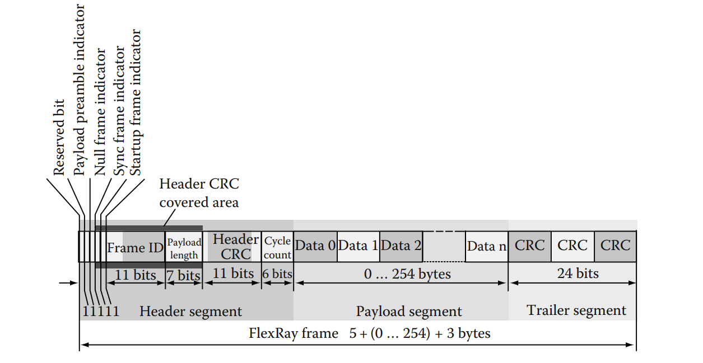
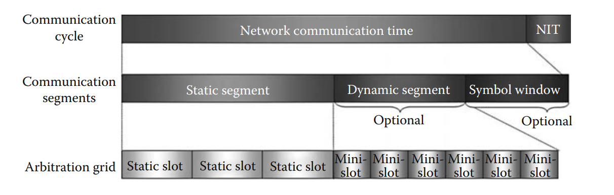
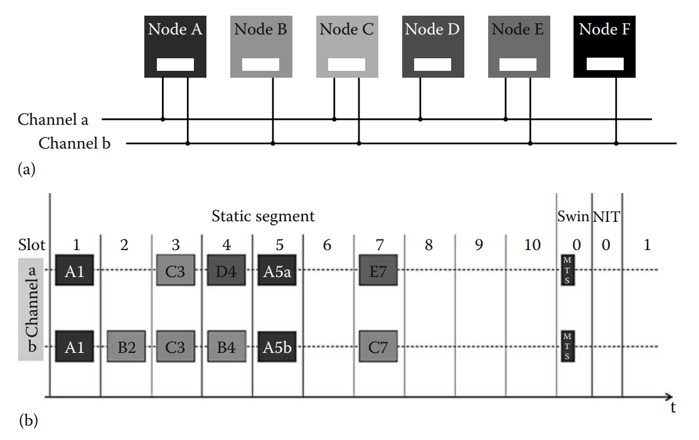
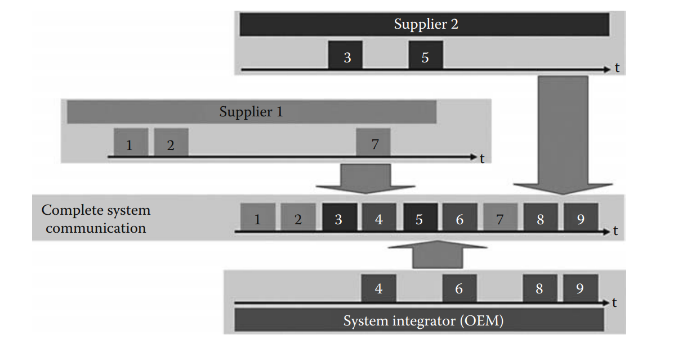
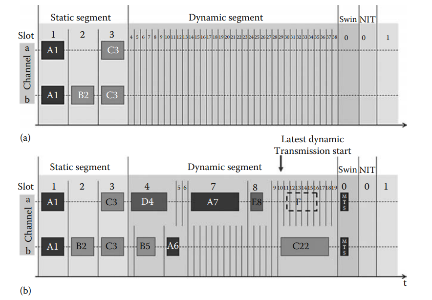
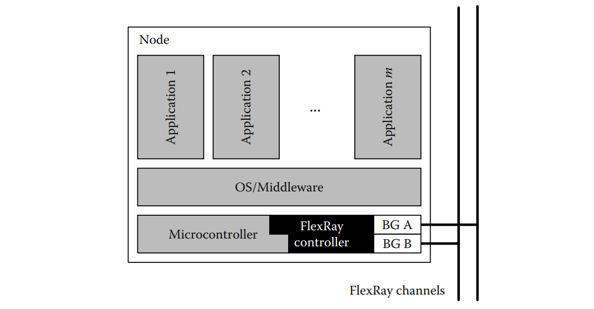
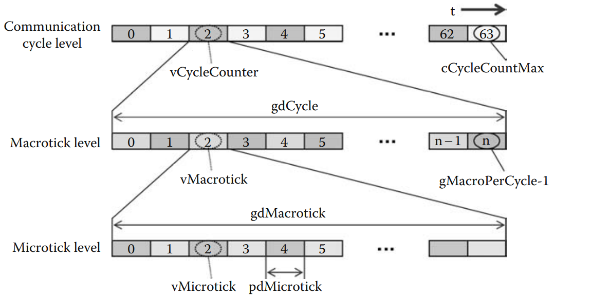
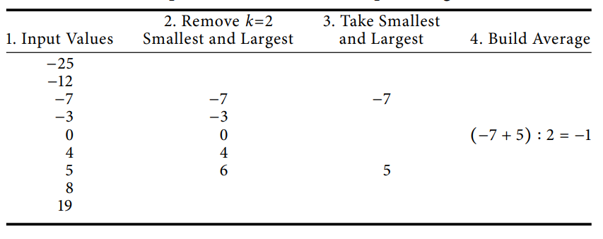

# FlexRay Protocol

## 5.1 Introduction

Việc các ECU kết hợp với phần mềm nhúng trong lĩnh vực ô tô đã cho phép triển khai các chức năng phức tạp như quản lý động cơ điện tử (electronic motor management) hoặc chương trình cân bằng điện tử (electronic stability program), từ đó nâng cao tính kinh tế, an toàn và tiện nghi cho xe hơi hiện đại. Để thực hiện một chức năng tiên tiến như chương trình cân bằng điện tử, nó phải tương tác với nhiều chức năng khác của xe, chẳng hạn như hệ thống phanh, điều khiển động cơ hoặc hộp số. Do đó, những chức năng này đòi hỏi một hạ tầng phù hợp để triển khai phân tán các ứng dụng điều khiển nhúng, sử dụng mạng lưới các ECU giao tiếp để trao đổi thông điệp giữa chúng.

Do tính chất an toàn quan trọng (safety-critical), các hệ thống nhúng ô tô thực hiện những chức năng này thường đòi hỏi phải có các đảm bảo về thuộc tính của hạ tầng truyền thông. Các yêu cầu điển hình là đảm bảo độ trễ truyền tải (latency) của các thông điệp có ưu tiên cao và độ bền vận hành (operational robustness) của truyền thông. Ngoài ra, các ràng buộc kinh tế trong lĩnh vực ô tô đòi hỏi hệ thống phải có hiệu quả cao, linh hoạt trong cấu hình và chi phí thấp cho mỗi nút truyền thông.

Để kết hợp giữa yêu cầu vận hành và ràng buộc kinh tế, các ECU được bố trí trong một mạng sử dụng phương tiện truyền thông chia sẻ (shared communication medium), kết hợp với một sơ đồ đồng bộ hóa (synchronization scheme) nhằm đảm bảo trao đổi thông điệp đáng tin cậy.

### 5.1.1 Event-Driven versus Time-Driven Communication

Để cung cấp một hạ tầng phù hợp cho ECU, hai mô hình giao thức khác nhau đã được đưa ra:
- Giao tiếp dựa trên sự kiện (event-driven communication), ví dụ như được triển khai trong giao thức CAN (Control Area Network)
- Giao tiếp dựa trên thời gian (time-driven communication), ví dụ như được triển khai trong giao thức TTP (Time-Triggered Protocol)

Hai mô hình này khác biệt cơ bản ở cách thức điều phối quyền truy cập vào phương tiện truyền thông chia sẻ giữa các ECU giao tiếp.

Trong giao tiếp dựa trên sự kiện, sử dụng một cơ chế đồng bộ ngẫu hứng. Nó dựa trên chính sách phân xử động để tránh xung đột truy cập bằng cách ưu tiên thông điệp dựa trên mức độ ưu tiên. Cơ chế này không cần phối hợp trước giữa các sự kiện giao tiếp; các tiến trình có thể gửi thông điệp bất kỳ lúc nào. Quyền gửi được cấp theo từng sự kiện: nếu phương tiện không bị chiếm dụng, tiến trình có thể truy cập để gửi thông điệp. Nếu có xung đột giữa nhiều bên gửi, thông điệp có mức ưu tiên thấp hơn sẽ bị trì hoãn để ưu tiên cho thông điệp có mức ưu tiên cao nhất. Do đó, giao thức này chỉ xử lý các sự kiện giao tiếp mà không cần thêm chức năng nào khác.

Ngược lại, trong giao tiếp dựa trên thời gian, áp dụng một cơ chế đồng bộ hóa được xác định trước. Nó sử dụng chính sách phân xử tĩnh dựa trên phân chia khe thời gian để tránh xung đột truy cập. Bằng cách gán trước một khe giao tiếp riêng cho từng thông điệp, không cần tránh xung đột ngẫu hứng. Quyền truy cập được cấp dựa trên chiến lược phụ thuộc thời gian; tiến trình chỉ có thể gửi thông điệp trong khe thời gian được gán. Tuy nhiên, việc tránh xung đột phụ thuộc chặt chẽ vào sự đồng thuận tổng thể về thời gian bắt đầu và độ dài của mỗi khe thời gian. Do đó, ngoài việc giao tiếp, giao thức còn phải bao gồm chức năng đồng bộ hóa khe thời gian giữa tất cả các tiến trình.

Do bản chất của các chiến lược phân xử, hai mô hình này mang lại các đặc tính bổ sung cho nhau trong quá trình phát triển phân tán, đặc biệt là trong giai đoạn thiết kế và tích hợp.

Giao tiếp dựa trên sự kiện sử dụng giao thức nhẹ. Nhờ khả năng tránh xung đột ngẫu hứng, không cần đặt trước khe thời gian khi thiết kế đặc tả giao diện. Chiến lược đồng bộ hóa của nó giúp tận dụng băng thông tối ưu, ngay cả khi các thông điệp được gửi không đều. Tùy vào tải giao tiếp và băng thông trung bình (trên thực tế thường thấp hơn băng thông tối đa), có thể đảm bảo độ trễ tối đa ít nhất cho các thông điệp ưu tiên cao. Việc tích hợp các thành phần theo mô hình này chỉ cần kết hợp trực tiếp; các xung đột sẽ được giải quyết ngẫu hứng. Tuy nhiên, vì độ trễ của thông điệp phụ thuộc vào băng thông khả dụng và tải giao tiếp, các bảo đảm độ trễ được thiết lập cho một tập hợp thành phần có thể không giữ nguyên khi kết hợp trong toàn mạng.

Ngược lại, giao tiếp dựa trên thời gian cần có thêm cơ chế đồng bộ đồng hồ. Do chiến lược phân xử, tất cả các khe thời gian phải được đặt trước khi thiết kế đặc tả giao diện, điều này có thể dẫn đến các khe không sử dụng và gây lãng phí băng thông, đặc biệt với thông điệp gửi không đều. Tuy nhiên, nhờ cơ chế đặt trước, giao tiếp dựa trên thời gian đảm bảo độ trễ tối đa cho tất cả các thông điệp nhờ phân bổ rõ ràng các thông điệp vào khe thời gian. Việc tích hợp thành phần cũng đòi hỏi đảm bảo tính tương thích của việc phân bổ khe thời gian. Tuy nhiên, các đảm bảo về độ trễ được thiết lập cho từng thành phần riêng lẻ sẽ tự động giữ nguyên khi ghép lại thành hệ thống tổng thể.

Tóm lại, sự linh hoạt của giao tiếp dựa trên sự kiện về tích hợp và xử lý thông điệp ngẫu hứng phải trả giá bằng khả năng ghép nối các hệ thống đáng tin cậy. Để kết hợp cả hai ưu điểm này, giao thức FlexRay kết hợp cả hai phương pháp.

### 5.1.2 Objectives of FlexRay

FlexRay được giới thiệu nhằm cung cấp một hệ thống giao tiếp nhắm đến nhu cầu cụ thể của các ứng dụng điều khiển tốc độ cao trong lĩnh vực ô tô.

Các ứng dụng điển hình trong lĩnh vực này như hệ thống truyền động tiên tiến (advanced power train systems), điện tử khung gầm (chassis electronics), hay các chức năng điều khiển bằng điện thay cho cơ khí (by-wire functionality) có những yêu cầu giao tiếp khá khác nhau, đặc biệt liên quan đến độ trễ cho phép của thông điệp hoặc tính chất định kỳ/không định kỳ của chúng. FlexRay được thiết kế để hỗ trợ các nhóm ứng dụng khác nhau này bằng cách cung cấp tính linh hoạt kiến trúc thông qua các lựa chọn giao tiếp chức năng có thể mở rộng.

Để đạt được mục tiêu đó, FlexRay hướng tới cung cấp một phương pháp “kết hợp ưu điểm của cả hai mô hình giao tiếp trên bằng cách:
- Tích hợp cả mô hình giao tiếp dựa trên sự kiện (event-driven) và dựa trên thời gian (time-driven) vào một giao thức chung, nhằm đồng thời cung cấp cả hai cơ chế giao tiếp.
- Hỗ trợ khả năng mở rộng tỷ lệ giữa phần giao tiếp dựa trên thời gian và phần giao tiếp dựa trên sự kiện.

Ở trường hợp cực đoan, FlexRay về cơ bản có thể được sử dụng như một giao thức thuần thời gian hoặc thuần sự kiện; nhưng trên thực tế, nó thường được sử dụng theo kiểu kết hợp cả hai cơ chế. Ngoài ra, FlexRay còn cung cấp các cơ chế an toàn (fail-safe mechanisms) nhằm tăng độ tin cậy của giao tiếp.

### 5.1.3 History of FlexRay

Giao thức FlexRay phiên bản 2.1 (FlexRay Protocol Specification V2.1) đã được định nghĩa vào năm 2005 bởi liên minh FlexRay.

Liên minh FlexRay được thành lập từ sự hợp tác giữa BMW và DaimlerChrysler, với mục tiêu tìm kiếm một giao thức kế nhiệm tiêu chuẩn ô tô hiện tại là CAN, đồng thời là một lựa chọn thay thế cho tiêu chuẩn giao tiếp TTP dành cho các ứng dụng trong tương lai có yêu cầu cao về tính quyết định (determinism), độ tin cậy (reliability), đồng bộ (synchronization), và băng thông (bandwidth), ví dụ như các chức năng X-by-wire.

Liên minh này được thành lập vào năm 2000 như một liên minh giữa các nhà sản xuất ô tô, bán dẫn, và hệ thống điện tử. Các thành viên sáng lập vào năm 2000 bao gồm BMW, DaimlerChrysler, Philips, và Motorola. Hiện tại, liên minh FlexRay còn có sự tham gia của Bosch, General Motors, Ford và nhiều công ty khác.

Dù các bộ kit FlexRay đã được tung ra thị trường từ năm 2005, nhưng FlexRay lần đầu tiên được ứng dụng vào sản xuất hàng loạt vào năm 2006 bởi BMW trong hệ thống treo (suspension system) của dòng xe X5.

## 5.2 FlexRay Communication

Việc trao đổi thông tin giữa các nút trong một cụm FlexRay được dựa trên sơ đồ truy cập đa kênh phân chia theo thời gian (TDMA - Time Division Multiple Access) và được tổ chức thành các chu kỳ truyền thông (communication cycle), được thực hiện định kỳ từ khi mạng khởi động cho đến khi tắt.

Một chu kỳ truyền thông được chia nhỏ thành các khe thời gian (time slot), trong đó việc truyền thông tin từ một nút gửi (sender) đến một hoặc nhiều nút nhận (receiver) diễn ra. Lịch trình (schedule) của cụm FlexRay xác định trong những khe thời gian nào các nút FlexRay được phép gửi các khung dữ liệu (frame) của mình.

### 5.2.1 Frame Format

Một khung dữ liệu (frame) FlexRay bao gồm ba phần: header, payload, và trailer.

Phần header chứa mã định danh khung (frame identifier), được các bộ điều khiển giao tiếp sử dụng để phát hiện lỗi, độ dài phần tải (payload length), bộ đếm chu kỳ truyền thông (communication cycle counter), cùng với các bit giao thức sau:
- Payload preamble indicator: báo hiệu liệu vector tùy chọn dành cho quản lý mạng (network management) hoặc mục đích mở rộng ID thông điệp có nằm trong các byte đầu của phần tải hay không.
- Null frame indicator: xác định liệu khung có chứa dữ liệu sử dụng được hay không.
- Sync frame indicator: đánh dấu liệu khung có được dùng bởi các bộ điều khiển giao tiếp để đồng bộ đồng hồ toàn cục (global clock synchronization) hay không.
- Startup frame indicator: báo hiệu liệu khung có tham gia vào quá trình khởi động của FlexRay hay không.

Phần payload chứa thông tin thực tế cần trao đổi. Dung lượng dữ liệu payload trong một khung FlexRay có thể từ 0 đến 254 byte.

Phần trailer bảo vệ toàn bộ khung, bao gồm một mã kiểm tra chu trình (CRC) dài 24 bit cho toàn khung. Ngoài ra, một phần của header cũng được bảo vệ bổ sung bằng mã CRC header dài 11 bit, với khoảng cách Hamming bằng 6.

### 5.2.2 Communication Cycle

Giao tiếp FlexRay diễn ra trong các chu kỳ truyền thông (communication cycle) có độ dài được xác định trước.

Một chu kỳ truyền thông FlexRay bao gồm một phân đoạn tĩnh (static segment) bắt buộc và một phân đoạn động (dynamic segment) tùy chọn, cũng như một hoặc hai phân đoạn giao thức, cụ thể là thời gian nhàn rỗi mạng (network idle time – NIT) bắt buộc và cửa sổ ký hiệu (symbol window) tùy chọn.

- Phân đoạn tĩnh gồm một số khe tĩnh (static slots) có độ dài cố định bằng nhau.
- Phân đoạn động gồm các khe nhỏ gọi là minislots, được dùng để truyền các khung dữ liệu có độ dài tải biến đổi, khung dữ liệu không định kỳ (sporadic), hoặc các khung có chu kỳ lớn hơn độ dài chu kỳ truyền thông.

Các khe của hai phân đoạn được đánh số liên tiếp, bắt đầu từ 1 với khe tĩnh đầu tiên.

Cửa sổ ký hiệu (symbol window) chỉ được dùng cho mục đích quản lý mạng. Đây là một khe thời gian mà trong đó ký hiệu kiểm tra truy cập phương tiện (MTS – media access test symbol) có thể được truyền trên mạng.

NIT (network idle time) là khoảng thời gian mà bus không truyền dữ liệu; nó được các bộ điều khiển giao tiếp dùng để thực hiện thuật toán đồng bộ đồng hồ (clock-synchronization algorithm). Độ dài của NIT phải được cấu hình từ giai đoạn thiết kế hệ thống và cần đủ dài để tất cả các bộ điều khiển giao tiếp có thể hoàn tất tính toán.

Một cấu hình tối thiểu của chu kỳ truyền thông FlexRay phải chứa ít nhất một phân đoạn tĩnh và NIT. Một cụm FlexRay (FlexRay cluster) phải có ít nhất hai nút, do đó tối thiểu cần hai khe tĩnh để đảm bảo đồng bộ.

Giao thức FlexRay hỗ trợ phân biệt 64 chu kỳ truyền thông nhờ bộ đếm chu kỳ toàn cục 6 bit (6-bit cycle counter). Giá trị bộ đếm này được truyền trong phần header của mỗi khung. Cơ chế phân biệt này cho phép một nút trong cụm truyền các khung khác nhau tại cùng một khe nhưng ở các chu kỳ truyền thông khác nhau (cycle filtering). Ngoài ra, trong phân đoạn động còn có thể dùng cơ chế slot hoặc cycle multiplexing, nghĩa là các nút khác nhau có thể truyền khung trong cùng một khe nhưng ở các chu kỳ khác nhau.

Bên cạnh cơ sở thời gian toàn cục của FlexRay, phần mềm máy chủ (host software) có thể sử dụng bộ đếm chu kỳ để đồng bộ các chương trình phần mềm với các khe thời gian cụ thể nhằm giảm thiểu độ trễ tín hiệu.

### 5.2.3 Static Segment

Trong phân đoạn tĩnh (static segment) của một chu kỳ truyền thông, tất cả các khe (slots) đều có độ dài cố định bằng nhau. FlexRay hỗ trợ tối đa hai kênh FlexRay, và mỗi khe chỉ được một bộ điều khiển giao tiếp (communication controller) trên mỗi kênh độc quyền sử dụng để truyền một khung (frame).

Nếu trong cụm (cluster) có hai kênh, một bộ điều khiển có thể sử dụng khe theo ba cách:
1. Truyền dư thừa (redundant transmission) một khung giống nhau trên cả hai kênh.
2. Truyền hai khung khác nhau trên hai kênh.
3. Hai bộ điều khiển giao tiếp khác nhau, mỗi bộ dùng một kênh của cùng khe để truyền khung.

Hình a minh họa một cấu trúc cụm FlexRay, còn hình b đưa ra ví dụ về giao tiếp trong phân đoạn tĩnh của một chu kỳ truyền thông.
- Node A và Node C sử dụng khe 1 và 3 trên cả hai kênh để truyền dư thừa một khung.
- Node B chỉ kết nối với kênh b và truyền các khung ở khe 2 và 4.
- Node D cũng dùng khe 4 để truyền một khung, nhưng trên kênh a.
- Node C và Node E chia sẻ khe 7 để truyền khung của họ.
- Ở khe 5, Node A truyền hai khung khác nhau.
- Các khe 6, 8, 9, và 10 không được sử dụng.

Không phải tất cả khe thời gian đều phải gán cho khung dữ liệu. Trong một số trường hợp, người ta có thể dự trữ băng thông cho các node sẽ được thêm vào cụm sau này. Nếu một khe tĩnh không được gán khung trong chu kỳ truyền thông, nó sẽ bị bỏ trống và phần băng thông đó sẽ bị lãng phí. Ngược lại, nếu một khung đã được gán cho một khe, nó sẽ luôn được gửi bởi bộ điều khiển giao tiếp tương ứng.

Việc đặt trước cố định các khe thời gian dành riêng cho các bộ điều khiển giao tiếp mang lại lợi thế bảo đảm mạnh mẽ về độ trễ truyền thông. Người thiết kế có thể biết chính xác khi nào một khung cụ thể sẽ được truyền trên kênh, và vì giao tiếp không xảy ra va chạm (collision-free), thời gian truyền tối đa (worst-case transmission time) có thể được tính toán rõ ràng.

FlexRay yêu cầu xác định trước lịch trình truyền thông (communication schedule) ngay từ giai đoạn thiết kế. Lịch trình này chứa thông tin quan trọng đối với các bộ điều khiển giao tiếp (communication controllers), ví dụ như ở khe nào chúng sẽ gửi hoặc nhận khung dữ liệu.

Đối với việc truyền khung trong phân đoạn tĩnh (static segment), các tham số cấu hình quan trọng bao gồm:
- Mã định danh khe thời gian (Slot ID)
- Kênh truyền (Channel)
- Thông tin lọc chu kỳ (Cycle filter information)

Ngoài ra, các tham số cấp thấp của FlexRay (low-level parameters), mô tả các đặc tính quan trọng của giao thức FlexRay cũng phải được xác định ở giai đoạn thiết kế hệ thống. Ví dụ:
- Số lượng và thời lượng của các khe tĩnh
- Độ dài của chu kỳ truyền thông
- Độ trễ điểm hành động (action point offset), tức là độ trễ của việc truyền khung so với lúc bắt đầu khe thời gian

Những tham số này là một phần của cấu hình mạng và phải giống hệt nhau trên tất cả các bộ điều khiển giao tiếp tham gia vào truyền thông trong cùng cụm FlexRay.
Đối với mỗi bộ điều khiển giao tiếp, người dùng cần cấu hình hơn 50 tham số tại thời điểm thiết kế hệ thống. Do nhiệm vụ này rất phức tạp cho nên phải sử dụng các công cụ hỗ trợ (tool support).

Bên cạnh tính năng truyền thông có tính xác định hoàn toàn (deterministic communication timing), một đặc điểm quan trọng khác của phân đoạn tĩnh là tính lắp ghép (composability). Đặc điểm này đóng vai trò quan trọng trong quá trình sản xuất hàng loạt của các nhà sản xuất ô tô (OEM — Original Equipment Manufacturer). Khi các hệ thống con từ OEM và nhà cung cấp được tích hợp vào hệ thống hoàn chỉnh, hành vi của các hệ thống con sẽ không bị ảnh hưởng vì tính chất phụ thuộc thời gian cố định của phân đoạn tĩnh giúp ngăn không cho các đặc tính truyền thông của hệ thống con thay đổi. Việc tích hợp các hệ thống con từ nhà cung cấp 1, nhà cung cấp 2 và OEM không làm thay đổi thời gian truyền thông, tức là vị trí của các khe tĩnh vẫn giữ nguyên.

### 5.2.4 Dynamic Segment

Trong phân đoạn động (dynamic segment) của một chu kỳ truyền thông, FlexRay sử dụng một phương pháp kiểm soát truy cập môi trường linh hoạt hơn: cơ chế FTDMA (Flexible Time Division Multiple Access).
Cơ chế này dựa trên giao thức byteflight [BFL] được BMW phát triển dựa trên ưu tiên và nhu cầu truyền dữ liệu. Phân đoạn động được chia nhỏ thành các minislot (khe nhỏ), có thời lượng rất ngắn. Tương tự như các khe tĩnh, các minislot này có thể được gán cho các khung dữ liệu, nhưng việc truyền một khung chỉ được bắt đầu nếu bộ điều khiển có dữ liệu cần gửi.

Do đó, quyết định có truyền khung trong phân đoạn động hay không được phần mềm chủ (host software) quyết định trong thời gian thực (runtime). Nếu không có bất kỳ khung động nào được truyền, phân đoạn động của chu kỳ truyền thông sẽ hoàn toàn không được sử dụng.

Thời lượng của các minislot (khe nhỏ) không đủ dài để chứa toàn bộ quá trình truyền một khung dữ liệu.
Trong trường hợp một minislot không được sử dụng để truyền thông, chỉ một lượng băng thông nhỏ bị lãng phí. Tuy nhiên, nếu bộ điều khiển truyền thông quyết định truyền một khung dữ liệu trong một minislot, thì minislot đó sẽ được mở rộng thành một khe thời gian đầy đủ (ví dụ: khe số 4 trên kênh a trong b).

Độ dài payload của các khung động không được xác định trước và có thể được phần mềm chủ (host software) thay đổi trong thời gian thực. Giới hạn duy nhất là dung lượng bộ đệm (buffer size) của các bộ điều khiển truyền thông. Khi một minislot được mở rộng, số lượng minislot còn lại trong phân đoạn động sẽ giảm xuống. Càng có nhiều khung được gửi ở giai đoạn đầu của phân đoạn động, cơ hội truyền khung ở các điểm sau càng giảm đi. Vì vậy, việc truyền khung trong phân đoạn động dựa trên ưu tiên; một khung nằm trong minislot có chỉ số nhỏ hơn sẽ có ưu tiên cao hơn. Một khung đã được yêu cầu truyền nhưng không thể gửi trong một chu kỳ truyền thông sẽ được bộ điều khiển gửi vào cùng khe đó ở lần cơ hội tiếp theo.

Việc hoãn (deferral) các minislot trong chu kỳ truyền, phụ thuộc vào số lượng và độ dài của các lần truyền trong các khe động trước đó, dẫn đến việc chia phân đoạn động thành hai phần logic. Trong phân đoạn động đảm bảo (guaranteed dynamic segment), tất cả các khung đã được lập lịch sẽ được truyền bất kể tải của bus. Trong phần còn lại của phân đoạn động, việc truyền một khung trong chu kỳ truyền hiện tại không được đảm bảo. Tại đây, bộ điều khiển truyền thông chỉ bắt đầu truyền nếu điểm bắt đầu truyền động trễ nhất (latest dynamic transmission start point).

## 5.3 FlexRay Protocol

### 5.3.1 Protocol Architecture

Trong FlexRay, một cụm (cluster) là một tập hợp các nút (nodes) được kết nối với nhau qua một hoặc hai kênh (channels). Tất cả các nút trong một cụm đều có chung một đồng hồ toàn cục (global clock). Một nút bao gồm một bộ xử lý chủ (host) và một bộ điều khiển FlexRay (FlexRay controller). Bộ điều khiển chịu trách nhiệm cho việc giao tiếp giữa các nút, trong khi bộ xử lý chủ chạy hệ điều hành và phần mềm ứng dụng. Kết nối vật lý của một cụm có thể là dạng bus, hình sao (star topology), hoặc sự kết hợp của cả hai. Trong ngữ cảnh của FlexRay, các ứng dụng, hệ điều hành/phần mềm trung gian (middleware), và vi điều khiển được gọi là "host", bộ điều khiển FlexRay (thể hiện bằng màu đen) được gọi đơn giản là "controller", và sự kết hợp giữa host, controller, cùng với bộ giám sát bus tùy chọn (bus guardians – viết tắt là BG) được gọi là nút.

Có hai cấu trúc liên kết cơ bản dành cho FlexRay là dạng bus và dạng sao chủ động (active star). Trong "cấu trúc liên kết dạng bus", tất cả các nút được kết nối vào cùng một (hoặc nhiều) sợi cáp vật lý, trong khi đó trong "cấu trúc liên kết dạng sao chủ động", mỗi nút được kết nối trực tiếp với các bộ ghép sao (star couplers). Trong cả hai trường hợp, một nút có thể được kết nối với một trong hai kênh hoặc cả hai. Một cụm cũng có thể sử dụng kết hợp cả cấu trúc bus và sao. Trong cả hai cấu trúc liên kết này, các đầu cáp đều phải được kết thúc bằng một điện trở.

### 5.3.2 Protocol Wakeup and Startup

Trước khi một cụm có thể bắt đầu giao tiếp thì nó cần phải được khởi tạo. Trong FlexRay, quá trình khởi tạo của một cụm bao gồm hai giai đoạn: đánh thức (wakeup) và khởi động (startup). Trong giai đoạn đánh thức, các nút trong cụm được cấp nguồn và các bộ xử lý chủ khởi động hệ điều hành của chúng. Sau khi đồng bộ hóa đồng hồ trong giai đoạn khởi động, các nút sẽ chuyển sang chế độ hoạt động bình thường.

Trong quá trình đánh thức và khởi động, một số nút đảm nhận vai trò đặc biệt: nút đánh thức (wakeup node) và nút khởi động lạnh (coldstart node). Một nút đánh thức là nút có khả năng đánh thức cụm đang ở trạng thái ngủ bằng cách gửi một mẫu đánh thức (wakeup pattern). Một nút khởi động lạnh là nút gửi các khung khởi động trong giai đoạn khởi động. Một nút đánh thức không nhất thiết phải là nút khởi động lạnh và ngược lại.

### 5.3.3 Wakeup

Khi cụm đang ở trạng thái ngủ và nút đầu tiên trong cụm được đánh thức bởi một sự kiện bên ngoài, nút này sẽ khởi động hệ điều hành và cấu hình bộ điều khiển FlexRay. Chỉ một kênh được đánh thức tại một thời điểm nhằm tránh trường hợp một host bị lỗi gây nhiễu đến việc giao tiếp của cụm đang hoạt động trên cả hai kênh. Do đó, host phải chọn kênh sẽ được đánh thức. Host sau đó yêu cầu bộ điều khiển gửi mẫu đánh thức (wakeup pattern) trên kênh này. Khi các bộ điều khiển khác nhận được mẫu đánh thức, chúng sẽ đánh thức host tương ứng của mình. Một trong các nút mới được đánh thức này có thể tiếp tục đánh thức kênh thứ hai, với quy trình tương tự như kênh đầu tiên. Vì cần ít nhất hai nút để khởi động cụm, nút đầu tiên sẽ chờ trong một khoảng thời gian được định nghĩa trước, trong đó giả định rằng ít nhất một nút khác sẽ sẵn sàng để khởi động. Sau đó, các nút được đánh thức sẽ chuyển sang giai đoạn khởi động.

#### 5.3.3.1 Startup

Trong giai đoạn khởi động, có ba loại nút khác nhau: chính xác một nút khởi động lạnh dẫn đầu (leading coldstart node), ít nhất một nút khởi động lạnh theo sau (following coldstart node), và bất kỳ số lượng nút không khởi động lạnh nào (non-coldstart nodes). Một nút khởi động lạnh sẽ trở thành "nút khởi động lạnh dẫn đầu" nếu nó đang ở chế độ khởi động và không nhận được bất kỳ giao tiếp nào. Nếu nó nhận được giao tiếp, nó sẽ trở thành "nút khởi động lạnh theo sau" vì giả định rằng đã có một nút dẫn đầu đang tồn tại.

Nút khởi động lạnh dẫn đầu là nút đầu tiên gửi ký hiệu tránh va chạm (Collision Avoidance Symbol - CAS) và sau đó bắt đầu chu kỳ truyền thông đầu tiên bằng cách truyền "khung khởi động" (startup frame) của nó. CAS được sử dụng để phát hiện nếu có nhiều hơn một nút khởi động lạnh đang cố gắng khởi động đồng thời. Mỗi nút khởi động lạnh chỉ có đúng một khung khởi động, đây là một khung có cờ startup và sync được thiết lập trong phần tiêu đề. Sau bốn chu kỳ, nút dẫn đầu sẽ nhận được các khung khởi động từ các nút theo sau. Nếu việc đồng bộ đồng hồ với các nút khởi động lạnh khác thành công, nó sẽ chuyển sang chế độ hoạt động bình thường.

Một nút khởi động lạnh theo sau sẽ chờ cho đến khi nó nhận được hai khung liên tiếp từ nút dẫn đầu. Hai khung này cần thiết để tạo lịch trình ban đầu. Nếu thành công, nó sẽ thu thập tất cả các khung đồng bộ trong hai chu kỳ tiếp theo và thực hiện đồng bộ hóa đồng hồ. Sau khi quá trình đồng bộ đồng hồ thành công, nó sẽ bắt đầu gửi khung khởi động của mình. Nếu không có lỗi xảy ra trong ba chu kỳ tiếp theo, nút theo sau sẽ chuyển sang hoạt động bình thường.

Một "nút không khởi động lạnh" sẽ chờ cho đến khi nó nhận được hai khung liên tiếp từ nút dẫn đầu. Nó sẽ thực hiện đồng bộ đồng hồ dựa trên hai khung này để tạo lịch trình ban đầu. Trong bốn chu kỳ tiếp theo, nó thu thập tất cả các khung đồng bộ và tiếp tục đồng bộ đồng hồ. Nếu thành công, nó sẽ chuyển sang hoạt động bình thường. Sự khác biệt chính giữa nút không khởi động lạnh và nút khởi động lạnh theo sau là nút không khởi động lạnh không gửi bất kỳ khung nào trong giai đoạn khởi động.

### 5.3.4 Clock Synchronization

Trong một mạng TDMA như FlexRay, tất cả các nút trong một cụm cần phải có một đồng hồ toàn cục chung để đảm bảo rằng mỗi nút chỉ truyền dữ liệu trong khung thời gian (time slot) của mình. Khi hệ thống khởi động, tất cả các đồng hồ cục bộ của các nút phải được đồng bộ hóa để tạo ra thời gian toàn cục này.

Mỗi nút có một bộ tạo xung nhịp cục bộ, thường dựa trên tần số cộng hưởng của một tinh thể thạch anh. Do hai tinh thể hiếm khi có tần số cộng hưởng hoàn toàn giống nhau, đồng hồ cục bộ sẽ bắt đầu lệch nhau trong quá trình hoạt động. Một tinh thể thạch anh điển hình có độ chính xác khoảng 50 ppm. Tần số của một tinh thể không thể được xác định một cách tĩnh, vì nó còn bị ảnh hưởng bởi các yếu tố bên ngoài như nhiệt độ và độ rung. Do đó, các đồng hồ cục bộ cần được đồng bộ hóa định kỳ trong suốt quá trình hệ thống hoạt động.

Vì sự đồng bộ tuyệt đối là điều không thể đạt được trong một hệ thống phân tán, nên đồng hồ toàn cục sẽ không hoàn toàn giống nhau trên tất cả các nút. Tuy nhiên, độ lệch giữa các đồng hồ cục bộ có một giới hạn trên. Giới hạn này được giả định là đủ nhỏ đối với miền ứng dụng, nên thời gian toàn cục chung vẫn có thể được giả định ở một mức trừu tượng nào đó.

#### 5.3.4.1 Timing in FlexRay

Thời gian trong FlexRay được định nghĩa bằng một bộ ba gồm: bộ đếm chu kỳ (cycle), bộ đếm macrotick và bộ đếm microtick, trong đó một chu kỳ bao gồm nhiều macrotick và mỗi macrotick lại bao gồm nhiều microtick. Số lượng macrotick trong mỗi chu kỳ là cố định cho toàn bộ cụm, vì các macrotick được đồng bộ giữa tất cả các nút. Các microtick được tạo ra bởi bộ tạo xung nhịp cục bộ, do đó giá trị hiện tại của microtick chỉ có ý nghĩa trong phạm vi một nút. Số lượng microtick trong mỗi macrotick phụ thuộc vào tần số của đồng hồ cục bộ và cũng khác nhau giữa các nút. Con số này sẽ được điều chỉnh trong thời gian chạy để đồng bộ hóa đồng hồ giữa các nút khác nhau.

Thuật toán đồng bộ hóa đồng hồ của FlexRay là một phần mở rộng của thuật toán Welch–Lynch. Đồng hồ cục bộ của bộ điều khiển chính (host) có thể được đồng bộ với thời gian toàn cục của FlexRay, để các ứng dụng chạy trên bộ điều khiển đó cũng có thể có một khái niệm về thời gian được đồng bộ toàn cụm . Đồng hồ toàn cục cũng có thể được đồng bộ hóa giữa hai cụm hoặc dựa trên một nguồn thời gian bên ngoài.

Việc đo thời gian chỉ được thực hiện trong phân đoạn tĩnh (static segment), còn việc tính toán các giá trị hiệu chỉnh được thực hiện trong phân đoạn động (dynamic segment) hoặc NIT.

#### 5.3.4.2 Measurement of Clock Drift

Một nút có thể tính toán sai số thời gian giữa đồng hồ cục bộ của nó và đồng hồ của các nút khác bằng cách quan sát thời điểm đến của các khung dữ liệu (frame) từ các nút đó. Cách này không yêu cầu bất kỳ giao tiếp bổ sung nào.

Mỗi khi một nút nhận được một khung đồng bộ (sync frame) từ một nút khác, một dấu thời gian (timestamp) sẽ được lưu lại cùng với khung đó. Một khung đồng bộ là khung có bit đồng bộ (sync bit) được thiết lập; các khung không phải đồng bộ sẽ không được xét đến trong quá trình đồng bộ hóa đồng hồ. Các sai lệch được lưu trữ riêng biệt đối với các khung đồng bộ thuộc chu kỳ chẵn và chu kỳ lẻ. Các giá trị hiệu chỉnh đồng hồ được tính toán dựa trên những phép đo này.

#### 5.3.4.3 Calculation of Correction Values

FlexRay sử dụng kết hợp hai giá trị hiệu chỉnh khác nhau: hiệu chỉnh độ lệch (offset correction) và hiệu chỉnh tốc độ (rate correction). Hiệu chỉnh độ lệch được dùng để giảm sự sai khác hiện tại giữa các đồng hồ, trong khi hiệu chỉnh tốc độ được dùng để dự đoán tốc độ trôi lệch của các đồng hồ.

Để tính các giá trị hiệu chỉnh này, thuật toán “midpoint chịu lỗi” (fault-tolerant midpoint algorithm) được sử dụng. Thuật toán này nhận đầu vào là một danh sách các số và trả về trung điểm (midpoint) làm đầu ra.

Từ danh sách ban đầu đã được sắp xếp, thuật toán loại bỏ k giá trị lớn nhất và k giá trị nhỏ nhất nhằm loại trừ ảnh hưởng của k nút có thể bị lỗi đến quá trình đồng bộ hóa đồng hồ. Tham số k được chọn dựa trên số lượng giá trị đầu vào: với 1 hoặc 2 giá trị thì k = 0; với 3 đến 7 giá trị thì k = 1; và với hơn 7 giá trị thì k = 2. Sau khi loại bỏ, thuật toán lấy phần tử lớn nhất và nhỏ nhất trong danh sách còn lại và trả về giá trị trung bình của hai phần tử đó.

Trong mỗi chu kỳ truyền thông lẻ, giá trị “hiệu chỉnh độ lệch” (offset correction) sẽ được tính toán. Với mỗi khung đồng bộ (sync frame) nhận được trong chu kỳ này, hiệu giữa thời gian đến dự kiến và thời gian đến thực tế sẽ được tính. Thuật toán midpoint chịu lỗi được áp dụng cho danh sách sai lệch này và tạo ra giá trị hiệu chỉnh độ lệch. Nếu giá trị hiệu chỉnh nằm trong giới hạn cho phép, nó sẽ được áp dụng vào cuối chu kỳ. Cột độ lệch offset là hiệu giữa cột “expected” (dự kiến) và “odd cycle measurement” (đo trong chu kỳ lẻ). Giá trị hiệu chỉnh độ lệch trong ví dụ này là 1.

Giá trị “hiệu chỉnh tốc độ” (rate correction) được tính trong mỗi chu kỳ truyền thông lẻ, dựa trên các phép đo của chu kỳ hiện tại và chu kỳ chẵn trước đó. Với mỗi khung đồng bộ đo được, sai khác giữa giá trị lệch của chu kỳ này và chu kỳ trước đó sẽ được tính. Kết quả là tốc độ trôi lệch (drift rate) cho từng nút khác. Thuật toán midpoint chịu lỗi được áp dụng cho các tốc độ trôi lệch này để tạo ra giá trị hiệu chỉnh tốc độ cho nút đó. Một lần nữa, nếu giá trị hiệu chỉnh nằm trong giới hạn cho phép, nó sẽ được áp dụng vào cuối chu kỳ. Cột “độ lệch offset” được tính là hiệu giữa cột “even cycle measurement” (đo trong chu kỳ chẵn) và “odd cycle measurement” (đo trong chu kỳ lẻ). Giá trị hiệu chỉnh tốc độ trong ví dụ này là −1.

#### 5.3.4.4 Application of Correction Values

Các giá trị hiệu chỉnh hiện tại sẽ được áp dụng trong NIT (Network Idle Time) của chu kỳ hiện tại. Việc hiệu chỉnh độ lệch (offset correction) được thực hiện vào mỗi chu kỳ lẻ, còn hiệu chỉnh tốc độ (rate correction) được thực hiện vào chu kỳ chẵn kế tiếp.

Giá trị hiệu chỉnh độ lệch được cộng trực tiếp vào NIT, qua đó rút ngắn hoặc kéo dài độ dài tổng thể của chu kỳ truyền thông một lần. Trong khi đó, giá trị hiệu chỉnh tốc độ được cộng vào số lượng microtick mỗi chu kỳ. Vì số lượng macrotick mỗi chu kỳ là cố định, nên số lượng microtick trên mỗi macrotick sẽ được tính toán lại dựa trên số microtick mới của cả chu kỳ. Giá trị hiệu chỉnh tốc độ vì vậy sẽ ảnh hưởng đến độ dài của hai chu kỳ tiếp theo, tại đó nó sẽ được đánh giá lại.

### 5.3.5 Fault-Tolerance Mechanisms

FlexRay cung cấp một số cơ chế khác để tăng khả năng chịu lỗi, ngoài cơ chế đã được triển khai trong thuật toán đồng bộ xung nhịp, nhằm bù đắp cho các lỗi truyền thông khác. Một chiến lược là dự phòng. Một cụm (cluster) có thể sử dụng hai kênh truyền thông riêng biệt để giao tiếp. Bằng cách sử dụng hai cấu trúc vật lý khác nhau cho mỗi kênh, khả năng xảy ra lỗi phần cứng ảnh hưởng đến toàn bộ cụm sẽ giảm đi. Khi sử dụng hai kênh, một thông điệp có thể được gửi độc lập trên cả hai kênh trong các ô thời gian khác nhau. Nhờ vậy, một lỗi thoáng qua sẽ chỉ dẫn đến việc truyền trễ chứ không mất hoàn toàn thông điệp.

Giống như hầu hết các giao thức truyền thông, FlexRay sử dụng CRC để xử lý lỗi bit trên bus — trong trường hợp này là CRC 24 bit. Xác suất xảy ra lỗi mạng không phát hiện được trong trường hợp này là dưới 6×10⁻⁸. Với 10.000 thông điệp mỗi giây và tỷ lệ lỗi bit không tương quan ước lượng là 10⁻⁶, điều này tương đương với khoảng 2×10⁻⁶ khung dữ liệu lỗi không được phát hiện mỗi giờ. Điều này đồng nghĩa với việc chỉ có khoảng 1% số xe sẽ gặp phải khung dữ liệu lỗi không phát hiện được trong suốt 6000 giờ hoạt động trung bình của vòng đời xe.

FlexRay sử dụng các cơ chế cách ly lỗi (fault containment) ở nhiều khu vực để đảm bảo rằng lỗi cục bộ của một nút sẽ không làm gián đoạn toàn bộ cụm. Một phương pháp nổi bật là bus guardian. Thành phần này giám sát một hoặc nhiều bộ điều khiển (tùy thuộc vào cấu trúc hệ thống), và chỉ cho phép bộ điều khiển truyền dữ liệu trong các ô thời gian đã được chỉ định. Ngoài các ô thời gian đó, bus guardian sẽ chặn tất cả các truyền dữ liệu từ bộ điều khiển. Điều này đảm bảo rằng một "nút nhiễu loạn" (babbling idiot) sẽ không làm gián đoạn hoạt động của các nút còn lại. Trong FlexRay, có hai cách bố trí bus guardian: bus guardian cục bộ tại nút (node-local) được đặt tại mỗi nút và bus guardian trung tâm (central), được tích hợp trong bộ tập trung dạng sao (star coupler).

Đối với các ứng dụng an toàn cao (safety-critical), có thể cần thêm các cơ chế như xác nhận thông điệp (message acknowledgment) và vector thành viên (membership vector). Vì đây không phải là một phần của FlexRay nên chúng cần được triển khai ở tầng giao thức cao hơn.

## 5.4 FlexRay Application

### 5.4.1 FlexRay Implementation

Các trình điều khiển FlexRay (FlexRay drivers) và các tầng giao tiếp liên quan cung cấp cho lập trình viên ứng dụng một giao diện dễ sử dụng dựa trên khung (frame) hoặc tín hiệu (signal) để làm việc với hệ thống truyền thông FlexRay. Các mô-đun phần mềm này thường được cấu hình bằng các công cụ thiết kế mạng. Hiện tại, có nhiều trình điều khiển và công cụ cấu hình FlexRay trên thị trường, khác nhau về hiệu suất, tính dễ sử dụng, phạm vi chức năng và giá thành.

Việc phát triển một ứng dụng sử dụng FlexRay đòi hỏi phải ra quyết định kiến trúc hệ thống ngay từ đầu, đặc biệt là về cách đồng bộ thời gian giữa FlexRay và ứng dụng. Có ba kịch bản chính:
- Ứng dụng và FlexRay hoạt động không đồng bộ (asynchronously).
- Ứng dụng được đồng bộ hoàn toàn với thời gian toàn cục của FlexRay.
- Một phần của ứng dụng chạy đồng bộ với thời gian FlexRay.

Trong ba kịch bản trên, kết quả tốt nhất về độ trễ tín hiệu (signal latency) đạt được khi ứng dụng đồng bộ với thời gian toàn cục của FlexRay. Khi đó, nút truyền có thể gửi dữ liệu mới nhất đến bộ điều khiển truyền thông ngay trước khi ô thời gian truyền bắt đầu. Nút nhận có thể đọc dữ liệu ngay sau khi khung dữ liệu được nhận, với điều kiện cũng được đồng bộ với thời gian FlexRay. Điều này cho phép độ trễ nhỏ, cố định và có thể dự đoán được giữa các tác vụ trên các ECU khác nhau, rất phù hợp cho các hệ thống điều khiển phân tán cấp cao, các hệ thống an toàn hoặc điều khiển động học xe.

Việc đồng bộ này có thể được thực hiện bằng ngắt từ bộ điều khiển truyền thông hoặc thông qua hệ điều hành thời gian thực có hỗ trợ cơ chế đồng bộ thời gian bên ngoài (ví dụ: OSEKtime).

Tuy nhiên, trong một số trường hợp đặc biệt, đồng bộ với FlexRay là không khả thi hoặc không cần thiết. Ví dụ, trong một bộ điều khiển động cơ, phần mềm cần chạy đồng bộ với tốc độ quay của động cơ, không thể tuân theo một mốc thời gian khác. Trong trường hợp này, cần sử dụng bộ điều khiển truyền thông hỗ trợ hoạt động không đồng bộ. Tuy nhiên, khi đó không thể kiểm soát chính xác độ trễ của tín hiệu. Nếu một tác vụ ghi dữ liệu vào bộ điều khiển ngay sau khi ô thời gian tương ứng vừa kết thúc, bộ điều khiển sẽ phải chờ đến chu kỳ sau mới gửi được dữ liệu. Khi nào dữ liệu thực sự được truyền thì không thể đoán trước được, chỉ có thể tính toán được trường hợp trễ xấu nhất. Nếu một nhóm tín hiệu trải trên nhiều khung, thì cũng không thể đảm bảo tính nhất quán giữa các tín hiệu. Do đó, không nên xây dựng ứng dụng hoàn toàn không đồng bộ với FlexRay.

Trong trường hợp ứng dụng buộc phải không đồng bộ, một lựa chọn khác là chỉ đồng bộ các tầng giao tiếp liên quan đến FlexRay với thời gian toàn cục FlexRay. Đặc biệt, các tác vụ truyền thông FlexRay, chịu trách nhiệm truyền dữ liệu giữa ứng dụng và bộ điều khiển truyền thông, sẽ được đồng bộ. Sau đó, các tầng này sẽ đảm nhiệm việc phân tách thời gian (temporal decoupling) giữa ứng dụng và mạng FlexRay.

### 5.4.2 FlexRay Tool Support

Việc cấu hình thủ công các node trong một cụm FlexRay mà không có sự hỗ trợ của công cụ là việc tốn thời gian và dễ xảy ra lỗi. Một lịch truyền hoặc cấu hình node sai trong cụm FlexRay thường đòi hỏi quá trình phân tích lỗi phức tạp và tốn kém. Vì lý do đó, công cụ hỗ trợ là không thể thiếu trong phần lớn các trường hợp.

Thông thường, các công cụ thiết kế mạng FlexRay cho phép:
- Xác định kiến trúc phần cứng của các node
- Lập kế hoạch cho lịch truyền thông (communication schedule)
- Lập kế hoạch cho lịch thực thi các tác vụ phần mềm (software task schedule)
- Và sinh ra cấu hình cho từng node

Ngoài ra, một số công cụ còn hỗ trợ quy trình phát triển giữa OEM và nhà cung cấp (supplier). OEM phát triển các ứng dụng phân tán và lên kế hoạch cho mạng các ECU, chức năng, lịch truyền và các tham số FlexRay toàn cục. Sau đó, họ cung cấp cho các nhà cung cấp ECU tất cả thông tin liên quan đến ECU tương ứng của họ. Nhà cung cấp ECU nhập dữ liệu này vào công cụ cấu hình, mở rộng thêm các thông tin đặc thù cho ECU của họ, và sinh ra các tập tin mã nguồn cấu hình một cách rất đơn giản.

Định dạng XML thường được sử dụng để trao đổi dữ liệu giữa các bên. Các công cụ giám sát và phân tích FlexRay cũng rất quan trọng trong quá trình phát triển ứng dụng phân tán. Những công cụ này thường được dùng để:
- Theo dõi và ghi lại tiến trình khởi động mạng và hoạt động truyền thông liên tục.
- Khi có lỗi xảy ra, công cụ sẽ cung cấp thông tin chi tiết về trạng thái và truyền thông cho người dùng FlexRay.
- Một số công cụ còn hỗ trợ xuất tín hiệu kích hoạt (trigger output) cho các thiết bị đo khác như oscilloscope để ghi lại khung FlexRay bị lỗi nhằm phân tích nâng cao.

Để phát hiện lỗi logic trong hệ thống phân tán, các công cụ này còn được dùng để giám sát đồng thời nhiều hệ thống giao tiếp và giao diện phần cứng khác nhau như CAN, FlexRay, tín hiệu số và tương tự.

Trong quá trình phát triển và kiểm thử một ECU, không phải lúc nào cũng có thể cung cấp đầy đủ các ECU khác trong cụm để làm đối tác truyền thông. Thậm chí để mạng FlexRay khởi động, cũng cần ít nhất một đối tác khởi động (startup partner). Ngoài ra, cũng thường cần kích thích ECU bằng dữ liệu phù hợp để tránh nó rơi vào trạng thái lỗi. Vì lý do đó, hiện nay có nhiều giải pháp mô phỏng cụm FlexRay được phát triển, từ các công cụ đơn giản như “startup buddy” cho đến hệ thống kiểm thử Hardware-in-the-Loop (HIL) cho FlexRay.

## 5.5 Conclusion

FlexRay nhờ đặc tính lai kết hợp các khía cạnh của hai mô hình tương tác: theo thời gian và theo sự kiện. Mô hình theo thời gian hướng tới tương tác định kỳ (được xác định trước), trong khi mô hình theo sự kiện mang tính chất ngẫu nhiên, không xác định.

Trong các hệ thống nhúng, cả hai mô hình này đều có vai trò nhất định trong việc xây dựng hệ thống ô tô, do mục tiêu sử dụng tài nguyên hiệu quả (ví dụ như slot truyền thông/vi xử lý được dành sẵn nhưng không dùng đến) thường mâu thuẫn với mục tiêu đảm bảo độ tin cậy (ví dụ như độ trễ không xác định trong xử lý/tín hiệu).

Ví dụ trong mô tả chức năng điều khiển: có những tác vụ tự nhiên thuộc về một trong hai mô hình. Chẳng hạn, điều khiển đánh lửa trong quản lý động cơ có cả hai loại tác vụ:
- Sự kiện (event-driven): thời điểm đánh lửa phụ thuộc vào vị trí trục khuỷu, xác định bởi sự kiện không định kỳ (vị trí zero của bánh đà).
- Theo thời gian (time-driven): tính toán lượng nhiên liệu phụ thuộc vào tín hiệu chân ga, được cập nhật định kỳ theo thời gian.

Trong truyền thông:
- Các thông điệp liên quan đến cấu hình, bảo trì, chẩn đoán thường là không định kỳ, tức là theo sự kiện.
- Các thông điệp liên quan đến điều khiển tiến trình vật lý liên tục (ví dụ tốc độ động cơ, hệ thống phanh ABS) lại có tính định kỳ — theo thời gian.

Không giống như lập lịch xử lý, trong truyền thông, độ tin cậy (reliability) thường quan trọng hơn hiệu quả sử dụng băng thông. Điều này là do giới hạn băng thông, các chế độ hoạt động khác nhau và yêu cầu độ trễ cho các tín hiệu phân tán toàn cục.

Hai mục tiêu phát triển khác thường mâu thuẫn khi chọn giữa mô hình theo thời gian và sự kiện là:
- Tính linh hoạt (flexibility)
- Tính an toàn (safety)

Để đảm bảo an toàn, hệ thống phải đưa ra các cam kết mạnh mẽ (ví dụ độ trễ tối đa từ cảm biến va chạm đến lúc kích hoạt túi khí). Điều này yêu cầu các thành phần có tính xác định và tĩnh (deterministic and static). Trong các lĩnh vực như hàng không, điều này cực kỳ quan trọng và được ưu tiên hơn tính linh hoạt.

Ngược lại, để đảm bảo tính linh hoạt, hệ thống cần dễ thay đổi từng phần (ví dụ thay thế linh kiện có mô hình tương tác khác nhau). Việc thay đổi dễ dàng được hỗ trợ bởi những giả định linh hoạt (nondeterministic) từ các thành phần.

Tuy nhiên, kinh nghiệm cho thấy rằng nếu không đảm bảo tính an toàn ngay từ khi thiết kế hạn chế, thì việc xác minh sau này sẽ khó khăn, đặc biệt là trong ngành ô tô với hàng loạt biến thể ECU. Để phát triển hệ thống tin cậy theo cách mô-đun, việc mô tả chính xác giao diện giữa các thành phần là điều bắt buộc. Các phương pháp định hướng kiến trúc như AUTOSAR nhấn mạnh tầm quan trọng của việc mô tả giao diện và đặc tính thời gian của các tín hiệu.

Việc gán tín hiệu vào phân đoạn tĩnh hay động (static/dynamic) tùy thuộc vào đặc điểm chức năng của chúng:
- Tín hiệu liên quan đến điều khiển thường có thời gian hiệu lực tối đa → nên được lập lịch định kỳ (static segment). Ví dụ tốc độ động cơ cần cập nhật thường xuyên hơn so với trạng thái khóa cửa.
- Tín hiệu không liên quan đến điều khiển (ví dụ chẩn đoán, cấu hình) → nên đặt trong phân đoạn động (dynamic segment).

Nhờ tính lai, FlexRay cung cấp nhiều cấu hình khác nhau như cấu hình chỉ dùng phân đoạn động như CAN, cấu hình chỉ dùng phân đoạn tĩnh như TTP, hoặc kết hợp cả hai.

Vì thế, FlexRay có thể thay thế hoàn toàn CAN, đồng thời hỗ trợ quá trình chuyển đổi mượt mà từ kiến trúc hệ thống theo sự kiện sang theo thời gian. Ngoài FlexRay, còn có các giao thức kết hợp khác như TTP với khả năng giả lập CAN hoặc TTCAN, cũng có đặc điểm tương tự nhưng nhấn mạnh vào mô hình theo thời gian hay sự kiện tùy từng giao thức.
